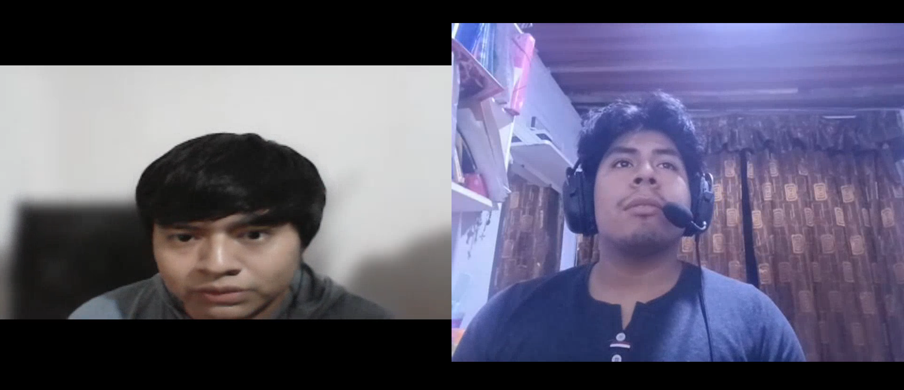
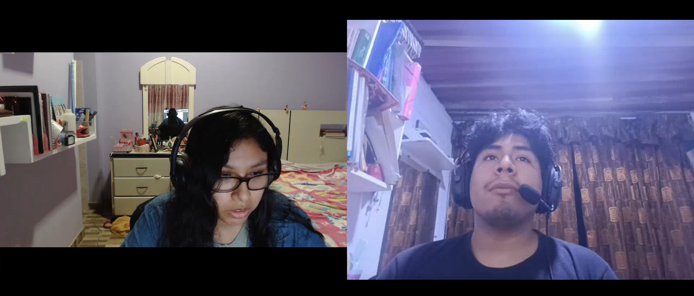
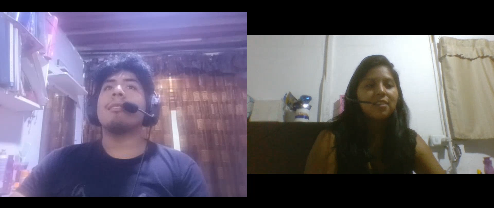
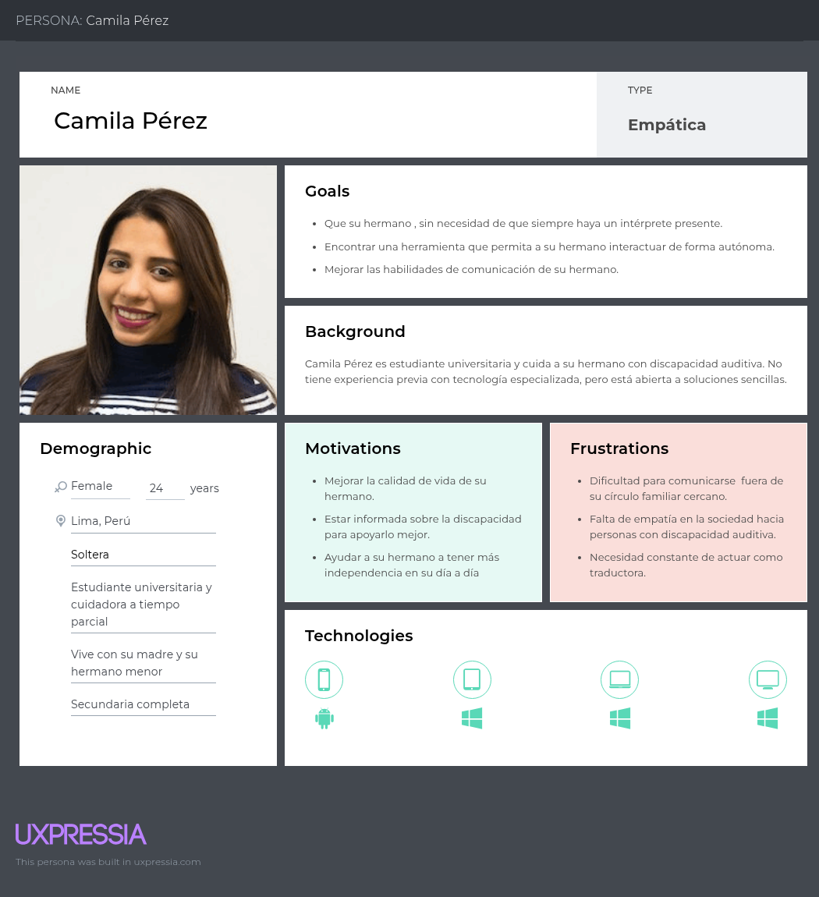
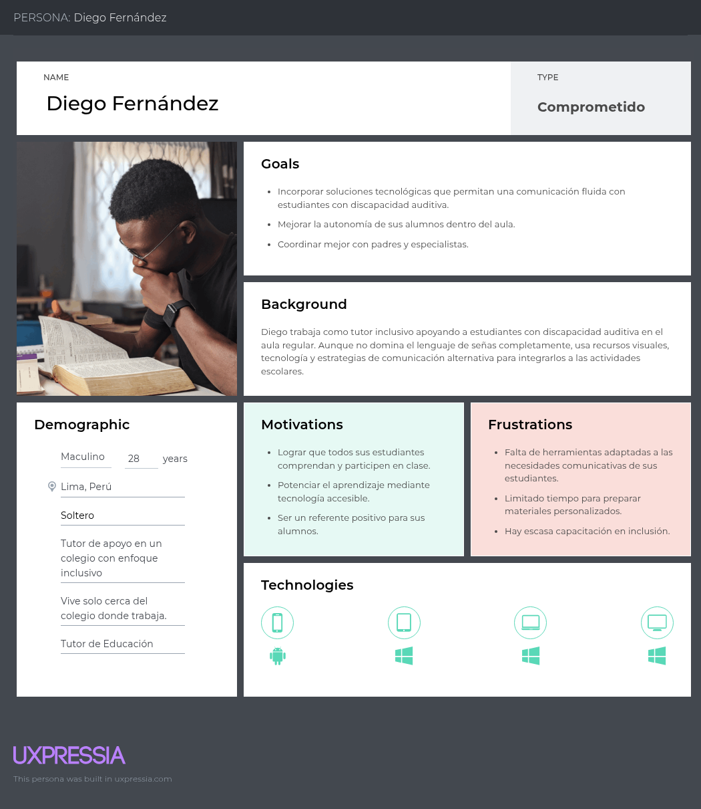
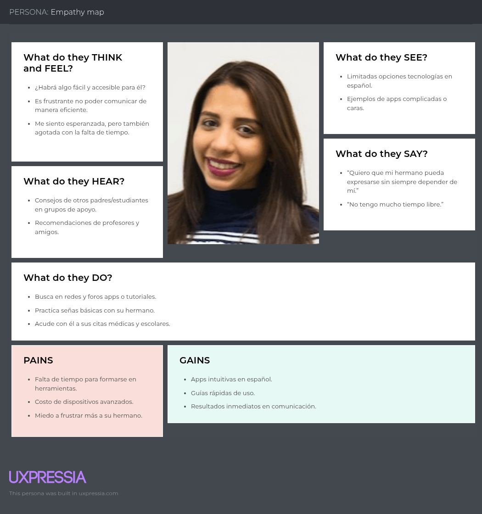
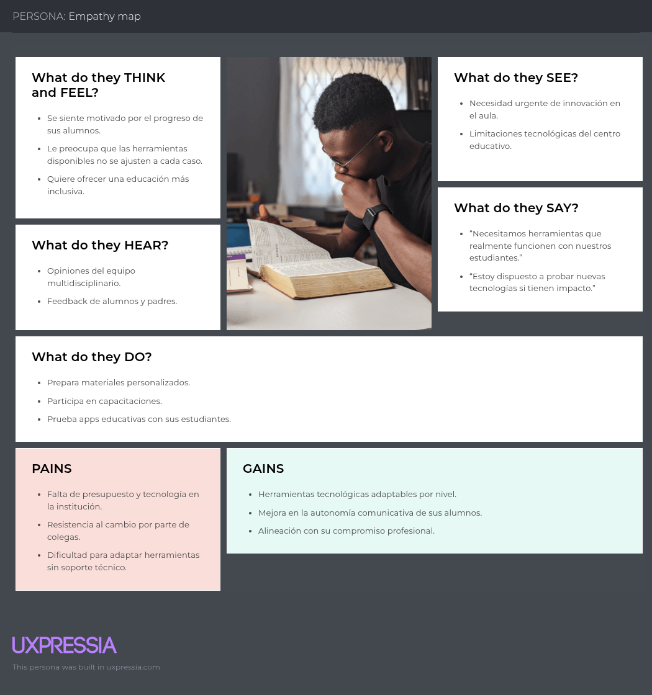
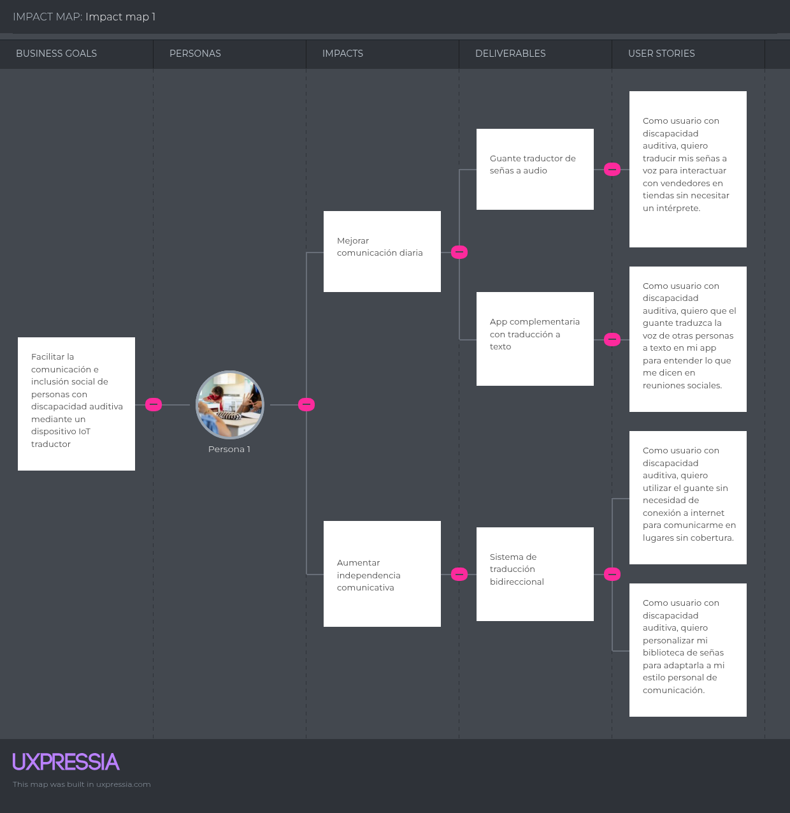

    <strong>Universidad Peruana de Ciencias Aplicadas</strong> 
    </img> 
    <strong>Ingeniería de Software</strong> 
    <strong>Arquitecturas De Software Emergentes - 4283</strong> 
    <strong>Profesor: Royer Edelwer Rojas Malasquez</strong> 
     INFORME

    <strong>Startup:  TechSign</strong> 
    <strong>Producto:  GloveTalk</strong>

    <h3 align="center">Team Members:</h3>
    

     <table align="center">
        <tr>
            <th style="text-align:center;">Member</th>
            <th style="text-align:center;">Code</th>
        </tr>
        <tr>
            <td></td>
            <td></td>
        </tr>
	<tr>
            <td>Llacchua Peralta, Joseph Ulysses</td>
            <td>U202317002</td>
        </tr>
        <tr>
            <td>Salazar Saldarriaga, Frank Junior</td>
            <td>U20181H103</td>
        </tr>
        <tr>
            <td>Crispin Ccancce, Alvaro Esteban</td>
            <td>U202020328</td>
        </tr>
         <tr>
            <td></td>
            <td></td>
        </tr>
    </table>

    <strong>2025</strong>

 

# Registro de Versiones del Informe
<table>
        <tr>
            <th style="text-align:center;">Versión</th>
            <th style="text-align:center;">Fecha</th>
            <th style="text-align:center;">Autor</th>
            <th style="text-align:center;">Descripción de la modificación</th>
        </tr>
        <tr>
            <td align = "center">TB1</td>
            <td>18/04/2025</td>
            <td> Grupo 1
            <td>Se agregó el contenido del capítulo 1, apartados 1.1, 1.2 y 1.3; el contenido del capítulo 2, apartados 2.1, 2.2, 2.3, 2.4; el contenido del capítulo 3, apartados 3.1, 3.2, 3.3 y 3.4; el contenido del capítulo 4, apartados 4.1 y 4.2</td>
        </tr>
</table>
 

# Tabla de Contenidos
- [Student Outcome](#student-outcome)
- [Capítulo I: Introducción](#capítulo-i-introducción)
    - [1.1. Startup Profile](#11-startup-profile)
        - [1.1.1. Descripción de la Startup](#111-descripción-de-la-startup)
        - [1.1.2. Perfiles de integrantes del equipo](#112-perfiles-de-integrantes-del-equipo)
    - [1.2. Solution Profile](#12-solution-profile)
        - [1.2.1. Antecedentes y problemática](#121-antecedentes-y-problemática)
        - [1.2.2. Lean UX Process](#122-lean-ux-process)
            - [1.2.2.1. Lean UX Problem Statements](#1221-lean-ux-problem-statements)
            - [1.2.2.2. Lean UX Assumptions](#1222-lean-ux-assumptions)
            - [1.2.2.3. Lean UX Hypothesis Statements](#1223-lean-ux-hypothesis-statements)
            - [1.2.2.4. Lean UX Canvas](#1224-lean-ux-canvas)
    - [1.3. Segmentos objetivo](#13-segmentos-objetivo)
- [Capítulo II: Requirements Elicitation & Analysis](#capítulo-ii-requirements-elicitation--analysis)
    - [2.1. Competidores](#21-competidores)
        - [2.1.1. Análisis competitivo](#211-análisis-competitivo)
        - [2.1.2. Estrategias y tácticas frente a competidores](#212-estrategias-y-tácticas-frente-a-competidores)
    - [2.2. Entrevistas](#22-entrevistas)
        - [2.2.1. Diseño de entrevistas](#221-diseño-de-entrevistas)
        - [2.2.2. Registro de entrevistas](#222-registro-de-entrevistas)
        - [2.2.3. Análisis de entrevistas](#223-análisis-de-entrevistas)
    - [2.3. Needfinding](#23-needfinding)
        - [2.3.1. User Personas](#231-user-personas)
        - [2.3.2. User Task Matrix](#232-user-task-matrix)
        - [2.3.3. User Journey Mapping](#233-user-journey-mapping)
        - [2.3.4. Empathy Mapping](#234-empathy-mapping)
        - [2.3.5. As-is Scenario Mapping](#235-as-is-scenario-mapping)
    - [2.4. Ubiquitous Language](#24-ubiquitous-language)
- [Capítulo III: Requirements Specification](#capítulo-iii-requirements-specification)
    - [3.1. To-Be Scenario Mapping](#31-to-be-scenario-mapping)
    - [3.2. User Stories](#32-user-stories)
    - [3.3. Impact Mapping](#33-impact-mapping)
    - [3.4. Product Backlog](#34-product-backlog)
- [Capítulo IV: Strategic-Level Software Design](#capítulo-iv-strategic-level-software-design)
    - [4.1. Strategic-Level Attribute-Driven Design](#41-strategic-level-attribute-driven-design)
        - [4.1.1. Design Purpose](#411-design-purpose)
        - [4.1.2. Attribute-Driven Design Inputs](#412-attribute-driven-design-inputs)
            - [4.1.2.1. Primary Functionality (Primary User Stories)](#4121-primary-functionality-primary-user-stories)
            - [4.1.2.2. Quality attribute Scenarios](#4122-quality-attribute-scenarios)
            - [4.1.2.3. Constraints](#4123-constraints)
        - [4.1.3. Architectural Drivers Backlog](#413-architectural-drivers-backlog)
        - [4.1.4. Architectural Design Decisions](#414-architectural-design-decisions)
        - [4.1.5. Quality Attribute Scenario Refinements](#415-quality-attribute-scenario-refinements)
    - [4.2. Strategic-Level Domain-Driven Design](#42-strategic-level-domain-driven-design)
        - [4.2.1. EventStorming](#421-eventstorming)
        - [4.2.2. Candidate Context Discovery](#422-candidate-context-discovery)
        - [4.2.3. Domain Message Flows Modeling](#423-domain-message-flows-modeling)
        - [4.2.4. Bounded Context Canvases](#424-bounded-context-canvases)
        - [4.2.5. Context Mapping](#425-context-mapping)
    - [4.3. Software Architecture](#43-software-architecture)
        - [4.3.1. Software Architecture System Landscape Diagram](#431-software-architecture-system-landscape-diagram)
        - [4.3.2. Software Architecture Context Level Diagrams](#432-software-architecture-context-level-diagrams)
        - [4.3.3. Software Architecture Container Level Diagrams](#433-software-architecture-container-level-diagrams)
        - [4.3.4. Software Architecture Deployment Diagrams](#434-software-architecture-deployment-diagrams)
    - [4.4. Tactical-Level Domain-Driven Design](#44-tactical-level-domain-driven-design)
        - [4.4.X. Bounded Context](#44x-bounded-context-bounded-context-name)
            - [4.4.X.1. Domain Layer](#44x1-domain-layer)
            - [4.4.X.2. Interface Layer](#44x2-interface-layer)
            - [4.4.X.3. Application Layer](#44x3-application-layer)
            - [4.4.X.4. Infrastructure Layer](#44x4-infrastructure-layer)
            - [4.4.X.5. Component Level Diagrams](#44x5-component-level-diagrams)
            - [4.4.X.6. Code Level Diagrams](#44x6-code-level-diagrams)
                - [4.4.X.6.1. Domain Layer Class Diagrams](#44x61-domain-layer-class-diagrams)
                - [4.4.X.6.2. Database Design Diagram](#44x62-database-design-diagram)
- [Capítulo V: Solution UI/UX Design](#capítulo-v-solution-uiux-design)
    - [5.1. Style Guidelines](#51-style-guidelines)
        - [5.1.1. General Style Guidelines](#511-general-style-guidelines)
        - [5.1.2. Web, Mobile and IoT Style Guidelines](#512-web-mobile-and-iot-style-guidelines)
    - [5.2. Information Architecture](#52-information-architecture)
        - [5.2.1. Organization Systems](#521-organization-systems)
        - [5.2.2. Labeling Systems](#522-labeling-systems)
        - [5.2.3. SEO Tags and Meta Tags](#523-seo-tags-and-meta-tags)
        - [5.2.4. Searching Systems](#524-searching-systems)
        - [5.2.5. Navigation Systems](#525-navigation-systems)
    - [5.3. Landing Page UI Design](#53-landing-page-ui-design)
        - [5.3.1. Wireframe](#531-wireframe)
        - [5.3.2. Mock-up](#532-mock-up)
    - [5.4. Applications UX/UI Design](#54-applications-uxui-design)
        - [5.4.1. Wireframes](#541-wireframes)
        - [5.4.2. Wireflow Diagrams](#542-wireflow-diagrams)
        - [5.4.3. Mock-ups](#543-mock-ups)
        - [5.4.4. User Flow Diagrams](#544-user-flow-diagrams)
    - [5.5. Applications Prototyping](#55-applications-prototyping)
- [Capítulo VI: Product Implementation, Validation & Deployment](#capítulo-vi-product-implementation-validation--deployment)
    - [6.1. Software Configuration Management](#61-software-configuration-management)
        - [6.1.1. Development Environment Configuration](#611-development-environment-configuration)
        - [6.1.2. Source Code Management](#612-source-code-management)
        - [6.1.3. Style Guide & Conventions](#613-style-guide--conventions)
        - [6.1.4. Deployment Configuration](#614-deployment-configuration)
    - [6.2. Implementation](#62-implementation)
        - [6.2.X. Sprint n](#62x-sprint-n)
            - [6.2.X.1. Sprint Planning](#62x1-sprint-planning)
            - [6.2.X.2. Aspect Leaders and Collaborators](#62x2-aspect-leaders-and-collaborators)
            - [6.2.X.3. Sprint Backlog](#62x3-sprint-backlog)
            - [6.2.X.4-8. Sprint Review Evidences](#62x4-8-sprint-review-evidences)
            - [6.2.X.9. Team Collaboration Insights](#62x9-team-collaboration-insights)
    - [6.3. Validation Interviews](#63-validation-interviews)
        - [6.3.1. Diseño](#631-diseño)
        - [6.3.2. Registro](#632-registro)
        - [6.3.3. Evaluaciones](#633-evaluaciones)
    - [6.4. Video About-the-Product](#64-video-about-the-product)
- [Conclusiones y Recomendaciones](#conclusiones-y-recomendaciones)
- [Video About-the-Team](#video-about-the-team)
- [Bibliografía](#bibliografía)
- [Anexos](#anexos)

---

# Student Outcome

| Student Name | Contribution Summary |
|--------------|----------------------|
|              |                      |

---

# Capítulo I: Introducción

## 1.1. Startup Profile

### 1.1.1. Descripción de la Startup

GloveTalk fue desarrollada con el objetivo fundamental de mejorar la calidad de vida de las personas que presentan discapacidad auditiva o dificultades del habla, para quienes la comunicación, un elemento crucial para la integración social, se convierte en un reto constante. Nuestra propuesta consiste en resolver esta problemática mediante el uso de tecnologías IoT, creando un guante equipado con sensores capaces de interpretar el lenguaje de señas y convertirlo en sonido, facilitando así una comunicación más fluida y efectiva. Esta solución no solo mejorará la inclusión social y las oportunidades de interacción para las personas con discapacidad auditiva, sino que también optimizará los procesos educativos en instituciones especializadas en enseñar a personas con estas dificultades.

**Misión:**

Contribuir a mejorar la comunicación e inclusión social de las personas con discapacidades auditivas y del habla mediante el desarrollo de innovaciones tecnológicas basadas en IoT que traduzcan el lenguaje de señas a audio, proporcionando autonomía, inclusión efectiva y mejor calidad de vida.

**Visión:**

Convertirnos en líderes reconocidos en el Perú por nuestras innovaciones tecnológicas dedicadas a la inclusión social, siendo un referente nacional en la implementación de soluciones inteligentes y accesibles que eliminen barreras comunicativas para personas con discapacidad auditiva y del habla, fomentando así una sociedad más justa, inclusiva e interconectada.

### 1.1.2. Perfiles de integrantes del equipo

## 1.2. Solution Profile

Nuestra iniciativa plantea desarrollar una solución basada en IoT, cuyo principal propósito es mejorar y facilitar la comunicación entre las personas con discapacidad auditiva y el resto de la comunidad, haciendo uso de tecnologías avanzadas como IoT y Deep Learning.

### 1.2.1. Antecedentes y problemática

**What?**

Según datos del Instituto Nacional de Estadística e Informática (INEI, 2017), en el Perú existen alrededor de 232,000 personas con discapacidad auditiva, de las cuales muchas enfrentan limitaciones importantes en su interacción cotidiana debido a barreras de comunicación. El principal problema que enfrentan estas personas es la dificultad para comunicarse de forma efectiva con quienes no dominan la lengua de señas, afectando significativamente su integración social, educativa y laboral.

**When?**

La problemática surge continuamente durante las interacciones sociales cotidianas, situaciones educativas y laborales, donde las personas con discapacidad auditiva o del habla requieren comunicarse con otras personas que desconocen la lengua de señas.

**Where?**

El problema está presente en todo el Perú, particularmente en instituciones educativas, centros laborales, hospitales y entornos públicos donde las personas con discapacidad auditiva o del habla necesitan interactuar constantemente y encuentran barreras para una comunicación efectiva.

**Who?**

Los usuarios afectados principalmente son personas con discapacidad auditiva y del habla, así como también sus familias, docentes y profesionales de la salud. Los beneficiarios directos serán las instituciones educativas especializadas y centros de rehabilitación que requieren herramientas tecnológicas efectivas para mejorar la inclusión y educación de personas con discapacidad auditiva y del habla.

**Why?**

Las principales causas del problema radican en la falta de soluciones tecnológicas accesibles que faciliten la comunicación entre personas que usan la lengua de señas y aquellas que no la dominan. Esto genera exclusión social, limitaciones educativas y barreras laborales significativas.

**How?**

La solución propuesta consiste en la implementación de un dispositivo inteligente basado en tecnología IoT, específicamente un guante equipado con sensores que traducen movimientos y posiciones de la lengua de señas peruana en audio. Este dispositivo facilitará la comunicación directa y clara en tiempo real, mejorando significativamente la interacción social, educativa y laboral.

**How much?**

¿Cuánto afecta este problema?:

La falta de comunicación efectiva afecta al 100% de las personas con discapacidad auditiva o del habla, reduciendo sus oportunidades educativas, laborales y de inclusión social, según la Defensoría del Pueblo del Perú (2024).

¿Cuánto costará resolver este problema?

El costo dependerá principalmente del desarrollo de la tecnología, la adquisición de sensores especializados y componentes IoT, así como los costos asociados al mantenimiento del software y hardware involucrados.

¿Cuántas personas se beneficiarán?:

Se estima que inicialmente se beneficiarían alrededor del 50% de las personas con discapacidad auditiva y del habla en las principales ciudades del Perú, además de docentes y profesionales en centros especializados que trabajen directamente con estas poblaciones.

**Conclusiones de 5w y 2h:**

En conclusión, mediante el análisis con las 5W's y 2H's, se ha identificado claramente la problemática principal que afecta a personas con discapacidad auditiva y del habla en Perú. GloveTalk implementará una solución tecnológica innovadora, accesible y efectiva, que facilitará la inclusión y comunicación, beneficiando directamente a personas con discapacidad auditiva y del habla, así como a instituciones educativas y de rehabilitación.

### 1.2.2. Lean UX Process

#### 1.2.2.1. Lean UX Problem Statements
En GloveTalk somos conscientes de que en el Perú existe una considerable población con dificultades auditivas y del habla, para quienes la comunicación es un desafío constante que afecta negativamente su desarrollo social, educativo y profesional.

**Problema:**

Una gran cantidad de personas con discapacidad auditiva o del habla enfrentan limitaciones frecuentes en su comunicación cotidiana debido a que la mayoría de las personas en su entorno desconoce o no maneja adecuadamente la lengua de señas. Esta situación suele provocar aislamiento, exclusión social y dificultades en su proceso de aprendizaje.

**Impacto:**

Nuestra propuesta genera un impacto social significativo al promover la integración social, educativa y laboral. De esta manera, permite que las personas con discapacidad auditiva y del habla se comuniquen con mayor autonomía y eficacia en diferentes ámbitos.

#### 1.2.2.2. Lean UX Assumptions

###### Bussiness Outcomes:

- Mejora del 40% en la capacidad de comunicación de los usuarios durante sus actividades diarias.

- Disminución del 50% en el tiempo necesario para lograr una comunicación efectiva en ambientes laborales y educativos.

- Incremento del 30% en la integración laboral de personas con discapacidad auditiva y del habla en instituciones que adopten el uso de GloveTalk.

- Reducción del 40% en la necesidad de intérpretes especializados en situaciones comunes.

- Aumento del 60% en el nivel de satisfacción de los usuarios en sus interacciones sociales.

###### Users:

- Individuos con discapacidad auditiva o del habla.

- Familiares y personas a cargo de su cuidado.

- Escuelas e instituciones educativas especializadas.

- Centros de salud y rehabilitación.

###### User Outcomes & Benefits

- Para las personas con discapacidad auditiva o del habla: mayor independencia para comunicarse, inclusión efectiva en la sociedad y acceso ampliado a oportunidades educativas y de empleo.

- Para centros educativos y de salud: disponibilidad de una herramienta tecnológica útil para mejorar procesos de enseñanza, comunicación y terapia.

###### Feature Assumptions:

- Capacidad de traducir lenguaje de señas en tiempo real a voz.

- Interfaz de uso amigable y accesible para todos.

- Herramientas adicionales como registro y análisis de datos para seguir el progreso en la comunicación.

- Alertas inteligentes que informan sobre la claridad y precisión de la traducción.

###### Business Assumptions:

Asumimos que nuestros usuarios requieren una solución tecnológica avanzada que les permita comunicarse de forma efectiva y autónoma en diferentes contextos, como el hogar, el trabajo o el estudio.

Nuestros clientes serán principalmente personas con discapacidad auditiva o del habla, sus familias y centros educativos o de salud interesados en fomentar la inclusión.

El principal valor que ofrecemos es la posibilidad de comunicarse sin barreras, promoviendo la autonomía.

Planeamos atraer a nuestros clientes mediante campañas en plataformas digitales, alianzas estratégicas con instituciones educativas y centros de rehabilitación, y presencia en eventos de inclusión social.

Obtendremos ingresos a través de la venta directa del dispositivo y planes de suscripción para soporte técnico y mantenimiento.

Nuestra propuesta se diferencia por su precisión en la traducción del lenguaje de señas, su facilidad de uso y el soporte permanente.

El mayor desafío será la aceptación inicial del producto; esto se abordará mediante demostraciones reales, historias de éxito y atención personalizada constante.

###### User Assumptions:

¿Quién utiliza el producto? 

Las personas con discapacidad auditiva o del habla, así como centros educativos y de rehabilitación.

¿Qué problema resuelve? 

Elimina las barreras de comunicación entre quienes usan lenguaje de señas y quienes no lo conocen.

¿Qué características son fundamentales? 

Precisión en tiempo real, interfaz sencilla, facilidad de transporte, alertas de precisión en movimientos y soporte técnico.

¿Cómo se integra el producto en su vida diaria? 

Se adapta fácilmente a cualquier entorno en donde se requiera comunicarse de manera fluida, ya sea en casa, el trabajo o el aula.

¿Cuándo y cómo se utiliza? 

Su uso será frecuente durante interacciones sociales, laborales o educativas.

¿Cómo debe ser el diseño del producto? 

Debe presentar una interfaz clara, accesible e intuitiva, con respuesta rápida, siendo además liviano y fácil de llevar.

#### 1.2.2.3. Lean UX Hypothesis Statements

#### 1.2.2.4. Lean UX Canvas

## 1.3. Segmentos objetivo

---

# Capítulo II: Requirements Elicitation & Analysis

## 2.1. Competidores

### 2.1.1. Análisis competitivo

|                                                         | **GloveTalk**                                                                                                                               | **SignAloud**                                                                                                                           | **SignAll**                                                                                                                      | **MotionSavvy**                                                                                                                                                 |
| ------------------------------------------------------- | ------------------------------------------------------------------------------------------------------------------------------------------- | ----------------------------------------------------------------------------------------------------------------------------------------- | -------------------------------------------------------------------------------------------------------------------------------- | ---------------------------------------------------------------------------------------------------------------------------------------------------------------- |
| **PERFIL**                                              |                                                                                                                                             |                                                                                                                                           |                                                                                                                                  |                                                                                                                                                                  |
| **Overview**                                            | Guante IoT con sensores que traducen la lengua de señas peruana en audio en tiempo real, respaldado por Deep Learning.                       | Guantes que traducen American Sign Language en texto y voz, desarrollados por estudiantes de la University of Washington.                    | Sistema de traducción automática de ASL basado en visión por computadora y NLP, utilizando cámaras y guantes marcados.            | UNI es un dispositivo portátil que utiliza tecnología Leap Motion en una funda para tablet que traduce lenguaje de señas a voz y texto. |
| **Ventaja competitiva** ¿Qué valor ofrece a los clientes? | Adaptación al contexto peruano y validación en instituciones locales; combinación de hardware y software.                                     | Ligero, ergonómico y premiado con el Lemelson-MIT Student Prize por su innovación.                                                       | Primera solución comercial que cubre todo el flujo de traducción sin necesidad de hardware especializado adicional.               | Permite comunicación bidireccional (señas↔texto/voz) sin Internet, actualizable vía crowdsourcing de nuevos gestos. |
| **PERFIL DE MARKETING**                                 |                                                                                                                                             |                                                                                                                                           |                                                                                                                                  |                                                                                                                                                                  |
| **Mercado Objetivo**                                    | Personas con discapacidad auditiva o del habla en Perú, sus familias, instituciones educativas y centros de rehabilitación.                  | Comunidades ASL en EE. UU. y entornos académicos (universidades, laboratorios).                                                         | Instituciones educativas y empresas en EE. UU. que requieren traducción en tiempo real.                                         | Personas sordas y oyentes en entornos cotidianos que necesitan comunicación fluida; sectores educativos y profesionales. |
| **Estrategias de Marketing**                            | Alianzas con instituciones educativas y de salud; pilotos gratuitos y campañas de concientización en redes locales.                        | Demostraciones en ferias tecnológicas y hackatones; cobertura en medios especializados (UW Today).                                       | Pilotos en bibliotecas y universidades (Gallaudet, PVAMU); partnership con Microsoft BizSpark.                                  | Crowdfunding en Indiegogo con early-birds, prensa en Forbes/CBS, y demostraciones en eventos de tecnología asistiva. |
| **PERFIL DE PRODUCTO**                                  |                                                                                                                                             |                                                                                                                                           |                                                                                                                                  |                                                                                                                                                                  |
| **Productos & Servicios**                               | Guante inteligente IoT + algoritmo de Deep Learning + dashboards web para seguimiento y análisis de uso en tiempo real.                    | Par de guantes con sensores de movimiento que envían datos vía Bluetooth a un computador para traducir gestos.                           | Workstation con cámaras y guantes marcados + SDK y chat app para traducción instantánea.                                       | Funda para tablet con Leap Motion + app móvil que reconoce gestos y traduce a texto/voz al instante. |
| **Precios & Costos**                                    | Modelo freemium con licencias institucionales y subsidios para el mercado peruano.                                                           | Prototipo en fase de investigación; no comercializado.                                                                                     | Disponible bajo lista de espera; precios no divulgados públicamente.                                                           | Early-bird en Indiegogo a USD 198; precio de lista USD 499, suscripción mensual USD 19.99 (futuro retail USD 499). |
| **Canales de distribución (Web y/o Móvil)**             | Web (landing page), distribuidores locales, API pública.                                                                                     | UW CoMotion MakerSpace y eventos académicos; no venta abierta.                                                                            | Descarga de demos vía web; demos presenciales en eventos.                                                                       | Indiegogo, sitio web oficial y distribución de apps en tablet preconfiguradas. |
| **ANÁLISIS SWOT**                                        |                                                                                                                                             |                                                                                                                                           |                                                                                                                                  |                                                                                                                                                                  |
| **Fortalezas**                                          | Enfoque local, adaptado a LSP; integración hardware-software; validación en campo.                                                           | Premiado con Lemelson-MIT; diseño ergonómico; uso de sensores precisos.                                                                  | Precisión (>99%) gracias a IA y visión por computadora; cobertura de oraciones completas.                                       | Comunicación bidireccional sin Internet; hardware accesible (tablet + funda); reconocimiento colaborativo de gestos. |
| **Debilidades**                                         | Requiere inversión inicial alta; pruebas de campo y escalabilidad pendientes.                                                               | No incluye expresiones faciales ni marcadores no manuales.                                                                               | Necesita múltiples cámaras y setup complejo; alto costo de infraestructura.                                                     | Dependencia de hardware específico (Leap Motion + tablet); exige entrenamiento inicial. |
| **Oportunidades**                                       | Subvenciones gubernamentales y ONGs; alianzas educativas; escalabilidad en LATAM.                                                            | Potencial comercialización y mejoras con Deep Learning.                                                                                   | Adaptación a otros idiomas de señas y mercados internacionales.                                                                  | Expansión a otras plataformas móviles; incorporación de nuevos idiomas de señas; mercado corporativo. |
| **Amenazas**                                            | Competencia global con más recursos; avances en software puro de visión por computadora.                                                     | Soluciones de software puro sin hardware que abaratan costos.                                                                            | Nuevas tecnologías emergentes de visión por computadora sin necesidad de guantes.                                                | Aparición de apps móviles basadas en IA sin depender de hardware adicional. |

### 2.1.2. Estrategias y tácticas frente a competidores

**AFRONTAR LAS FORTALEZAS (de la competencia):**

* Respaldar la innovación académica de SignAloud con alianzas locales: colaboraciones con universidades peruanas para co-desarrollar y validar nuevas versiones del guante.
* Igualar la precisión de SignAll mediante un ciclo ágil de mejora continua: implementar feedback de campo y tests en escuelas de LSP para refinar los modelos de Deep Learning.

**APROVECHAR LAS DEBILIDADES (de la competencia):**

* Prototipo listo para producción vs. investigación en prototipo: fabricar lotes iniciales del guante y comercializarlos localmente, aprovechando que SignAloud aún no está en mercado.
* Simplicidad de implementación: usar un solo dispositivo IoT (el guante) sin necesidad de cámaras adicionales ni setups complejos como SignAll o MotionSavvy.

**OPORTUNIDADES Y AMENAZAS DE LA COMPETENCIA:**

**Oportunidades:**
* Acceder a subvenciones y programas de inclusión social del gobierno peruano y ONGs, que buscan financiar tecnología para discapacidad.
* Escalar a otros idiomas de señas de Latinoamérica, aprovechando la experiencia piloto en Perú como caso de éxito.

**Amenazas:**
* Soluciones de software puro basadas en visión por computadora que prescinden de hardware y pueden ser más económicas.
* Grandes empresas tecnológicas con presupuestos mayores podrían lanzar apps integradas (voz + señas) apoyadas en sus plataformas globales.

## 2.2. Entrevistas

### 2.2.1. Diseño de entrevistas

1. **Datos generales**
   * ¿Cuál es su nombre?
   * ¿Cuántos años tiene?
   * ¿En qué ciudad y distrito reside?
   * ¿A qué se dedica actualmente?

2. **Segmento 1: Personas con discapacidad auditiva y del habla (Cuidadores)**
   * ¿Cuál es su relación con la persona con discapacidad auditiva o del habla que cuida?
   * ¿Qué estrategias o métodos utiliza actualmente para comunicarse con ella?
   * ¿En qué tipo de situaciones suele haber más dificultades de comunicación (visitas médicas, trámites, tiendas, transporte, etc.)?
   * ¿Con qué tipo de personas se presentan mayores barreras (familiares, profesores, personal de atención al cliente, desconocidos)?
   * ¿Utilizan actualmente algún tipo de tecnología o aplicación para facilitar la comunicación? ¿Cuál ha sido su experiencia?
   * ¿Qué limitaciones ha encontrado en las herramientas existentes para ayudar en la comunicación?
   * ¿Ha presenciado o vivido junto con la persona bajo su cuidado situaciones de exclusión o malentendidos debido a la barrera del lenguaje?
   * ¿Cómo se sienten usted y la persona que cuida cuando no pueden hacerse entender en ciertos contextos?
   * ¿Considera que la sociedad en general está preparada para interactuar adecuadamente con personas con discapacidad auditiva o del habla?
   * ¿Cree que esta situación afecta las oportunidades educativas, sociales o laborales de la persona que cuida?
   * ¿Qué tipo de funcionalidades esperaría de un dispositivo o aplicación para facilitar la comunicación?
   * ¿Qué tipo de mensajes o expresiones serían más útiles que se pudieran traducir automáticamente con la ayuda de un dispositivo?
   * ¿En qué espacios le gustaría que esta herramienta sea especialmente útil (hospitales, bancos, centros educativos, etc.)?

3. **Segmento 2: Instituciones educativas especializadas**
   * ¿Cuál es su rol dentro de la institución?
   * ¿Cuántos estudiantes con discapacidad auditiva o del habla atienden en promedio?
   * ¿Qué métodos utilizan actualmente para facilitar la enseñanza del lenguaje de señas?
   * ¿Han utilizado tecnología para mejorar la comunicación o el aprendizaje de sus estudiantes? ¿Cuál fue su experiencia?
   * ¿Qué dificultades enfrentan sus estudiantes al interactuar con personas fuera del entorno institucional?
   * ¿Considera que el lenguaje de señas se enseña de forma adecuada en los niveles educativos actuales?
   * ¿Qué limitaciones tienen actualmente en cuanto a recursos tecnológicos para mejorar sus procesos de enseñanza?
   * ¿Qué tipo de dispositivo o aplicación cree que sería útil para reforzar la enseñanza del lenguaje de señas?
   * ¿Le gustaría contar con una herramienta que permita evaluar en tiempo real la expresión en señas de los estudiantes?

4. **Validación de la propuesta**
   * Se presenta al entrevistado la idea del proyecto GloveTalk y sus principales funcionalidades (traducción en tiempo real de señas a texto o voz y viceversa, uso de IA para mejorar la precisión, compatibilidad con dispositivos móviles y wearables).
   * ¿Qué le parece la propuesta de GloveTalk?
   * ¿Cree que podría ser útil en su vida diaria o en su entorno educativo/laboral?
   * ¿Alguna vez ha usado una tecnología similar?
   * ¿Cuál es el aspecto que más le llama la atención de esta propuesta?
   * ¿Qué sugerencias o mejoras le gustaría que tenga el dispositivo o la aplicación?
   * ¿En qué escenarios le gustaría poder utilizar esta solución?

### 2.2.2. Registro de entrevistas

**Entrevistas a representantes de Instituciones Educativas**

| Nombre de entrevistado  | Alexis Patazca  |
|-----------------|-----------------|
| Edad   | 26  |
| Departamento   | Los Olivos, Lima |
|  | El entrevistado es estudiante y tutor en una institucion educativa especializada en dicapacidad auditiva y del habla del estudiante, se encarga del acompañamiento de los estudiantes durante la clase y trata de ayudarlos desde el enfoque pedagogico. El combina el lenguaje de señas con materiales didacticos para reforzar mejor el aprendizaje en clase, usa aplicativos en las clases con vocabularios, videos y otros materiales para que esten en constante aprendizaje. El entrevistado se muestra perceptivo y señala que existe una falta de conocimiento de la sociedad hacia ellos porque existe estereotipos por prte de las personas, ademas en la sociedad hay muchas barreras para los estudiantes con estas capacidades. A ellos les hace falta mas dispositivos tecnologicos y una capacitacion para los docentes, cree que los aplicativos y videos son de mucha ayuda para la enseñanza. Dice que una tecnologia que ayude en la comunicacion de los estudiantes con los demas, seria de mucha ayuda y mejoraria la comunicacion en el ambito edicativo, en incluso en lo social.|
| Duracion de entrevista: 0:00 - 9:10 | https://upcedupe-my.sharepoint.com/:v:/g/personal/u20201c179_upc_edu_pe/EXO7g9TKViBNgRxl5OomyjkBJZ5SOpgnwoCvSU-T1VIdFA?e=iCHRQw&nav=eyJyZWZlcnJhbEluZm8iOnsicmVmZXJyYWxBcHAiOiJTdHJlYW1XZWJBcHAiLCJyZWZlcnJhbFZpZXciOiJTaGFyZURpYWxvZy1MaW5rIiwicmVmZXJyYWxBcHBQbGF0Zm9ybSI6IldlYiIsInJlZmVycmFsTW9kZSI6InZpZXcifX0%3D   |

| Nombre de entrevistado  | Andrea Garcia |
|-----------------|-----------------|
| Edad   | 25  |
| Departamento   | San Martin de Porres, Lima |
|  | La entrevistada es docente y coordinadora en una institucion educativa especializada en dicapacidad auditiva. Ellos en la institucion usan materiales visuales y juegos didactivos y apoyo de interpretes de señas, tambien han probado aplicaciones moviles y siente que ha sido una experiencia postiva, pero con sus limitaciones. Siente que las personas desconocen el lenguajes de señas y genera frustacion y limita su participacion social. Señala que la institucion cuenta con recursos tecnologicos como proyectores y tablets, pero no cuentan con herramientas especializadas para los estudiantes. Siente que una herramienta que mejore la comunicacion con los estudiantes seria de mucho apoyo dentro y fuera del aula para que los estudiantes tengan mayor autonomia. |
| Duracion de entrevista: 0:00 - 6:51 | https://upcedupe-my.sharepoint.com/:v:/g/personal/u20201c179_upc_edu_pe/EeTJmt03eVdBrhRXjZcq4-ABwScIHxWxS3r3k4sdbvv-Mw?e=z4nFPY&nav=eyJyZWZlcnJhbEluZm8iOnsicmVmZXJyYWxBcHAiOiJTdHJlYW1XZWJBcHAiLCJyZWZlcnJhbFZpZXciOiJTaGFyZURpYWxvZy1MaW5rIiwicmVmZXJyYWxBcHBQbGF0Zm9ybSI6IldlYiIsInJlZmVycmFsTW9kZSI6InZpZXcifX0%3D  |

| Nombre de entrevistado  | Meliza Luque |
|-----------------|-----------------|
| Edad   | 24  |
| Departamento   | Los Olivos, Lima |
|  | Ella es asistente administrativa en una institucion educativa que esta especializada para niños con dificultades auditivas y del habla. Ella se considera un apoyo para los educadores, organiza la parte logistica y gestiona los recursos materiales y ayuda en las clases con los estudiantes cuando es necesario. Señala que utilizan apoyo visual y auditivo, con enseñanza presencial de lenguaje de señas por parte de los educadores. Ellos usan aplicaciones de lenguajes de señas y software educativos, aunque no todas las aplicaciones son intuitivas para los niños y no se adaptan a un ritmo de aprendizaje personalizado. Siente que los estudiantes estan limitados para comunicarse en situaciones cotidianas, ya que dependen de familiares o interpretes para comunicarse de manera efectiva. Cuenta que existe una falta de dispositivos especializados para los estudiantes, cree los estudiantes necesitan una aplicacion personalizadas que los ayude a aprender y mejorar su comunicacion. Espera que un dispositivo para mejorar la comunicacion facilite la comunicacion no solo para los educadores, sino para los padres y otras personas cercanas al estudiante. |
| Duracion de entrevista: 0:00 - 7:37 | https://upcedupe-my.sharepoint.com/:v:/g/personal/u20201c179_upc_edu_pe/EYY5O9iM9KhDj68r2SrwNrsBcZ_Ky2AyxtRSlGLCyoyaMg?e=Yg54cv&nav=eyJyZWZlcnJhbEluZm8iOnsicmVmZXJyYWxBcHAiOiJTdHJlYW1XZWJBcHAiLCJyZWZlcnJhbFZpZXciOiJTaGFyZURpYWxvZy1MaW5rIiwicmVmZXJyYWxBcHBQbGF0Zm9ybSI6IldlYiIsInJlZmVycmFsTW9kZSI6InZpZXcifX0%3D  |

### 2.2.3. Análisis de entrevistas

## 2.3. Needfinding

### 2.3.1. User Personas

**SEGMENTO CUIDADORES:**  

**SEGMENTO EDUCADORES:**  

### 2.3.2. User Task Matrix

| **Tareas Identificadas**                    | **Cuidadores Importancia** | **Cuidadores Frecuencia** | **Educadores Importancia** | **Educadores Frecuencia** |
|---------------------------------------------|-----------------------------|----------------------------|-----------------------------|----------------------------|
| Motivar la comunicación                     | Alta                        | Alta                       | Alta                        | Alta                       |
| Practicar lenguaje de señas                 | Alta                        | Media                      | Alta                        | Alta                       |
| Promover la autonomía comunicativa          | Alta                        | Alta                       | Alta                        | Alta                       |
| Adaptar el entorno para comunicarse         | Alta                        | Media                      | Alta                        | Alta                       |
| Hacer seguimiento al progreso comunicativo  | Alta                        | Media                      | Alta                        | Alta                       |
| Buscar herramientas de apoyo                | Alta                        | Media                      | Alta                        | Media                      |
| Coordinar con instituciones                 | Media                       | Media                      | Alta                        | Alta                       |
| Recibir capacitación                        | Alta                        | Baja                       | Alta                        | Media                      |

### 2.3.4. Empathy Mapping

**SEGMENTO CUIDADORES**  

**SEGMENTO EDUCADORES**  

### 2.3.5. As-is Scenario Mapping

### **SEGMENTO CUIDADORES:**

| **Phase**            | **Doing (Haciendo)**                                                                 | **Thinking (Pensando)**                                                  | **Feeling (Sintiendo)**                                         |
|----------------------|--------------------------------------------------------------------------------------|------------------------------------------------------------------------|------------------------------------------------------------------|
| **Inicio del proceso**| Usa señales y gestos con su hermano para comunicarse.                                | "¿Cómo podré ayudar mejor a mi hermano para que se sienta comprendido?"  | Frustración, preocupación por no lograr una comunicación efectiva. |
| **Interacción diaria**| Habla con su hermano, usando gestos básicos o escritura.                             | "A veces me siento cansada porque la comunicación es difícil."          | Cansancio, inseguridad, frustración.                            |
| **Problemas de comunicación**| Hace esfuerzos por mejorar la comprensión con su hermano.                        | "¿Existen mejores formas de comunicación?"                             | Inseguridad, ansiedad.                                          |
| **Resultados**        | La comunicación sigue siendo limitada, pero mejora con el tiempo.                    | "Me gustaría tener algo más eficiente para la comunicación."           | Esperanza, frustración.                                          |

### **SEGMENTO EDUCADORES:**

| **Phase**            | **Doing (Haciendo)**                                                                 | **Thinking (Pensando)**                                                  | **Feeling (Sintiendo)**                                         |
|----------------------|--------------------------------------------------------------------------------------|------------------------------------------------------------------------|------------------------------------------------------------------|
| **Inicio del proceso**| Utiliza métodos tradicionales para enseñar lenguaje de señas.                       | "Necesito recursos nuevos para enseñar a mis estudiantes de forma más efectiva." | Preocupación por las limitaciones de los métodos actuales.        |
| **Interacción con estudiantes**| Organiza actividades de aprendizaje práctico.                                     | "¿Cómo puedo hacer que los estudiantes se involucren más?"             | Estrés, deseo de mejorar la calidad de la enseñanza.              |
| **Evaluación del aprendizaje**| Evalúa el progreso de los estudiantes de manera limitada.                         | "Mis estudiantes necesitan más tiempo y práctica para dominar los signos." | Frustración por no tener herramientas adecuadas.                  |
| **Resultados**        | Los estudiantes avanzan, pero a un ritmo más lento del que se espera.               | "Espero que los estudiantes mejoren con más práctica."                  | Satisfacción parcial, frustración por el ritmo lento de progreso. |

## 2.4. Ubiquitous Language

* **Sign Language (Lengua de Señas):** Sistema de comunicación visual-gestual utilizado por personas con discapacidad auditiva mediante movimientos de las manos, el rostro y el cuerpo.

* **Hearing Impairment (Discapacidad Auditiva):** Condición que limita parcial o totalmente la capacidad de oír, afectando la comprensión y producción del lenguaje oral.

* **Speech Impairment (Discapacidad del Habla):** Dificultad o imposibilidad de articular palabras o sonidos, lo que dificulta la comunicación oral directa.

* **Sensor Glove (Guante de Sensores):** Dispositivo wearable que detecta los movimientos de la mano y los dedos mediante sensores, con el fin de interpretar gestos.

* **Gesture Recognition (Reconocimiento de Gestos):** Tecnología que analiza e interpreta los movimientos manuales para traducirlos en comandos, texto o voz.

* **Real-Time Translation (Traducción en Tiempo Real):** Proceso de conversión inmediata de un lenguaje de señas a voz o texto de manera instantánea durante una interacción.

* **Inclusive Communication (Comunicación Inclusiva):** Estrategia que busca garantizar que todas las personas, con o sin discapacidad, puedan comunicarse de forma efectiva y sin barreras.

* **Accessibility (Accesibilidad):** Grado en que un producto, servicio o entorno puede ser utilizado por personas con diferentes tipos de discapacidad.

* **Caregiver (Cuidador):** Persona encargada del cuidado de un familiar o persona con discapacidad, apoyando su desarrollo y autonomía diaria.

* **Educational Institution (Institución Educativa):** Entidad (pública o privada) que brinda formación académica y puede incluir estudiantes con discapacidad auditiva o del habla.

* **Educator (Educador):** Profesional responsable de la enseñanza, quien puede tener estudiantes con necesidades de comunicación inclusiva.

* **Pilot Test (Prueba Piloto):** Implementación inicial de una solución en un entorno controlado para obtener retroalimentación real de los usuarios antes del despliegue final.

* **Inclusion Barrier (Barrera de Inclusión):** Obstáculo que impide la participación equitativa de personas con discapacidad en contextos sociales, educativos o laborales.

* **Autonomy (Autonomía):** Capacidad de una persona con discapacidad de comunicarse y realizar sus actividades diarias sin dependencia constante de un tercero.

* **Daily Scenario (Escenario Diario):** Situación típica que una persona enfrenta en su rutina diaria donde necesita comunicarse (escuela, casa, transporte, salud, etc.).

---

# Capítulo III: Requirements Specification

## 3.1. To-Be Scenario Mapping

## 3.2. User Stories
| Story ID   | Título                                   | Descripción                                                                                                                                      | Criterios de Aceptación                                                                        | Relacionado con (Epic ID) |
|:-----------|:-----------------------------------------|:-------------------------------------------------------------------------------------------------------------------------------------------------|:-----------------------------------------------------------------------------------------------|---------------------------|
| US01       | Interacción cotidiana accesible           | Como persona con discapacidad auditiva, deseo interactuar sin dificultades con quienes no dominan lengua de señas, para sentirme incluida.       | Se detecta la dificultad de comunicarse en contextos sociales diarios.                         | EPIC-01                   |
| US02       | Claridad al comunicarse en público        | Como persona con discapacidad del habla, necesito expresar mis ideas de forma clara en espacios públicos para evitar ser ignorado.               | Se muestra la necesidad de comunicar sin trabas en ambientes comunes.                          | EPIC-01                   |
| US03       | Facilidad para hacer nuevas amistades     | Como persona con discapacidad auditiva, deseo entablar relaciones con nuevas personas sin barreras comunicativas para fortalecer mi vida social. | Se evidencia la exclusión social provocada por la falta de comunicación efectiva.              | EPIC-01                   |
| US04       | Gestiones administrativas independientes  | Como persona con discapacidad auditiva, quiero realizar trámites sin ayuda de terceros, fomentando mi independencia.                             | Se subraya la necesidad de realizar trámites de forma autónoma.                                | EPIC-01                   |
| US05       | Entendimiento general del entorno         | Como persona con discapacidad auditiva, quiero que todos puedan comprenderme sin saber lengua de señas, para evitar malos entendidos.            | Se enfatiza la importancia de facilitar la comprensión a nivel social.                         | EPIC-01                   |
| US06       | Asistencia efectiva en emergencias        | Como persona con discapacidad auditiva, necesito poder solicitar auxilio de forma rápida en situaciones críticas, para sentirme resguardado.     | Se destaca la urgencia de contar con medios de comunicación accesibles en emergencias.         | EPIC-02                   |
| US07       | Comunicación médica accesible             | Como persona con discapacidad auditiva, requiero expresar mis síntomas de manera clara en centros médicos para recibir una atención adecuada.    | Se evidencia la barrera de acceso a servicios de salud por falta de comprensión comunicativa.  | EPIC-02                   |
| US08       | Inclusión en actividades culturales       | Como persona con discapacidad auditiva, anhelo participar sin limitaciones en eventos recreativos y culturales para enriquecer mi vida.          | Se señala la exclusión de personas con discapacidad en espacios culturales y de ocio.          | EPIC-02                   |
| US09       | Interacción educativa inclusiva           | Como persona con discapacidad auditiva, quiero integrarme en entornos educativos donde no todos manejan lengua de señas.                         | Se observa la desigualdad comunicativa dentro del ámbito educativo.                            | EPIC-03                   |
| US10       | Comprensión docente inmediata             | Como docente, deseo captar rápidamente lo que un estudiante con discapacidad auditiva necesita expresar.                                         | Se necesita una respuesta veloz y precisa a la comunicación del estudiante.                    | EPIC-03                   |
| US11       | Facilitación de participación académica   | Como profesor, busco promover la participación equitativa de estudiantes con discapacidad auditiva.                                              | Se enfrenta el reto de asegurar la integración plena en el aula común.                         | EPIC-03                   |
| US12       | Conexión entre estudiantes diversos       | Como institución educativa, queremos fomentar la comunicación entre estudiantes con y sin discapacidad auditiva.                                 | Se evidencia la necesidad de cerrar la brecha comunicativa entre estudiantes.                  | EPIC-03                   |
| US13       | Prevención de malentendidos en clase      | Como profesor, quiero recibir retroalimentación inmediata sobre lo que comunica el estudiante con discapacidad auditiva.                         | Se destaca la importancia de una comprensión rápida en el entorno académico.                   | EPIC-03                   |
| US14       | Detección temprana de dudas estudiantiles | Como docente, deseo saber rápidamente si un estudiante con discapacidad auditiva tiene dudas o dificultades.                                     | Se resalta la necesidad de atención oportuna y adaptada en clases.                             | EPIC-03                   |
| US15       | Evaluación efectiva del aprendizaje       | Como profesor, quiero contar con herramientas para validar lo aprendido por estudiantes con discapacidad auditiva.                               | Se necesita retroalimentación clara para verificar el entendimiento del contenido.             | EPIC-03                   |
| US16       | Participación laboral activa              | Como persona con discapacidad auditiva, necesito integrarme plenamente en reuniones de trabajo.                                                  | Se subraya la exclusión laboral por barreras en la comunicación.                               | EPIC-04                   |
| US17       | Inclusión en procesos de selección        | Como organización inclusiva, queremos que las entrevistas laborales sean accesibles para personas con discapacidad auditiva.                     | Se destaca la relevancia de la inclusión desde el primer contacto laboral.                     | EPIC-04                   |
| US18       | Monitoreo de habilidades comunicativas    | Como centro de rehabilitación, requerimos herramientas que evalúen la evolución comunicativa de los usuarios.                                    | Se evidencia la necesidad de seguimiento específico de habilidades comunicativas.              | EPIC-05                   |
| US19       | Autonomía sin intérpretes externos        | Como institución, aspiramos a disminuir la dependencia de intérpretes contratados.                                                               | Se busca implementar soluciones internas sostenibles para la comunicación.                     | EPIC-05                   |
| US20       | Accesibilidad en eventos institucionales  | Como organización, queremos asegurar que nuestros eventos y talleres sean inclusivos para todos los asistentes.                                  | Se menciona la exclusión recurrente en eventos abiertos por falta de accesibilidad.            | EPIC-05                   |

## 3.3. Impact Mapping

## 3.4. Product Backlog
| Orden | User Story Id | Título                                    | Descripción                                                                                                                                      | Story Points |
|--------|----------------|------------------------------------------|--------------------------------------------------------------------------------------------------------------------------------------------------|--------------|
| 1      | US01           | Interacción cotidiana accesible           | Como persona con discapacidad auditiva, deseo interactuar sin dificultades con quienes no dominan lengua de señas, para sentirme incluida.       | 3            |
| 2      | US02           | Claridad al comunicarse en público        | Como persona con discapacidad del habla, necesito expresar mis ideas de forma clara en espacios públicos para evitar ser ignorado.               | 3            |
| 3      | US06           | Asistencia efectiva en emergencias        | Como persona con discapacidad auditiva, necesito poder solicitar auxilio de forma rápida en situaciones críticas, para sentirme resguardado.     | 5            |
| 4      | US07           | Comunicación médica accesible             | Como persona con discapacidad auditiva, requiero expresar mis síntomas de manera clara en centros médicos para recibir una atención adecuada.    | 5            |
| 5      | US10           | Comprensión docente inmediata             | Como docente, deseo captar rápidamente lo que un estudiante con discapacidad auditiva necesita expresar.                                         | 3            |
| 6      | US11           | Facilitación de participación académica   | Como profesor, busco promover la participación equitativa de estudiantes con discapacidad auditiva.                                              | 3            |
| 7      | US14           | Detección temprana de dudas estudiantiles | Como docente, deseo saber rápidamente si un estudiante con discapacidad auditiva tiene dudas o dificultades.                                     | 2            |
| 8      | US13           | Prevención de malentendidos en clase      | Como profesor, quiero recibir retroalimentación inmediata sobre lo que comunica el estudiante con discapacidad auditiva.                         | 2            |
| 9      | US03           | Facilidad para hacer nuevas amistades     | Como persona con discapacidad auditiva, deseo entablar relaciones con nuevas personas sin barreras comunicativas para fortalecer mi vida social. | 3            |
| 10     | US04           | Gestiones administrativas independientes  | Como persona con discapacidad auditiva, quiero realizar trámites sin ayuda de terceros, fomentando mi independencia.                             | 3            |
| 11     | US18           | Monitoreo de habilidades comunicativas    | Como centro de rehabilitación, requerimos herramientas que evalúen la evolución comunicativa de los usuarios.                                    | 5            |
| 12     | US09           | Interacción educativa inclusiva           | Como persona con discapacidad auditiva, quiero integrarme en entornos educativos donde no todos manejan lengua de señas.                         | 2            |
| 13     | US08           | Inclusión en actividades culturales       | Como persona con discapacidad auditiva, anhelo participar sin limitaciones en eventos recreativos y culturales para enriquecer mi vida.          | 2            |
| 14     | US05           | Entendimiento general del entorno         | Como persona con discapacidad auditiva, quiero que todos puedan comprenderme sin saber lengua de señas, para evitar malos entendidos.            | 2            |
| 15     | US15           | Evaluación efectiva del aprendizaje       | Como profesor, quiero contar con herramientas para validar lo aprendido por estudiantes con discapacidad auditiva.                               | 3            |
| 16     | US12           | Conexión entre estudiantes diversos       | Como institución educativa, queremos fomentar la comunicación entre estudiantes con y sin discapacidad auditiva.                                 | 2            |
| 17     | US16           | Participación laboral activa              | Como persona con discapacidad auditiva, necesito integrarme plenamente en reuniones de trabajo.                                                  | 3            |
| 18     | US17           | Inclusión en procesos de selección        | Como organización inclusiva, queremos que las entrevistas laborales sean accesibles para personas con discapacidad auditiva.                     | 3            |
| 19     | US19           | Autonomía sin intérpretes externos        | Como institución, aspiramos a disminuir la dependencia de intérpretes contratados.                                                               | 2            |
| 20     | US20           | Accesibilidad en eventos institucionales  | Como organización, queremos asegurar que nuestros eventos y talleres sean inclusivos para todos los asistentes.                                  | 2            |

---

# Capítulo IV: Strategic-Level Software Design

## 4.1. Strategic-Level Attribute-Driven Design

### 4.1.1. Design Purpose

### 4.1.2. Attribute-Driven Design Inputs

#### 4.1.2.1. Primary Functionality (Primary User Stories)

#### 4.1.2.2. Quality attribute Scenarios

#### 4.1.2.3. Constraints

### 4.1.3. Architectural Drivers Backlog

### 4.1.4. Architectural Design Decisions

### 4.1.5. Quality Attribute Scenario Refinements

## 4.2. Strategic-Level Domain-Driven Design

### 4.2.1. EventStorming

Empleando la metodología de EventStorming con enfoque en la técnica "start-with-simple", realizamos una sesión colaborativa donde identificamos los siguientes contextos candidatos para nuestro sistema GloveTalk:

**Proceso de identificación:**

**Identificación de Valores del Negocio:**  
   Analizamos los valores clave que nuestro sistema debe proporcionar:
   - Inclusión efectiva para personas con discapacidad auditiva
   - Comunicación bidireccional fluida entre personas sordas y oyentes
   - Autonomía para personas con discapacidad auditiva en diversas situaciones cotidianas
   - Mejora en oportunidades educativas, sociales y laborales

**Identificación de Funcionalidades Clave:**  
   Determinamos las capacidades esenciales que el sistema debe ofrecer:
   - Reconocimiento preciso de gestos en lenguaje de señas
   - Traducción en tiempo real de señas a voz/texto
   - Traducción inversa de voz a representación visual para el usuario sordo
   - Sistema de aprendizaje continuo para mejorar la precisión

1. **Gesture Recognition & Processing**  
     
   Este contexto es responsable de capturar y procesar los movimientos de las manos y dedos a través de los sensores del guante, interpretando estos datos para identificar los gestos correspondientes en el lenguaje de señas.

2. **Translation Engine**  
     
   
   Gestiona la conversión de los gestos reconocidos a palabras o frases en lenguaje hablado, incluyendo el procesamiento de contexto y la interpretación semántica para lograr traducciones precisas y naturales.

3. **User Profile & Learning Management**  
     

   Maneja la información de los usuarios, sus preferencias de idioma, ajustes de voz y datos de aprendizaje personalizado para mejorar la precisión del reconocimiento de gestos específicos de cada usuario.

4. **Audio Output Management**  
     

   Coordina la producción de audio a partir del texto traducido, gestionando aspectos como la entonación, volumen, velocidad y características de la voz sintetizada según las preferencias del usuario.

5. **Usage Analytics**  
     

   Procesa los datos de uso del sistema para proporcionar información sobre patrones de comunicación, vocabulario frecuente y mejoras en la precisión del reconocimiento, ayudando tanto al usuario como al sistema a optimizar la experiencia.

### 4.2.2. Candidate Context Discovery

### 4.2.3. Domain Message Flows Modeling

### 4.2.4. Bounded Context Canvases

### 4.2.5. Context Mapping

## 4.3. Software Architecture

### 4.3.1. Software Architecture System Landscape Diagram

### 4.3.2. Software Architecture Context Level Diagrams

### 4.3.3. Software Architecture Container Level Diagrams

### 4.3.4. Software Architecture Deployment Diagrams

## 4.4. Tactical-Level Domain-Driven Design

### 4.4.X. Bounded Context: <Bounded Context Name>

#### 4.4.X.1. Domain Layer

#### 4.4.X.2. Interface Layer

#### 4.4.X.3. Application Layer

#### 4.4.X.4. Infrastructure Layer

#### 4.4.X.5. Component Level Diagrams

#### 4.4.X.6. Code Level Diagrams

##### 4.4.X.6.1. Domain Layer Class Diagrams

##### 4.4.X.6.2. Database Design Diagram

---

# Capítulo V: Solution UI/UX Design

## 5.1. Style Guidelines

### 5.1.1. General Style Guidelines

### 5.1.2. Web, Mobile and IoT Style Guidelines

## 5.2. Information Architecture

### 5.2.1. Organization Systems

### 5.2.2. Labeling Systems

### 5.2.3. SEO Tags and Meta Tags

### 5.2.4. Searching Systems

### 5.2.5. Navigation Systems

## 5.3. Landing Page UI Design

### 5.3.1. Wireframe

### 5.3.2. Mock-up

## 5.4. Applications UX/UI Design

### 5.4.1. Wireframes

### 5.4.2. Wireflow Diagrams

### 5.4.3. Mock-ups

### 5.4.4. User Flow Diagrams

## 5.5. Applications Prototyping

---

# Capítulo VI: Product Implementation, Validation & Deployment

## 6.1. Software Configuration Management

### 6.1.1. Development Environment Configuration

### 6.1.2. Source Code Management

### 6.1.3. Style Guide & Conventions

### 6.1.4. Deployment Configuration

## 6.2. Implementation

### 6.2.X. Sprint n

#### 6.2.X.1. Sprint Planning

#### 6.2.X.2. Aspect Leaders and Collaborators

#### 6.2.X.3. Sprint Backlog

#### 6.2.X.4-8. Sprint Review Evidences

#### 6.2.X.9. Team Collaboration Insights

## 6.3. Validation Interviews

### 6.3.1. Diseño

### 6.3.2. Registro

### 6.3.3. Evaluaciones

## 6.4. Video About-the-Product

---

# Conclusiones y Recomendaciones

# Video About-the-Team

# Bibliografía

# Anexos
