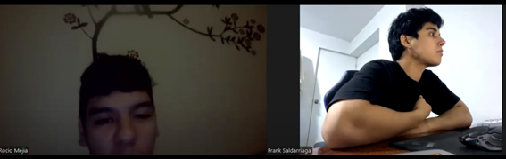
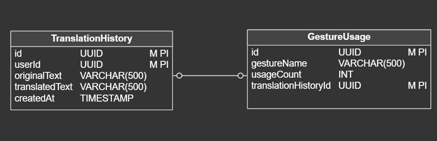
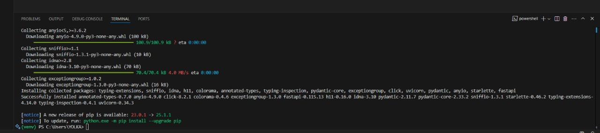

<p align="center">
    <strong>Universidad Peruana de Ciencias Aplicadas</strong><br>
    </img><br>
    <strong>Ingeniería de Software</strong><br>
    <strong>Arquitecturas De Software Emergentes - 4283</strong><br>
    <strong>Profesor: Royer Edelwer Rojas Malasquez</strong><br>
    <br>INFORME
</p>
<p align="center">
    <strong>Startup:  TechSign</strong><br>
    <strong>Producto:  GloveTalk</strong>
</p>
    <h3 align="center">Team Members:</h3>
    </div>
<div>
     <table align="center">
        <tr>
            <th style="text-align:center;">Member</th>
            <th style="text-align:center;">Code</th>
        </tr>
        <tr>
            <td>Mendez Rosales, Marco Aurelio</td>
            <td>u202018273</td>
        </tr>
	<tr>
            <td>Llacchua Peralta, Joseph Ulysses</td>
            <td>U202317002</td>
        </tr>
        <tr>
            <td>Salazar Saldarriaga, Frank Junior</td>
            <td>U20181H103</td>
        </tr>
        <tr>
            <td>Crispin Ccancce, Alvaro Esteban</td>
            <td>U202020328</td>
        </tr>
         <tr>
            <td>Macedo Calsina, Anderson Walter</td>
            <td>U20201C179</td>
        </tr>
    </table>
</div>

<p align="center">
    <strong>2025</strong>
</p>

<br>

# Registro de Versiones del Informe
<table>
        <tr>
            <th style="text-align:center;">Versión</th>
            <th style="text-align:center;">Fecha</th>
            <th style="text-align:center;">Autor</th>
            <th style="text-align:center;">Descripción de la modificación</th>
        </tr>
        <tr>
            <td align = "center">TB1</td>
            <td>18/04/2025</td>
            <td>Grupo 1</td>
            <td>Se agregó el contenido del capítulo 1, apartados 1.1, 1.2 y 1.3; el contenido del capítulo 2, apartados 2.1, 2.2, 2.3, 2.4; el contenido del capítulo 3, apartados 3.1, 3.2, 3.3 y 3.4; el contenido del capítulo 4, apartados 4.1 y 4.2</td>
        </tr>
        <tr>
            <td align = "center">TP</td>
            <td>16/05/2025</td>
            <td>Grupo 1</td>
            <td>Se agregó el contenido del capítulo 5, apartados 5.1, 5.4.1, 5.4.2 y 5.4.3; así como el capítulo 6 completo, incluyendo los apartados 6.1, 6.2, 6.3, 6.4 y 6.5, con sus respectivas guías de estilo, wireframes, wireflows, mockups, user flows y prototipos.</td>
        </tr>
</table>
<br>

# Tabla de Contenidos
- [Student Outcome](#student-outcome)
- [Capítulo I: Introducción](#capítulo-i-introducción)
    - [1.1. Startup Profile](#11-startup-profile)
        - [1.1.1. Descripción de la Startup](#111-descripción-de-la-startup)
        - [1.1.2. Perfiles de integrantes del equipo](#112-perfiles-de-integrantes-del-equipo)
    - [1.2. Solution Profile](#12-solution-profile)
        - [1.2.1. Antecedentes y problemática](#121-antecedentes-y-problemática)
        - [1.2.2. Lean UX Process](#122-lean-ux-process)
            - [1.2.2.1. Lean UX Problem Statements](#1221-lean-ux-problem-statements)
            - [1.2.2.2. Lean UX Assumptions](#1222-lean-ux-assumptions)
            - [1.2.2.3. Lean UX Hypothesis Statements](#1223-lean-ux-hypothesis-statements)
            - [1.2.2.4. Lean UX Canvas](#1224-lean-ux-canvas)
    - [1.3. Segmentos objetivo](#13-segmentos-objetivo)
- [Capítulo II: Requirements Elicitation & Analysis](#capítulo-ii-requirements-elicitation--analysis)
    - [2.1. Competidores](#21-competidores)
        - [2.1.1. Análisis competitivo](#211-análisis-competitivo)
        - [2.1.2. Estrategias y tácticas frente a competidores](#212-estrategias-y-tácticas-frente-a-competidores)
    - [2.2. Entrevistas](#22-entrevistas)
        - [2.2.1. Diseño de entrevistas](#221-diseño-de-entrevistas)
        - [2.2.2. Registro de entrevistas](#222-registro-de-entrevistas)
        - [2.2.3. Análisis de entrevistas](#223-análisis-de-entrevistas)
    - [2.3. Needfinding](#23-needfinding)
        - [2.3.1. User Personas](#231-user-personas)
        - [2.3.2. User Task Matrix](#232-user-task-matrix)
        - [2.3.3. User Journey Mapping](#233-user-journey-mapping)
        - [2.3.4. Empathy Mapping](#234-empathy-mapping)
        - [2.3.5. As-is Scenario Mapping](#235-as-is-scenario-mapping)
    - [2.4. Ubiquitous Language](#24-ubiquitous-language)
- [Capítulo III: Requirements Specification](#capítulo-iii-requirements-specification)
    - [3.1. To-Be Scenario Mapping](#31-to-be-scenario-mapping)
    - [3.2. User Stories](#32-user-stories)
    - [3.3. Impact Mapping](#33-impact-mapping)
    - [3.4. Product Backlog](#34-product-backlog)
- [Capítulo IV: Strategic-Level Software Design](#capítulo-iv-strategic-level-software-design)
    - [4.1. Strategic-Level Attribute-Driven Design](#41-strategic-level-attribute-driven-design)
        - [4.1.1. Design Purpose](#411-design-purpose)
        - [4.1.2. Attribute-Driven Design Inputs](#412-attribute-driven-design-inputs)
            - [4.1.2.1. Primary Functionality (Primary User Stories)](#4121-primary-functionality-primary-user-stories)
            - [4.1.2.2. Quality attribute Scenarios](#4122-quality-attribute-scenarios)
            - [4.1.2.3. Constraints](#4123-constraints)
        - [4.1.3. Architectural Drivers Backlog](#413-architectural-drivers-backlog)
        - [4.1.4. Architectural Design Decisions](#414-architectural-design-decisions)
        - [4.1.5. Quality Attribute Scenario Refinements](#415-quality-attribute-scenario-refinements)
    - [4.2. Strategic-Level Domain-Driven Design](#42-strategic-level-domain-driven-design)
        - [4.2.1. EventStorming](#421-eventstorming)
        - [4.2.2. Candidate Context Discovery](#422-candidate-context-discovery)
        - [4.2.3. Domain Message Flows Modeling](#423-domain-message-flows-modeling)
        - [4.2.4. Bounded Context Canvases](#424-bounded-context-canvases)
        - [4.2.5. Context Mapping](#425-context-mapping)
    - [4.3. Software Architecture](#43-software-architecture)
        - [4.3.1. Software Architecture System Landscape Diagram](#431-software-architecture-system-landscape-diagram)
        - [4.3.2. Software Architecture Context Level Diagrams](#432-software-architecture-context-level-diagrams)
        - [4.3.3. Software Architecture Container Level Diagrams](#433-software-architecture-container-level-diagrams)
        - [4.3.4. Software Architecture Deployment Diagrams](#434-software-architecture-deployment-diagrams)
    - [4.4. Tactical-Level Domain-Driven Design](#44-tactical-level-domain-driven-design)
        - [4.4.1. Bounded Context](#441-bounded-context-bounded-context-name)
            - [4.4.1.1. Domain Layer](#4411-domain-layer)
            - [4.4.1.2. Interface Layer](#4412-interface-layer)
            - [4.4.1.3. Application Layer](#4413-application-layer)
            - [4.4.1.4. Infrastructure Layer](#4414-infrastructure-layer)
            - [4.4.1.5. Component Level Diagrams](#4415-component-level-diagrams)
            - [4.4.1.6. Code Level Diagrams](#4416-code-level-diagrams)
                - [4.4.1.6.1. Domain Layer Class Diagrams](#44161-domain-layer-class-diagrams)
                - [4.4.1.6.2. Database Design Diagram](#44162-database-design-diagram)
        - [4.4.2. Bounded Context](#442-bounded-context-bounded-context-name)
            - [4.4.2.1. Domain Layer](#4421-domain-layer)
            - [4.4.2.2. Interface Layer](#4422-interface-layer)
            - [4.4.2.3. Application Layer](#4423-application-layer)
            - [4.4.2.4. Infrastructure Layer](#4424-infrastructure-layer)
            - [4.4.2.5. Component Level Diagrams](#4425-component-level-diagrams)
            - [4.4.2.6. Code Level Diagrams](#4426-code-level-diagrams)
                - [4.4.2.6.1. Domain Layer Class Diagrams](#44261-domain-layer-class-diagrams)
                - [4.4.2.6.2. Database Design Diagram](#44262-database-design-diagram)
        - [4.4.3. Bounded Context](#443-bounded-context-bounded-context-name)
            - [4.4.3.1. Domain Layer](#4431-domain-layer)
            - [4.4.3.2. Interface Layer](#4432-interface-layer)
            - [4.4.3.3. Application Layer](#4433-application-layer)
            - [4.4.3.4. Infrastructure Layer](#4434-infrastructure-layer)
            - [4.4.3.5. Component Level Diagrams](#4435-component-level-diagrams)
            - [4.4.3.6. Code Level Diagrams](#4436-code-level-diagrams)
                - [4.4.3.6.1. Domain Layer Class Diagrams](#44361-domain-layer-class-diagrams)
                - [4.4.3.6.2. Database Design Diagram](#44362-database-design-diagram)
        - [4.4.4. Bounded Context](#444-bounded-context-bounded-context-name)
            - [4.4.4.1. Domain Layer](#4441-domain-layer)
            - [4.4.4.2. Interface Layer](#4442-interface-layer)
            - [4.4.4.3. Application Layer](#4443-application-layer)
            - [4.4.4.4. Infrastructure Layer](#4444-infrastructure-layer)
            - [4.4.4.5. Component Level Diagrams](#4445-component-level-diagrams)
            - [4.4.4.6. Code Level Diagrams](#4446-code-level-diagrams)
                - [4.4.4.6.1. Domain Layer Class Diagrams](#44461-domain-layer-class-diagrams)
                - [4.4.4.6.2. Database Design Diagram](#44462-database-design-diagram)
- [Capítulo V: Solution UI/UX Design](#capítulo-v-solution-uiux-design)
    - [5.1. Style Guidelines](#51-style-guidelines)
        - [5.1.1. General Style Guidelines](#511-general-style-guidelines)
        - [5.1.2. Web, Mobile and IoT Style Guidelines](#512-web-mobile-and-iot-style-guidelines)
    - [5.2. Information Architecture](#52-information-architecture)
        - [5.2.1. Organization Systems](#521-organization-systems)
        - [5.2.2. Labeling Systems](#522-labeling-systems)
        - [5.2.3. SEO Tags and Meta Tags](#523-seo-tags-and-meta-tags)
        - [5.2.4. Searching Systems](#524-searching-systems)
        - [5.2.5. Navigation Systems](#525-navigation-systems)
    - [5.3. Landing Page UI Design](#53-landing-page-ui-design)
        - [5.3.1. Wireframe](#531-wireframe)
        - [5.3.2. Mock-up](#532-mock-up)
    - [5.4. Applications UX/UI Design](#54-applications-uxui-design)
        - [5.4.1. Wireframes](#541-wireframes)
        - [5.4.2. Wireflow Diagrams](#542-wireflow-diagrams)
        - [5.4.3. Mock-ups](#543-mock-ups)
        - [5.4.4. User Flow Diagrams](#544-user-flow-diagrams)
    - [5.5. Applications Prototyping](#55-applications-prototyping)
- [Capítulo VI: Product Implementation, Validation & Deployment](#capítulo-vi-product-implementation-validation--deployment)
    - [6.1. Software Configuration Management](#61-software-configuration-management)
        - [6.1.1. Development Environment Configuration](#611-development-environment-configuration)
        - [6.1.2. Source Code Management](#612-source-code-management)
        - [6.1.3. Style Guide & Conventions](#613-style-guide--conventions)
        - [6.1.4. Deployment Configuration](#614-deployment-configuration)
    - [6.2. Implementation](#62-implementation)
        - [6.2.X. Sprint n](#62x-sprint-n)
            - [6.2.X.1. Sprint Planning](#62x1-sprint-planning)
            - [6.2.X.2. Aspect Leaders and Collaborators](#62x2-aspect-leaders-and-collaborators)
            - [6.2.X.3. Sprint Backlog](#62x3-sprint-backlog)
            - [6.2.X.4-8. Sprint Review Evidences](#62x4-8-sprint-review-evidences)
            - [6.2.X.9. Team Collaboration Insights](#62x9-team-collaboration-insights)
    - [6.3. Validation Interviews](#63-validation-interviews)
        - [6.3.1. Diseño](#631-diseño)
        - [6.3.2. Registro](#632-registro)
        - [6.3.3. Evaluaciones](#633-evaluaciones)
    - [6.4. Video About-the-Product](#64-video-about-the-product)
- [Capítulo VII: Product Implementation, Validation & Deployment](#capítulo-vii-product-implementation-validation--deployment)
    - [7.1. Software Configuration Management](#71-software-configuration-management)
        - [7.1.1. Development Environment Configuration](#711-development-environment-configuration)
        - [7.1.2. Source Code Management](#712-source-code-management)
        - [7.1.3. Style Guide & Conventions](#713-style-guide--conventions)
        - [7.1.4. Deployment Configuration](#714-deployment-configuration)
    - [7.2. Solution Implementation](#72-solution-implementation)
        - [7.2.1. Sprint 1](#721-sprint-1)
            - [7.2.1.1. Sprint Planning 1](#7211-sprint-planning-1)
            - [7.2.1.2. Sprint Backlog 1](#7212-sprint-backlog-1)
            - [7.2.1.3. Development Evidence for Sprint Review](#7213-development-evidence-for-sprint-review)
            - [7.2.1.4. Testing Suite Evidence for Sprint Review](#7214-testing-suite-evidence-for-sprint-review)
            - [7.2.1.5. Execution Evidence for Sprint Review](#7215-execution-evidence-for-sprint-review)
            - [7.2.1.6. Services Documentation Evidence for Sprint Review](#7216-services-documentation-evidence-for-sprint-review)
            - [7.2.1.7. Software Deployment Evidence for Sprint Review](#7217-software-deployment-evidence-for-sprint-review)
            - [7.2.1.8. Team Collaboration Insights during Sprint](#7218-team-collaboration-insights-during-sprint)
        - [7.2.2. Sprint 2](#722-sprint-2)
            - [7.2.2.1. Sprint Planning 2](#7221-sprint-planning-2)
            - [7.2.2.2. Sprint Backlog 2](#7222-sprint-backlog-2)
            - [7.2.2.3. Development Evidence for Sprint Review](#7223-development-evidence-for-sprint-review)
            - [7.2.2.4. Testing Suite Evidence for Sprint Review](#7224-testing-suite-evidence-for-sprint-review)
            - [7.2.2.5. Execution Evidence for Sprint Review](#7225-execution-evidence-for-sprint-review)
            - [7.2.2.6. Services Documentation Evidence for Sprint Review](#7226-services-documentation-evidence-for-sprint-review)
            - [7.2.2.7. Software Deployment Evidence for Sprint Review](#7227-software-deployment-evidence-for-sprint-review)
            - [7.2.2.8. Team Collaboration Insights during Sprint](#7228-team-collaboration-insights-during-sprint)
    - [7.3. Validation Interviews](#73-validation-interviews)
        - [7.3.1. Diseño](#731-diseño)
        - [7.3.2. Registro](#732-registro)
        - [7.3.3. Evaluaciones](#733-evaluaciones)
    - [7.4. Video About-the-Product](#74-video-about-the-product)
- [Conclusiones y Recomendaciones](#conclusiones-y-recomendaciones)
- [Video About-the-Team](#video-about-the-team)
- [Bibliografía](#bibliografía)
- [Anexos](#anexos)

---

# Student Outcome

| Criterio Especifico                                                                             | Acciones Realizadas                                                                                                                                                                                                                                                                                                                                                                                                                                                                                                                                                                                                                                                                                                                                                                                                                                                                                                                                                                                                                                                                                                                                                                                                                                                                                                                                                                                                                                                                                                                                                                                                                                                                                                                                                                                                                                                                                                                                                                                                                                                                                                                                                                                                                                                                                                                                                                                                                                                                                                                                                                                                                                                                                                                                                                                                                                                                                                                                                                                                                                                                                                                                                                                                                                                                                                                                                                                                                                                                                                                                                                                                                                                                                                                                                                                                                                                                                                                                                                                                                                                                                                                                                                                                                                                                                                                                                                                                                                                                                                                                                                                                                                                                                                                                                                                                                                                                                                                                                                                                                                                                                                                                                                                                                                                                                                                                                                   | Conclusiones                                                                                                                                                                          |
|-------------------------------------------------------------------------------------------------|---------------------------------------------------------------------------------------------------------------------------------------------------------------------------------------------------------------------------------------------------------------------------------------------------------------------------------------------------------------------------------------------------------------------------------------------------------------------------------------------------------------------------------------------------------------------------------------------------------------------------------------------------------------------------------------------------------------------------------------------------------------------------------------------------------------------------------------------------------------------------------------------------------------------------------------------------------------------------------------------------------------------------------------------------------------------------------------------------------------------------------------------------------------------------------------------------------------------------------------------------------------------------------------------------------------------------------------------------------------------------------------------------------------------------------------------------------------------------------------------------------------------------------------------------------------------------------------------------------------------------------------------------------------------------------------------------------------------------------------------------------------------------------------------------------------------------------------------------------------------------------------------------------------------------------------------------------------------------------------------------------------------------------------------------------------------------------------------------------------------------------------------------------------------------------------------------------------------------------------------------------------------------------------------------------------------------------------------------------------------------------------------------------------------------------------------------------------------------------------------------------------------------------------------------------------------------------------------------------------------------------------------------------------------------------------------------------------------------------------------------------------------------------------------------------------------------------------------------------------------------------------------------------------------------------------------------------------------------------------------------------------------------------------------------------------------------------------------------------------------------------------------------------------------------------------------------------------------------------------------------------------------------------------------------------------------------------------------------------------------------------------------------------------------------------------------------------------------------------------------------------------------------------------------------------------------------------------------------------------------------------------------------------------------------------------------------------------------------------------------------------------------------------------------------------------------------------------------------------------------------------------------------------------------------------------------------------------------------------------------------------------------------------------------------------------------------------------------------------------------------------------------------------------------------------------------------------------------------------------------------------------------------------------------------------------------------------------------------------------------------------------------------------------------------------------------------------------------------------------------------------------------------------------------------------------------------------------------------------------------------------------------------------------------------------------------------------------------------------------------------------------------------------------------------------------------------------------------------------------------------------------------------------------------------------------------------------------------------------------------------------------------------------------------------------------------------------------------------------------------------------------------------------------------------------------------------------------------------------------------------------------------------------------------------------------------------------------------------------------------------------------|---------------------------------------------------------------------------------------------------------------------------------------------------------------------------------------|
| Trabaja en equipo para proporcionar liderazgo en forma conjunta.                                | **TB1:** <br> Frank Salazar: <br> Se trabajó con el equipo la estructura del proyecto para poder delegar funciones en el desarrollo del proyecto y mejorar el trabajo en equipo <br> Anderson Macedo <br>En esta entrega se trabajo en equipo, realizando las partes del trabajo de forma colaborativa, tuvimos coordinaciones en reuniones para las actividades realizadas. <br> Joseph Llacchua: <br> En esta entrega, trabajamos en la definición de metas claras, distribuyendo responsabilidades según las habilidades individuales mientras manteníamos un propósito colectivo.<br> Marco Mendez:<br> Nos apoyamos en la estructura entregada por el proesor para poder desarrollar un trabajo bien elaborado. <br> Alvaro Crispin: <br> Coordiné con el equipo la definición y redacción de las User Stories y del Product Backlog, asegurando una visión compartida de los requerimientos, Propuse y validé la estructura del modelo C4 general, guiando a mis compañeros durante su elaboración. Finalmente, asistí en la creación del Bounded Context de Translation, fomentando la participación activa de todos. <br> **TP:**  <br> Frank Salazar: <br> Para este entregable, tomé la iniciativa de desarrollar una versión funcional del frontend de GloveTalk, lo cual permitió al equipo validar las ideas de diseño planteadas en el Capítulo VI. Además, realicé simulaciones de componentes físicos utilizando Wokwi, adelantando parte de la lógica que se implementará en la fase técnica del proyecto. Esto ayudó a que el equipo tuviera una visión más clara del sistema final y facilitó la toma de decisiones con base en pruebas reales. <br> Anderson Macedo:<br> Para este entregable me encargué de organizar la distribución del capítulo 6 junto con el equipo, asignando tareas específicas a cada integrante. Además, lideré el diseño de los wireframes y wireflows de la aplicación web, asegurando coherencia con los objetivos planteados y facilitando el avance coordinado del trabajo. <br> Joseph Llacchua: <br> Para este entregable, asumí la responsabilidad de elaborar y estructurar la documentación oficial del proyecto, integrando de forma coherente los aportes del equipo en los capítulos correspondientes. Además de ordenar y dar formato al documento, participé en la revisión y consolidación de contenido, asegurando que el entregable cumpla con los requisitos académicos. También brindé apoyo puntual en otros puntos del trabajo, lo que permitió mantener la coordinación general y una presentación uniforme. <br> Marco Mendez:<br> Durante este entregable, me encargué de diseñar los wireframes y mockups de la landing page de GloveTalk, proponiendo una estructura visual clara, jerárquica y alineada con los principios definidos en la guía de estilos. Coordiné con el equipo para asegurarme de que el diseño representara adecuadamente la identidad del proyecto y sirviera como base para su futura implementación. Mi participación permitió visualizar anticipadamente cómo se comunicaría la propuesta de valor del sistema a los usuarios desde la primera interacción. <br> Alvaro Crispin: <br> Para este entregable, colaboré activamente con el equipo liderando la creación de la primera versión funcional de la landing page de GloveTalk, adelantando la etapa de implementación visual respecto al diseño establecido en los wireframes y mockups. Esta iniciativa permitió validar la propuesta visual desde una perspectiva real, facilitando los ajustes necesarios antes de avanzar a siguientes fases. Mi aporte ayudó a alinear el diseño con la experiencia de usuario esperada y fortaleció el trabajo del equipo con resultados visibles. <br> **TB2:** <br> Anderson Macedo: <br> Durante el desarrollo del proyecto GloveTalk, asumí un rol activo en la coordinación del capítulo 7, organizando la información técnica relacionada con el entorno de desarrollo, despliegue y control de versiones. Además, participé en la redacción de la documentación técnica y en la integración de los avances realizados por el equipo, asegurando coherencia en el contenido entregado.    <br> Marco Mendez: <br> Durante el desarrollo del proyecto apoye en el feedback del proyecto, aportando gran información ya que al validar las heuristicas pude ver ciertos puntos de mejora por parte de nuestros usuarios finales <br> Frank Salazar: <br> Durante el desarrollo de esta entrega he sido capaz de desarrollar el backend a nivel de especializado buscando el dataset para entrenar a nuestro modelo y cumpliendo con las fechas para obtener las primeras traducciones <br> <br> Alvaro Crispin: <br> Para esta entrega he sido capaz de indentificar los puntos clave para obtener las primeras traducciones de nuestro modelo y ser capaz de mediante la FASTAPI mandar información inmediata a nuestra solución <br> <br> **TF:** <br> Joseph Llacchua: <br> Durante el desarrollo del TF, asumí un rol activo en la coordinación y estructuración de la documentación oficial del proyecto. Me encargué de integrar los aportes de todos los miembros del equipo, asegurando coherencia y calidad en el informe final. Además, participé en la revisión y consolidación de contenido, promoviendo la colaboración y el liderazgo compartido. Mi enfoque fue mantener una comunicación constante, resolver dudas y facilitar la integración de los avances técnicos y de diseño, permitiendo que el equipo cumpliera los objetivos en los plazos establecidos    <br>                                                                                                                                                                                                                                                                                                                                                                                                                                                                                       | **TB1:** <br> Se logró desarrollar la primera parte del proyecto, hablando del documentado, de manera satisfactoria, gracias a la correcta delegación de funciones que se realizó. <br> **TP:** <br> A lo largo del desarrollo del entregable, todos los integrantes del equipo demostraron liderazgo desde sus roles específicos. Algunos miembros asumieron la dirección en el diseño de interfaces, otros adelantaron el desarrollo técnico del sistema (frontend, simulaciones) y otros organizaron la estructura del documento y coordinaron los aportes. Esta diversidad de iniciativas permitió mantener el trabajo enfocado, avanzar de forma paralela y asegurar una integración sólida de todas las partes. <br> **TB2:** <br> Durante el desarrollo del Sprint 1 y la elaboración del Capítulo VII, el equipo demostró liderazgo compartido al asumir roles técnicos específicos como desarrollo frontend, backend, despliegue y documentación. Cada integrante lideró decisiones dentro de su módulo, lo cual permitió avanzar de forma autónoma y coordinada. La división clara de responsabilidades facilitó la entrega de las evidencias de desarrollo, pruebas y configuración dentro de los plazos establecidos. |
| Crea un entorno colaborativo e inclusivo, establece metas, planifica tareas y cumple objetivos. | **TB1:** <br> Frank Salazar: <br> En trabajo con mis compañeros, pudimos establecer funciones, plazos y reuniones a realizar para el desarrollo del proyecto. <br> Anderson Macedo: En este trabajo, nos pusimos la meta de cumplir con la entrega del trabajo, cada uno puso de su parte para avanzar el proyecto y colaboro de forma activa, por mi parte cumpli con la meta de la finalizacion de esta entrega exitosamente. <br> Joseph Llacchua: <br> Durante esta fase, prioricé la creación de un espacio de trabajo en equipo, integrando diversas perspectivas y fortaleciendo la comunicación. Realizamos una revisión conjunta de la literatura existente, analizamos los segmentos objetivos de manera participativa y exploramos metodologías de resolución de problemas en conjunto. <br> Marco Mendez:<br> Se realizo un analisis y supervisión de la documentación realizada, logrando un trabajo en equipo concluso. <br> Alvaro Crispin: <br> Fui responsable de cada artefacto (User Stories, Backlog, C4, Bounded Context), Implementé sprints cortos con entregables parciales y seguimiento del avance. Finalmente, realicé demos internas del Bounded Context de Translation, recogiendo feedback y ajustando el plan de trabajo. <br> **TP:** <br> Frank Salazar: <br> Mi contribución principal fue apoyar al equipo con la construcción del frontend y la simulación de hardware, lo que permitió transformar las ideas del diseño en elementos funcionales. A través de estos avances, ayudé a mantener al grupo enfocado en los objetivos, generando entregables visibles que facilitaron el trabajo colaborativo.  <br> Anderson Macedo: <br> Colaboré activamente con mi equipo en la planificación de tareas y cumplimiento de metas dentro del capítulo 6. Me enfoqué en el diseño funcional de la aplicación web, apoyando en la construcción de los flujos de interacción (wireflows) y la estructura visual (wireframes), lo que permitió al grupo avanzar de forma organizada y mantener un enfoque claro en la experiencia del usuario.<br> Joseph Llacchua: <br> Colaboré activamente en el trabajo conjunto del equipo, gestionando y redactando la documentación del entregable, lo cual fue fundamental para integrar el esfuerzo de todos en un único producto final. Además, ofrecí apoyo en distintos momentos del desarrollo del proyecto, ayudando a revisar los contenidos de diseño y asegurar el cumplimiento de los objetivos establecidos. Mi participación contribuyó a mantener un entorno organizado y cooperativo entre todos los integrantes. <br> Marco Mendez:<br> Aporté al trabajo colaborativo desarrollando los diseños visuales preliminares de la landing page, los cuales fueron utilizados como guía para mantener coherencia estética y funcional en el desarrollo posterior. Me aseguré de incorporar los elementos necesarios para transmitir accesibilidad y claridad en el contenido, facilitando que el equipo tuviera una visión compartida sobre cómo debía estructurarse esta sección del producto. Este trabajo nos permitió avanzar de forma organizada y con objetivos definidos. <br> Alvaro Crispin: <br> Desarrolle la version web de la landing page para apoyar al equipo. Esto permitió tener una versión navegable que nos ayudó a visualizar mejor la estructura, jerarquía de contenido y estilo visual definido. Este avance contribuyó al cumplimiento de los objetivos y permitió que el equipo trabaje con mayor claridad, promoviendo un entorno de colaboración activa y mejora continua. <br> **TB2:** <br> Anderson Macedo: <br> Contribuí directamente al cumplimiento de los objetivos del capítulo, estructurando secciones clave como el  para el Software Deployment. Mi enfoque fue mantener la claridad en las entregas y facilitar el trabajo en conjunto mediante el uso compartido de herramientas como GitHub y Vercel, fortaleciendo así el entorno colaborativo del equipo. <br> Marco Mendez: <br> Contribuí principalmente en el diseño de las entrevistas de validación. Además, realicé el análisis de las mismas para obtener retroalimentación clave de los usuarios, lo que nos permitió validar nuestras heurísticas de usabilidad. <br> Frank Salazar: <br> Durante el desarrollo de esta entrega he sido capaz de desarrollar el backend a nivel de especializado buscando el dataset para entrenar a nuestro modelo y cumpliendo con las fechas para obtener las primeras traducciones <br> <br> Alvaro Crispin: <br> Para esta entrega he sido capaz de indentificar los puntos clave para obtener las primeras traducciones de nuestro modelo y ser capaz de mediante la FASTAPI mandar información inmediata a nuestra solución <br>**TF:** <br> Joseph Llacchua: <br> En este entregable, prioricé la creación de un ambiente de trabajo colaborativo e inclusivo, donde cada integrante pudiera aportar desde sus fortalezas. Organicé reuniones para definir metas claras, distribuir tareas y dar seguimiento al avance del equipo. Me aseguré de que todos los miembros tuvieran acceso a la información y recursos necesarios, promoviendo la participación activa y el respeto por las ideas de cada uno. Gracias a esta planificación y coordinación, logramos cumplir con los objetivos del TF y entregar un producto final de calidad. <br>                                                                                                                                                                                                                                                                                                                                                                                                                                                                                                                                                                                                                                                                                                                                                                                                                                                                                                                                                                                                                                                                                                                              | **TB1:** <br> La correcta delegación del proyecto, junto a las reuniones, plazos y funciones permitieron llevar un orden en el desarrollo del proyecto. <br> **TP:** <br>  El equipo logró un entorno de trabajo colaborativo en el que cada miembro aportó desde sus fortalezas, respetando los tiempos y objetivos comunes. La distribución clara de tareas, la comunicación constante y el compromiso con la calidad del entregable fueron claves para cumplir con los capítulos requeridos. La integración de prototipos, simulaciones, documentación y diseño visual se dio de forma ordenada, con una participación equitativa que fortaleció el desarrollo del proyecto. <br> **TB2:** <br> El equipo logró establecer un entorno de trabajo colaborativo y participativo. Se definieron objetivos semanales, se organizó el backlog de Sprint 1 y se distribuyeron tareas considerando las fortalezas de cada miembro. A través de reuniones y acuerdos internos, se cumplió con la planificación y se completaron todas las evidencias solicitadas.                  |


---

# Capítulo I: Introducción

## 1.1. Startup Profile

### 1.1.1. Descripción de la Startup

GloveTalk fue desarrollada con el objetivo fundamental de mejorar la calidad de vida de las personas que presentan discapacidad auditiva o dificultades del habla, para quienes la comunicación, un elemento crucial para la integración social, se convierte en un reto constante. Nuestra propuesta consiste en resolver esta problemática mediante el uso de tecnologías IoT, creando un guante equipado con sensores capaces de interpretar el lenguaje de señas y convertirlo en sonido, facilitando así una comunicación más fluida y efectiva. Esta solución no solo mejorará la inclusión social y las oportunidades de interacción para las personas con discapacidad auditiva, sino que también optimizará los procesos educativos en instituciones especializadas en enseñar a personas con estas dificultades.

**Misión:**

Contribuir a mejorar la comunicación e inclusión social de las personas con discapacidades auditivas y del habla mediante el desarrollo de innovaciones tecnológicas basadas en IoT que traduzcan el lenguaje de señas a audio, proporcionando autonomía, inclusión efectiva y mejor calidad de vida.

**Visión:**

Convertirnos en líderes reconocidos en el Perú por nuestras innovaciones tecnológicas dedicadas a la inclusión social, siendo un referente nacional en la implementación de soluciones inteligentes y accesibles que eliminen barreras comunicativas para personas con discapacidad auditiva y del habla, fomentando así una sociedad más justa, inclusiva e interconectada.

### 1.1.2. Perfiles de integrantes del equipo

<table>
  <tr>
    <td rowspan="3"></td>
    <td>Frank Junior Salazar Saldarriaga (u20181h103)</td>
  </tr>
  <tr>
        <td>Ingenieria de Software</td>
  </tr>
    <tr>
    <td>Soy Frank Salazar, tengo 24 años y tengo una gran devoción por la programación, desde los 8 años me gustó programar, iniciando por algoritmos sencillos, hasta la recreación de videojuegos. Hace unos años decidí centrarme mucho en el desarrollo Backend y frontend, pero también le he agarrado mucho gusto a la data science. Actualmente soy programador en Yape, BCP. Soy asistente desde el año pasado, pero comencé como practicando desde agosto del 2023.</td>
  </tr>
  <tr>
    <td rowspan="3"></td>
    <td>Joseph Ulysses Llacchua Peralta (u202317002) </td>
  </tr>
  <tr>
        <td>Ingenieria de Software</td>
  </tr>
    <tr>
    <td>Soy un estudiante de la carrera de Ingeniería de Software, con experiencia en lenguajes de programación como Java, TypeScript y C#. Soy una persona comprometida con lo que me propongo, puntual, responsable y con habilidades para trabajar en equipo.</td>
  </tr>
<tr>
    <td rowspan="3"></td>
    <td>Alvaro Esteban Crispin Ccancce (u202020328)</td>
  </tr>
  <tr>
        <td>Ingenieria de Software</td>
  </tr>
    <tr>
    <td>Soy Alvaro Crispin, tengo 22 años y me encanta ser innovador, buscar nuevas ideas, crear soluciones y asumir retos. Desde pequeño me interesó mucho lo que son las computadoras a nivel hardware y sobre la ciberseguridad. Actualmente me encanta todo lo relacionado a soldar, crear, programar y manipular artefactos electrónicos como chips, sensores, redes, etc.</td>
  </tr>
<tr>
    <td rowspan="3"></td>
    <td>Marco Aurelio Mendez Rosales (u202018273)</td>
  </tr>
  <tr>
        <td>Ingenieria de Software</td>
  </tr>
    <tr>
    <td>Soy un estudiante de la carrera de ingeniería de software que le encanta desarrollar y aprender nuevas tecnologías, sobretodo crear soluciones que puedan ayudar a los demás.</td>
  </tr>
<tr>
    <td rowspan="3"></td>
    <td>Anderson Walter Macedo Calsina</td>
  </tr>
  <tr>
        <td>Ingenieria de Software</td>
  </tr>
    <tr>
    <td>Soy Anderson Walter Macedo Calsina, tengo 22 años y actualmente estoy estudiando Ingeniería de Software en la UPC. Me gusta colaborar con mis compañeros y contribuir en proyectos conjuntos. Estoy dispuesto a contribuir a mi equipo en el desarrollo del proyecto con los conocimientos que he ido adquiriendo.</td>
  </tr>
</table>

## 1.2. Solution Profile

Nuestra iniciativa plantea desarrollar una solución basada en IoT, cuyo principal propósito es mejorar y facilitar la comunicación entre las personas con discapacidad auditiva y el resto de la comunidad, haciendo uso de tecnologías avanzadas como IoT y Deep Learning.

### 1.2.1. Antecedentes y problemática

**What?**

Según datos del Instituto Nacional de Estadística e Informática (INEI, 2017), en el Perú existen alrededor de 232,000 personas con discapacidad auditiva, de las cuales muchas enfrentan limitaciones importantes en su interacción cotidiana debido a barreras de comunicación. El principal problema que enfrentan estas personas es la dificultad para comunicarse de forma efectiva con quienes no dominan la lengua de señas, afectando significativamente su integración social, educativa y laboral.


**When?**

La problemática surge continuamente durante las interacciones sociales cotidianas, situaciones educativas y laborales, donde las personas con discapacidad auditiva o del habla requieren comunicarse con otras personas que desconocen la lengua de señas.


**Where?**

El problema está presente en todo el Perú, particularmente en instituciones educativas, centros laborales, hospitales y entornos públicos donde las personas con discapacidad auditiva o del habla necesitan interactuar constantemente y encuentran barreras para una comunicación efectiva.


**Who?**

Los usuarios afectados principalmente son personas con discapacidad auditiva y del habla, así como también sus familias, docentes y profesionales de la salud. Los beneficiarios directos serán las instituciones educativas especializadas y centros de rehabilitación que requieren herramientas tecnológicas efectivas para mejorar la inclusión y educación de personas con discapacidad auditiva y del habla.


**Why?**

Las principales causas del problema radican en la falta de soluciones tecnológicas accesibles que faciliten la comunicación entre personas que usan la lengua de señas y aquellas que no la dominan. Esto genera exclusión social, limitaciones educativas y barreras laborales significativas.


**How?**

La solución propuesta consiste en la implementación de un dispositivo inteligente basado en tecnología IoT, específicamente un guante equipado con sensores que traducen movimientos y posiciones de la lengua de señas peruana en audio. Este dispositivo facilitará la comunicación directa y clara en tiempo real, mejorando significativamente la interacción social, educativa y laboral.


**How much?**

¿Cuánto afecta este problema?:

La falta de comunicación efectiva afecta al 100% de las personas con discapacidad auditiva o del habla, reduciendo sus oportunidades educativas, laborales y de inclusión social, según la Defensoría del Pueblo del Perú (2024).


¿Cuánto costará resolver este problema?

El costo dependerá principalmente del desarrollo de la tecnología, la adquisición de sensores especializados y componentes IoT, así como los costos asociados al mantenimiento del software y hardware involucrados.


¿Cuántas personas se beneficiarán?:

Se estima que inicialmente se beneficiarían alrededor del 50% de las personas con discapacidad auditiva y del habla en las principales ciudades del Perú, además de docentes y profesionales en centros especializados que trabajen directamente con estas poblaciones.


**Conclusiones de 5w y 2h:**

En conclusión, mediante el análisis con las 5W's y 2H's, se ha identificado claramente la problemática principal que afecta a personas con discapacidad auditiva y del habla en Perú. GloveTalk implementará una solución tecnológica innovadora, accesible y efectiva, que facilitará la inclusión y comunicación, beneficiando directamente a personas con discapacidad auditiva y del habla, así como a instituciones educativas y de rehabilitación.

### 1.2.2. Lean UX Process

#### 1.2.2.1. Lean UX Problem Statements
En GloveTalk somos conscientes de que en el Perú existe una considerable población con dificultades auditivas y del habla, para quienes la comunicación es un desafío constante que afecta negativamente su desarrollo social, educativo y profesional.

**Problema:**

Una gran cantidad de personas con discapacidad auditiva o del habla enfrentan limitaciones frecuentes en su comunicación cotidiana debido a que la mayoría de las personas en su entorno desconoce o no maneja adecuadamente la lengua de señas. Esta situación suele provocar aislamiento, exclusión social y dificultades en su proceso de aprendizaje.

**Impacto:**

Nuestra propuesta genera un impacto social significativo al promover la integración social, educativa y laboral. De esta manera, permite que las personas con discapacidad auditiva y del habla se comuniquen con mayor autonomía y eficacia en diferentes ámbitos.


#### 1.2.2.2. Lean UX Assumptions

###### Bussiness Outcomes:

- Mejora del 40% en la capacidad de comunicación de los usuarios durante sus actividades diarias.


- Disminución del 50% en el tiempo necesario para lograr una comunicación efectiva en ambientes laborales y educativos.


- Incremento del 30% en la integración laboral de personas con discapacidad auditiva y del habla en instituciones que adopten el uso de GloveTalk.


- Reducción del 40% en la necesidad de intérpretes especializados en situaciones comunes.


- Aumento del 60% en el nivel de satisfacción de los usuarios en sus interacciones sociales.


###### Users:

- Individuos con discapacidad auditiva o del habla.

- Familiares y personas a cargo de su cuidado.

- Escuelas e instituciones educativas especializadas.

- Centros de salud y rehabilitación.

###### User Outcomes & Benefits

- Para las personas con discapacidad auditiva o del habla: mayor independencia para comunicarse, inclusión efectiva en la sociedad y acceso ampliado a oportunidades educativas y de empleo.

- Para centros educativos y de salud: disponibilidad de una herramienta tecnológica útil para mejorar procesos de enseñanza, comunicación y terapia.

###### Feature Assumptions:

- Capacidad de traducir lenguaje de señas en tiempo real a voz.

- Interfaz de uso amigable y accesible para todos.

- Herramientas adicionales como registro y análisis de datos para seguir el progreso en la comunicación.

- Alertas inteligentes que informan sobre la claridad y precisión de la traducción.

###### Business Assumptions:

Asumimos que nuestros usuarios requieren una solución tecnológica avanzada que les permita comunicarse de forma efectiva y autónoma en diferentes contextos, como el hogar, el trabajo o el estudio.

Nuestros clientes serán principalmente personas con discapacidad auditiva o del habla, sus familias y centros educativos o de salud interesados en fomentar la inclusión.

El principal valor que ofrecemos es la posibilidad de comunicarse sin barreras, promoviendo la autonomía.

Planeamos atraer a nuestros clientes mediante campañas en plataformas digitales, alianzas estratégicas con instituciones educativas y centros de rehabilitación, y presencia en eventos de inclusión social.

Obtendremos ingresos a través de la venta directa del dispositivo y planes de suscripción para soporte técnico y mantenimiento.

Nuestra propuesta se diferencia por su precisión en la traducción del lenguaje de señas, su facilidad de uso y el soporte permanente.

El mayor desafío será la aceptación inicial del producto; esto se abordará mediante demostraciones reales, historias de éxito y atención personalizada constante.

###### User Assumptions:

¿Quién utiliza el producto? 

Las personas con discapacidad auditiva o del habla, así como centros educativos y de rehabilitación.

¿Qué problema resuelve? 

Elimina las barreras de comunicación entre quienes usan lenguaje de señas y quienes no lo conocen.

¿Qué características son fundamentales? 

Precisión en tiempo real, interfaz sencilla, facilidad de transporte, alertas de precisión en movimientos y soporte técnico.

¿Cómo se integra el producto en su vida diaria? 

Se adapta fácilmente a cualquier entorno en donde se requiera comunicarse de manera fluida, ya sea en casa, el trabajo o el aula.

¿Cuándo y cómo se utiliza? 

Su uso será frecuente durante interacciones sociales, laborales o educativas.

¿Cómo debe ser el diseño del producto? 

Debe presentar una interfaz clara, accesible e intuitiva, con respuesta rápida, siendo además liviano y fácil de llevar.


#### 1.2.2.3. Lean UX Hypothesis Statements

**Hypothesis Statement 1:**

**Creemos** que las personas con discapacidad auditiva necesitan una solución que traduzca de manera rápida el lenguaje de señas a audio para facilitar su comunicación efectiva.

**Sabremos** que hemos tenido éxito:

**Cuando** el 90% de los usuarios manifieste un aumento en su independencia comunicativa y una mejora clara en sus interacciones sociales.

**Hypothesis Statement 2:**

**Creemos** que las instituciones educativas y los centros de rehabilitación necesitan una herramienta tecnológica que potencie la enseñanza y terapia del lenguaje de señas.

**Sabremos** que hemos tenido éxito:

**Cuando** las instituciones reporten un incremento del 40% en la eficiencia y efectividad de sus programas educativos y terapéuticos.

**Hypothesis Statement 3:**

**Creemos** que los usuarios necesitan recibir alertas y guías visuales que les permitan perfeccionar la precisión de sus movimientos en la traducción.

**Sabremos** que hemos tenido éxito:

**Cuando** el 85% de los usuarios mejore significativamente su comunicación gracias al uso continuo del dispositivo.

**Hypothesis Statement 4:**

**Creemos** que contar con una interfaz accesible y amigable será esencial para la adopción masiva de nuestra solución.

**Sabremos** que hemos tenido éxito:

**Cuando** el 95% de los usuarios realice tareas básicas de manera autónoma y exprese comodidad y satisfacción al utilizar el producto.

#### 1.2.2.4. Lean UX Canvas


## 1.3. Segmentos objetivo

Según datos del Instituto Nacional de Estadística e Informática (INEI, 2017), en el Perú existen alrededor de 232,000 personas con discapacidad auditiva, enfrentando diariamente desafíos significativos en su comunicación e integración social debido a la falta de herramientas adecuadas para facilitar la interacción efectiva.

Nuestros principales segmentos objetivo son:

**Personas con discapacidad auditiva y del habla:**

Este segmento es clave para nuestra solución, ya que representa a los usuarios directos del dispositivo SmartSign. Estas personas requieren soluciones innovadoras y accesibles que les permitan comunicarse de forma clara y efectiva en cualquier contexto, facilitando su inclusión social, educativa y laboral.

**Instituciones educativas especializadas:**

Las instituciones educativas especializadas constituyen otro segmento objetivo esencial, dado que necesitan herramientas tecnológicas eficientes para mejorar sus procesos educativos. La implementación del dispositivo SmartSign permitirá realizar evaluaciones en tiempo real, facilitar el aprendizaje del lenguaje de señas y mejorar significativamente la comunicación en entornos educativos.

---

# Capítulo II: Requirements Elicitation & Analysis

## 2.1. Competidores

### 2.1.1. Análisis competitivo

|                                                         | **GloveTalk**                                                                                                                               | **SignAloud**                                                                                                                           | **SignAll**                                                                                                                      | **MotionSavvy**                                                                                                                                                 |
| ------------------------------------------------------- | ------------------------------------------------------------------------------------------------------------------------------------------- | ----------------------------------------------------------------------------------------------------------------------------------------- | -------------------------------------------------------------------------------------------------------------------------------- | ---------------------------------------------------------------------------------------------------------------------------------------------------------------- |
| **PERFIL**                                              |                                                                                                                                             |                                                                                                                                           |                                                                                                                                  |                                                                                                                                                                  |
| **Overview**                                            | Guante IoT con sensores que traducen la lengua de señas peruana en audio en tiempo real, respaldado por Deep Learning.                       | Guantes que traducen American Sign Language en texto y voz, desarrollados por estudiantes de la University of Washington.                    | Sistema de traducción automática de ASL basado en visión por computadora y NLP, utilizando cámaras y guantes marcados.            | UNI es un dispositivo portátil que utiliza tecnología Leap Motion en una funda para tablet que traduce lenguaje de señas a voz y texto. |
| **Ventaja competitiva** ¿Qué valor ofrece a los clientes? | Adaptación al contexto peruano y validación en instituciones locales; combinación de hardware y software.                                     | Ligero, ergonómico y premiado con el Lemelson-MIT Student Prize por su innovación.                                                       | Primera solución comercial que cubre todo el flujo de traducción sin necesidad de hardware especializado adicional.               | Permite comunicación bidireccional (señas↔texto/voz) sin Internet, actualizable vía crowdsourcing de nuevos gestos. |
| **PERFIL DE MARKETING**                                 |                                                                                                                                             |                                                                                                                                           |                                                                                                                                  |                                                                                                                                                                  |
| **Mercado Objetivo**                                    | Personas con discapacidad auditiva o del habla en Perú, sus familias, instituciones educativas y centros de rehabilitación.                  | Comunidades ASL en EE. UU. y entornos académicos (universidades, laboratorios).                                                         | Instituciones educativas y empresas en EE. UU. que requieren traducción en tiempo real.                                         | Personas sordas y oyentes en entornos cotidianos que necesitan comunicación fluida; sectores educativos y profesionales. |
| **Estrategias de Marketing**                            | Alianzas con instituciones educativas y de salud; pilotos gratuitos y campañas de concientización en redes locales.                        | Demostraciones en ferias tecnológicas y hackatones; cobertura en medios especializados (UW Today).                                       | Pilotos en bibliotecas y universidades (Gallaudet, PVAMU); partnership con Microsoft BizSpark.                                  | Crowdfunding en Indiegogo con early-birds, prensa en Forbes/CBS, y demostraciones en eventos de tecnología asistiva. |
| **PERFIL DE PRODUCTO**                                  |                                                                                                                                             |                                                                                                                                           |                                                                                                                                  |                                                                                                                                                                  |
| **Productos & Servicios**                               | Guante inteligente IoT + algoritmo de Deep Learning + dashboards web para seguimiento y análisis de uso en tiempo real.                    | Par de guantes con sensores de movimiento que envían datos vía Bluetooth a un computador para traducir gestos.                           | Workstation con cámaras y guantes marcados + SDK y chat app para traducción instantánea.                                       | Funda para tablet con Leap Motion + app móvil que reconoce gestos y traduce a texto/voz al instante. |
| **Precios & Costos**                                    | Modelo freemium con licencias institucionales y subsidios para el mercado peruano.                                                           | Prototipo en fase de investigación; no comercializado.                                                                                     | Disponible bajo lista de espera; precios no divulgados públicamente.                                                           | Early-bird en Indiegogo a USD 198; precio de lista USD 499, suscripción mensual USD 19.99 (futuro retail USD 499). |
| **Canales de distribución (Web y/o Móvil)**             | Web (landing page), distribuidores locales, API pública.                                                                                     | UW CoMotion MakerSpace y eventos académicos; no venta abierta.                                                                            | Descarga de demos vía web; demos presenciales en eventos.                                                                       | Indiegogo, sitio web oficial y distribución de apps en tablet preconfiguradas. |
| **ANÁLISIS SWOT**                                        |                                                                                                                                             |                                                                                                                                           |                                                                                                                                  |                                                                                                                                                                  |
| **Fortalezas**                                          | Enfoque local, adaptado a LSP; integración hardware-software; validación en campo.                                                           | Premiado con Lemelson-MIT; diseño ergonómico; uso de sensores precisos.                                                                  | Precisión (>99%) gracias a IA y visión por computadora; cobertura de oraciones completas.                                       | Comunicación bidireccional sin Internet; hardware accesible (tablet + funda); reconocimiento colaborativo de gestos. |
| **Debilidades**                                         | Requiere inversión inicial alta; pruebas de campo y escalabilidad pendientes.                                                               | No incluye expresiones faciales ni marcadores no manuales.                                                                               | Necesita múltiples cámaras y setup complejo; alto costo de infraestructura.                                                     | Dependencia de hardware específico (Leap Motion + tablet); exige entrenamiento inicial. |
| **Oportunidades**                                       | Subvenciones gubernamentales y ONGs; alianzas educativas; escalabilidad en LATAM.                                                            | Potencial comercialización y mejoras con Deep Learning.                                                                                   | Adaptación a otros idiomas de señas y mercados internacionales.                                                                  | Expansión a otras plataformas móviles; incorporación de nuevos idiomas de señas; mercado corporativo. |
| **Amenazas**                                            | Competencia global con más recursos; avances en software puro de visión por computadora.                                                     | Soluciones de software puro sin hardware que abaratan costos.                                                                            | Nuevas tecnologías emergentes de visión por computadora sin necesidad de guantes.                                                | Aparición de apps móviles basadas en IA sin depender de hardware adicional. |

### 2.1.2. Estrategias y tácticas frente a competidores

**AFRONTAR LAS FORTALEZAS (de la competencia):**

* Respaldar la innovación académica de SignAloud con alianzas locales: colaboraciones con universidades peruanas para co-desarrollar y validar nuevas versiones del guante.
* Igualar la precisión de SignAll mediante un ciclo ágil de mejora continua: implementar feedback de campo y tests en escuelas de LSP para refinar los modelos de Deep Learning.

**APROVECHAR LAS DEBILIDADES (de la competencia):**

* Prototipo listo para producción vs. investigación en prototipo: fabricar lotes iniciales del guante y comercializarlos localmente, aprovechando que SignAloud aún no está en mercado.
* Simplicidad de implementación: usar un solo dispositivo IoT (el guante) sin necesidad de cámaras adicionales ni setups complejos como SignAll o MotionSavvy.

**OPORTUNIDADES Y AMENAZAS DE LA COMPETENCIA:**

**Oportunidades:**
* Acceder a subvenciones y programas de inclusión social del gobierno peruano y ONGs, que buscan financiar tecnología para discapacidad.
* Escalar a otros idiomas de señas de Latinoamérica, aprovechando la experiencia piloto en Perú como caso de éxito.

**Amenazas:**
* Soluciones de software puro basadas en visión por computadora que prescinden de hardware y pueden ser más económicas.
* Grandes empresas tecnológicas con presupuestos mayores podrían lanzar apps integradas (voz + señas) apoyadas en sus plataformas globales.

## 2.2. Entrevistas

### 2.2.1. Diseño de entrevistas

1. **Datos generales**
   * ¿Cuál es su nombre?
   * ¿Cuántos años tiene?
   * ¿En qué ciudad y distrito reside?
   * ¿A qué se dedica actualmente?

2. **Segmento 1: Personas con discapacidad auditiva y del habla (Cuidadores)**
   * ¿Cuál es su relación con la persona con discapacidad auditiva o del habla que cuida?
   * ¿Qué estrategias o métodos utiliza actualmente para comunicarse con ella?
   * ¿En qué tipo de situaciones suele haber más dificultades de comunicación (visitas médicas, trámites, tiendas, transporte, etc.)?
   * ¿Con qué tipo de personas se presentan mayores barreras (familiares, profesores, personal de atención al cliente, desconocidos)?
   * ¿Utilizan actualmente algún tipo de tecnología o aplicación para facilitar la comunicación? ¿Cuál ha sido su experiencia?
   * ¿Qué limitaciones ha encontrado en las herramientas existentes para ayudar en la comunicación?
   * ¿Ha presenciado o vivido junto con la persona bajo su cuidado situaciones de exclusión o malentendidos debido a la barrera del lenguaje?
   * ¿Cómo se sienten usted y la persona que cuida cuando no pueden hacerse entender en ciertos contextos?
   * ¿Considera que la sociedad en general está preparada para interactuar adecuadamente con personas con discapacidad auditiva o del habla?
   * ¿Cree que esta situación afecta las oportunidades educativas, sociales o laborales de la persona que cuida?
   * ¿Qué tipo de funcionalidades esperaría de un dispositivo o aplicación para facilitar la comunicación?
   * ¿Qué tipo de mensajes o expresiones serían más útiles que se pudieran traducir automáticamente con la ayuda de un dispositivo?
   * ¿En qué espacios le gustaría que esta herramienta sea especialmente útil (hospitales, bancos, centros educativos, etc.)?

3. **Segmento 2: Instituciones educativas especializadas**
   * ¿Cuál es su rol dentro de la institución?
   * ¿Cuántos estudiantes con discapacidad auditiva o del habla atienden en promedio?
   * ¿Qué métodos utilizan actualmente para facilitar la enseñanza del lenguaje de señas?
   * ¿Han utilizado tecnología para mejorar la comunicación o el aprendizaje de sus estudiantes? ¿Cuál fue su experiencia?
   * ¿Qué dificultades enfrentan sus estudiantes al interactuar con personas fuera del entorno institucional?
   * ¿Considera que el lenguaje de señas se enseña de forma adecuada en los niveles educativos actuales?
   * ¿Qué limitaciones tienen actualmente en cuanto a recursos tecnológicos para mejorar sus procesos de enseñanza?
   * ¿Qué tipo de dispositivo o aplicación cree que sería útil para reforzar la enseñanza del lenguaje de señas?
   * ¿Le gustaría contar con una herramienta que permita evaluar en tiempo real la expresión en señas de los estudiantes?

4. **Validación de la propuesta**
   * Se presenta al entrevistado la idea del proyecto GloveTalk y sus principales funcionalidades (traducción en tiempo real de señas a texto o voz y viceversa, uso de IA para mejorar la precisión, compatibilidad con dispositivos móviles y wearables).
   * ¿Qué le parece la propuesta de GloveTalk?
   * ¿Cree que podría ser útil en su vida diaria o en su entorno educativo/laboral?
   * ¿Alguna vez ha usado una tecnología similar?
   * ¿Cuál es el aspecto que más le llama la atención de esta propuesta?
   * ¿Qué sugerencias o mejoras le gustaría que tenga el dispositivo o la aplicación?
   * ¿En qué escenarios le gustaría poder utilizar esta solución?


### 2.2.2. Registro de entrevistas

**Entrevistas a personas con discapacidad auditiva y del habla**

| Nombre de entrevistado  | Isaac Burgos |
|-----------------|-----------------|
| Edad   | 22  |
| Departamento   | Breña, Lima |
|  | La entrevista fue realizada a Isaac burgos, un comerciante de 22 años que nos cuenta el cómo es la vida de su hermano, el cual sufre de la discapacidad del habla. Él nos comenta que pasa por muchas dificultades, ya sean en la escuela o incluso en la comunicación diaria; sin embargo, en cuanto al entorno familiar, han logrado sobrellevarlo y han podido establecer una forma de comunicarse un tanto fluida. Isaac nos comenta que tuvo que aprender lenguaje de señas para poder comunicarse con su hermano, pero que lamentablemente la sociedad no está lista para poder fomentar la inclusión totalitaria para este tipo de personas. Nos menciona que un dispositivo inteligente que facilite la vida diaria a las personas con esta discapacidad ayudaría muchísimo a la sociedad, fomentando la inclusión. |
| Duracion de entrevista: 0:00 - 5:20 | https://upcedupe-my.sharepoint.com/:v:/g/personal/u20181h103_upc_edu_pe/ERqFIKCBy5ZDoDzHma95mSABx9pv1eydKsMxamH9bhL9dQ?e=D5yJUd&nav=eyJyZWZlcnJhbEluZm8iOnsicmVmZXJyYWxBcHAiOiJTdHJlYW1XZWJBcHAiLCJyZWZlcnJhbFZpZXciOiJTaGFyZURpYWxvZy1MaW5rIiwicmVmZXJyYWxBcHBQbGF0Zm9ybSI6IldlYiIsInJlZmVycmFsTW9kZSI6InZpZXcifX0%3D |

| Nombre de entrevistado  | Yasmin Diaz |
|-----------------|-----------------|
| Edad   | 20  |
| Departamento   | San martin de porres, Lima |
|  | La entrevista fue realizada a Yasmin Diaz, quien es una estudiante de la carrera de Publicidad de la UPC. Nos comenta que ella cuenta con su hermano, el cual cuenta con la discapacidad del habla, pero no de nacimiento, sino esto a causa de una enfermedad. Nos comenta que tuvo que aprender el lenguaje de señas; sin embargo, esto al no ser lo más viable, ya que notoda su familia logró aprenderlo de la mejor manera, tuvieron que comenzar a comunicarse via mensaje de texto, haciendo uso de aplicaciones con whatsapp, facebook o instagram. Nos comenta que a pesar de la discapacidad y clara desventaja en la sociedad, su hermano ha logrado conseguir trabajo en un almacen, pudiendo desempeñar sus actividades de la mejor manera. Nos comenta que le encantaría que existiera una tecnología o dispositivo que permita facilitar la comunicación para estar personas, especialmente en citas, ya sean médicas, de trabajo, etc. |
| Duracion de entrevista: 0:00 - 6:44 | https://upcedupe-my.sharepoint.com/:v:/g/personal/u20181h103_upc_edu_pe/ETCaSVWyWtdHpMvY5TuygwIB3_SI4uLw3sYqiJGzctoptg?e=Q2mKkz&nav=eyJyZWZlcnJhbEluZm8iOnsicmVmZXJyYWxBcHAiOiJTdHJlYW1XZWJBcHAiLCJyZWZlcnJhbFZpZXciOiJTaGFyZURpYWxvZy1MaW5rIiwicmVmZXJyYWxBcHBQbGF0Zm9ybSI6IldlYiIsInJlZmVycmFsTW9kZSI6InZpZXcifX0%3D |

| Nombre de entrevistado                                                 | Emilio Alexander                                                                                                                                                                                                                                                                                                                                                                                                                                                                                                                                                                                                                                                                                                                                                                                                                                                                                                                                         |
|------------------------------------------------------------------------|----------------------------------------------------------------------------------------------------------------------------------------------------------------------------------------------------------------------------------------------------------------------------------------------------------------------------------------------------------------------------------------------------------------------------------------------------------------------------------------------------------------------------------------------------------------------------------------------------------------------------------------------------------------------------------------------------------------------------------------------------------------------------------------------------------------------------------------------------------------------------------------------------------------------------------------------------------|
| Edad                                                                   | 23                                                                                                                                                                                                                                                                                                                                                                                                                                                                                                                                                                                                                                                                                                                                                                                                                                                                                                                                                       |
| Departamento                                                           | Cercado de Lima, Lima                                                                                                                                                                                                                                                                                                                                                                                                                                                                                                                                                                                                                                                                                                                                                                                                                                                                                                                                    |
|  | La entrevista fue realizada a Emilio Alexander, el cual tiene la edad de 23 años, reside en cercado de Lima y actualmente es estudiante de la UNMSM. Nos comenta que su sobrino tiene la discapacidad auditiva y del habla, pero que han podido comunicarse con algo de facilidad gracias a aplicaciones que cuentan con mensajería, como lo es whatsapp o messenger. Lamentablemente nos menciona que esto no siempre es lo más óptimo, ya que no existe esa comunicación instantanea que permite ser espontáneo. Nos comenta que no ha vivido ninguna situación de discriminación y que no cree que esta discapacidad sea una barrera para el aprendizaje en las instituciones educativas. Sin embargo, apoya la idea de que debería existir alguna tecnología que permita la comunicación instantánea de la persona, cree que esto sería una gran forma de inclusión social, ya que elimina en gran parte las barreras existentes en la comunicación. |
| Duracion de entrevista: 0:00 - 6:19                                    | https://goo.su/KAv44                                                                                                                                                                                                                                                                                                                                                                                                                                                                                                                                                                                                                                                                                                                                                                                                                                                                                                                                                         |

**Entrevistas a representantes de Instituciones Educativas**

| Nombre de entrevistado  | Alexis Patazca  |
|-----------------|-----------------|
| Edad   | 26  |
| Departamento   | Los Olivos, Lima |
|  | El entrevistado es estudiante y tutor en una institucion educativa especializada en dicapacidad auditiva y del habla del estudiante, se encarga del acompañamiento de los estudiantes durante la clase y trata de ayudarlos desde el enfoque pedagogico. El combina el lenguaje de señas con materiales didacticos para reforzar mejor el aprendizaje en clase, usa aplicativos en las clases con vocabularios, videos y otros materiales para que esten en constante aprendizaje. El entrevistado se muestra perceptivo y señala que existe una falta de conocimiento de la sociedad hacia ellos porque existe estereotipos por prte de las personas, ademas en la sociedad hay muchas barreras para los estudiantes con estas capacidades. A ellos les hace falta mas dispositivos tecnologicos y una capacitacion para el docente, cree que los aplicativos y videos son de mucha ayuda para la enseñanza. Dice que una tecnologia que ayude en la comunicacion de los estudiantes con los demas, seria de mucha ayuda y mejoraria la comunicacion en el ambito edicativo, en incluso en lo social.|
| Duracion de entrevista: 0:00 - 9:10 | https://upcedupe-my.sharepoint.com/:v:/g/personal/u20201c179_upc_edu_pe/EXO7g9TKViBNgRxl5OomyjkBJZ5SOpgnwoCvSU-T1VIdFA?e=iCHRQw&nav=eyJyZWZlcnJhbEluZm8iOnsicmVmZXJyYWxBcHAiOiJTdHJlYW1XZWJBcHAiLCJyZWZlcnJhbFZpZXciOiJTaGFyZURpYWxvZy1MaW5rIiwicmVmZXJyYWxBcHBQbGF0Zm9ybSI6IldlYiIsInJlZmVycmFsTW9kZSI6InZpZXcifX0%3D   |


| Nombre de entrevistado  | Andrea Garcia |
|-----------------|-----------------|
| Edad   | 25  |
| Departamento   | San Martin de Porres, Lima |
|  | La entrevistada es docente y coordinadora en una institucion educativa especializada en dicapacidad auditiva. Ellos en la institucion usan materiales visuales y juegos didacticos y apoyo de interpretes de señas, tambien han probado aplicaciones moviles y siente que ha sido una experiencia postiva, pero con sus limitaciones. Siente que las personas desconocen el lenguajes de señas y genera frustacion y limita su participacion social. Señala que la institucion cuenta con recursos tecnologicos como proyectores y tablets, pero no cuentan con herramientas especializadas para los estudiantes. Siente que una herramienta que mejore la comunicacion con los estudiantes seria de mucho apoyo dentro y fuera del aula para que los estudiantes tengan mayor autonomia. Espera que un dispositivo para mejorar la comunicacion facilite la comunicacion no solo para los educadores, sino para los padres y otras personas cercanas al estudiante. |
| Duracion de entrevista: 0:00 - 6:51 | https://upcedupe-my.sharepoint.com/:v:/g/personal/u20201c179_upc_edu_pe/EeTJmt03eVdBrhRXjZcq4-ABwScIHxWxS3r3k4sdbvv-Mw?e=z4nFPY&nav=eyJyZWZlcnJhbEluZm8iOnsicmVmZXJyYWxBcHAiOiJTdHJlYW1XZWJBcHAiLCJyZWZlcnJhbFZpZXciOiJTaGFyZURpYWxvZy1MaW5rIiwicmVmZXJyYWxBcHBQbGF0Zm9ybSI6IldlYiIsInJlZmVycmFsTW9kZSI6InZpZXcifX0%3D  |


| Nombre de entrevistado  | Meliza Luque |
|-----------------|-----------------|
| Edad   | 24  |
| Departamento   | Los Olivos, Lima |
|  | Ella es asistente administrativa en una institucion educativa que esta especializada para niños con dificultades auditivas y del habla. Ella se considera un apoyo para los educadores, organiza la parte logistica y gestiona los recursos materiales y ayuda en las clases con los estudiantes cuando es necesario. Señala que utilizan apoyo visual y auditivo, con enseñanza presencial de lenguaje de señas por parte de los educadores. Ellos usan aplicaciones de lenguajes de señas y software educativos, aunque no todas las aplicaciones son intuitivas para los niños y no se adaptan a un ritmo de aprendizaje personalizado. Siente que los estudiantes estan limitados para comunicarse en situaciones cotidianas, ya que dependen de familiares o interpretes para comunicarse de manera efectiva. Cuenta que existe una falta de dispositivos especializados para los estudiantes, cree los estudiantes necesitan una aplicacion personalizadas que los ayude a aprender y mejorar su comunicacion. Espera que un dispositivo para mejorar la comunicacion facilite la comunicacion no solo para los educadores, sino para los padres y otras personas cercanas al estudiante. |
| Duracion de entrevista: 0:00 - 7:37 | https://upcedupe-my.sharepoint.com/:v:/g/personal/u20201c179_upc_edu_pe/EYY5O9iM9KhDj68r2SrwNrsBcZ_Ky2AyxtRSlGLCyoyaMg?e=Yg54cv&nav=eyJyZWZlcnJhbEluZm8iOnsicmVmZXJyYWxBcHAiOiJTdHJlYW1XZWJBcHAiLCJyZWZlcnJhbFZpZXciOiJTaGFyZURpYWxvZy1MaW5rIiwicmVmZXJyYWxBcHBQbGF0Zm9ybSI6IldlYiIsInJlZmVycmFsTW9kZSI6InZpZXcifX0%3D  |

### 2.2.3. Análisis de entrevistas

**Análisis del segmento de personas con discapacidad auditiva y del habla**<br>
En este segmento, el 100% de los entrevistados mencionaron que enfrentan grandes dificultades en la comunicación debido a la falta de herramientas tecnológicas adecuadas. Aunque utilizan aplicaciones de mensajería como WhatsApp y Facebook, estas no permiten una comunicación instantánea, especialmente en situaciones formales o urgentes. Todos los entrevistados expresaron la necesidad de dispositivos que faciliten la comunicación en tiempo real, lo cual promovería una mayor inclusión social. Además, el 66,7% destacó que, aunque sus familias aprenden lenguaje de señas, la sociedad aún no está preparada para una inclusión total. Todos coinciden en que una tecnología adaptada sería clave para mejorar la comunicación y autonomía de las personas con discapacidad auditiva y del habla.

**Análisis del segmento de representantes de instituciones educativas especializadas**<br>
Los entrevistados de este segmento coincidieron en que las herramientas visuales y tecnológicas, como aplicaciones y videos, son esenciales para el aprendizaje de los estudiantes con discapacidad auditiva y del habla. Sin embargo, el 80% señaló que las aplicaciones actuales no son lo suficientemente efectivas ni intuitivas. Todos coincidieron en que se necesita una tecnología especializada para mejorar la comunicación de los estudiantes dentro y fuera del aula. También resaltaron la falta de capacitación docente y la dependencia de intérpretes o familiares para la comunicación, lo que limita la autonomía de los estudiantes. En general, se destacó la necesidad de crear dispositivos adaptados que faciliten la inclusión educativa y social.

## 2.3. Needfinding

### 2.3.1. User Personas

**SEGMENTO CUIDADORES:**  


**SEGMENTO EDUCADORES:**  


### 2.3.2. User Task Matrix

| **Tareas Identificadas**                    | **Cuidadores Importancia** | **Cuidadores Frecuencia** | **Educadores Importancia** | **Educadores Frecuencia** |
|---------------------------------------------|-----------------------------|----------------------------|-----------------------------|----------------------------|
| Motivar la comunicación                     | Alta                        | Alta                       | Alta                        | Alta                       |
| Practicar lenguaje de señas                 | Alta                        | Media                      | Alta                        | Alta                       |
| Promover la autonomía comunicativa          | Alta                        | Alta                       | Alta                        | Alta                       |
| Adaptar el entorno para comunicarse         | Alta                        | Media                      | Alta                        | Alta                       |
| Hacer seguimiento al progreso comunicativo  | Alta                        | Media                      | Alta                        | Alta                       |
| Buscar herramientas de apoyo                | Alta                        | Media                      | Alta                        | Media                      |
| Coordinar con instituciones                 | Media                       | Media                      | Alta                        | Alta                       |
| Recibir capacitación                        | Alta                        | Baja                       | Alta                        | Media                      |

### 2.3.4. Empathy Mapping

**SEGMENTO CUIDADORES**  


**SEGMENTO EDUCADORES**  


### 2.3.5. As-is Scenario Mapping

### **SEGMENTO CUIDADORES:**

| **Phase**            | **Doing (Haciendo)**                                                                 | **Thinking (Pensando)**                                                  | **Feeling (Sintiendo)**                                         |
|----------------------|--------------------------------------------------------------------------------------|------------------------------------------------------------------------|------------------------------------------------------------------|
| **Inicio del proceso**| Usa señales y gestos con su hermano para comunicarse.                                | "¿Cómo podré ayudar mejor a mi hermano para que se sienta comprendido?"  | Frustración, preocupación por no lograr una comunicación efectiva. |
| **Interacción diaria**| Habla con su hermano, usando gestos básicos o escritura.                             | "A veces me siento cansada porque la comunicación es difícil."          | Cansancio, inseguridad, frustración.                            |
| **Problemas de comunicación**| Hace esfuerzos por mejorar la comprensión con su hermano.                        | "¿Existen mejores formas de comunicación?"                             | Inseguridad, ansiedad.                                          |
| **Resultados**        | La comunicación sigue siendo limitada, pero mejora con el tiempo.                    | "Me gustaría tener algo más eficiente para la comunicación."           | Esperanza, frustración.                                          |


### **SEGMENTO EDUCADORES:**

| **Phase**            | **Doing (Haciendo)**                                                                 | **Thinking (Pensando)**                                                  | **Feeling (Sintiendo)**                                         |
|----------------------|--------------------------------------------------------------------------------------|------------------------------------------------------------------------|------------------------------------------------------------------|
| **Inicio del proceso**| Utiliza métodos tradicionales para enseñar lenguaje de señas.                       | "Necesito recursos nuevos para enseñar a mis estudiantes de forma más efectiva." | Preocupación por las limitaciones de los métodos actuales.        |
| **Interacción con estudiantes**| Organiza actividades de aprendizaje práctico.                                     | "¿Cómo puedo hacer que los estudiantes se involucren más?"             | Estrés, deseo de mejorar la calidad de la enseñanza.              |
| **Evaluación del aprendizaje**| Evalúa el progreso de los estudiantes de manera limitada.                         | "Mis estudiantes necesitan más tiempo y práctica para dominar los signos." | Frustración por no tener herramientas adecuadas.                  |
| **Resultados**        | Los estudiantes avanzan, pero a un ritmo más lento del que se espera.               | "Espero que los estudiantes mejoren con más práctica."                  | Satisfacción parcial, frustración por el ritmo lento de progreso. |


## 2.4. Ubiquitous Language

* **Sign Language (Lengua de Señas):** Sistema de comunicación visual-gestual utilizado por personas con discapacidad auditiva mediante movimientos de las manos, el rostro y el cuerpo.

* **Hearing Impairment (Discapacidad Auditiva):** Condición que limita parcial o totalmente la capacidad de oír, afectando la comprensión y producción del lenguaje oral.

* **Speech Impairment (Discapacidad del Habla):** Dificultad o imposibilidad de articular palabras o sonidos, lo que dificulta la comunicación oral directa.

* **Sensor Glove (Guante de Sensores):** Dispositivo wearable que detecta los movimientos de la mano y los dedos mediante sensores, con el fin de interpretar gestos.

* **Gesture Recognition (Reconocimiento de Gestos):** Tecnología que analiza e interpreta los movimientos manuales para traducirlos en comandos, texto o voz.

* **Real-Time Translation (Traducción en Tiempo Real):** Proceso de conversión inmediata de un lenguaje de señas a voz o texto de manera instantánea durante una interacción.

* **Inclusive Communication (Comunicación Inclusiva):** Estrategia que busca garantizar que todas las personas, con o sin discapacidad, puedan comunicarse de forma efectiva y sin barreras.

* **Accessibility (Accesibilidad):** Grado en que un producto, servicio o entorno puede ser utilizado por personas con diferentes tipos de discapacidad.

* **Caregiver (Cuidador):** Persona encargada del cuidado de un familiar o persona con discapacidad, apoyando su desarrollo y autonomía diaria.

* **Educational Institution (Institución Educativa):** Entidad (pública o privada) que brinda formación académica y puede incluir estudiantes con discapacidad auditiva o del habla.

* **Educator (Educador):** Profesional responsable de la enseñanza, quien puede tener estudiantes con necesidades de comunicación inclusiva.

* **Pilot Test (Prueba Piloto):** Implementación inicial de una solución en un entorno controlado para obtener retroalimentación real de los usuarios antes del despliegue final.

* **Inclusion Barrier (Barrera de Inclusión):** Obstáculo que impide la participación equitativa de personas con discapacidad en contextos sociales, educativos o laborales.

* **Autonomy (Autonomía):** Capacidad de una persona con discapacidad de comunicarse y realizar sus actividades diarias sin dependencia constante de un tercero.

* **Daily Scenario (Escenario Diario):** Situación típica que una persona enfrenta en su rutina diaria donde necesita comunicarse (escuela, casa, transporte, salud, etc.).

---

# Capítulo III: Requirements Specification

## 3.1. To-Be Scenario Mapping

**SEGMENTO CUIDADORES: To-Be Scenario Mapping**

| Phase                  | Doing (Haciendo)                                                                 | Thinking (Pensando)                                                                 | Feeling (Sintiendo)                                                                |
|-------------------------|----------------------------------------------------------------------------------|-------------------------------------------------------------------------------------|------------------------------------------------------------------------------------|
| **Inicio del proceso**  | Se pone el guante GloveTalk antes de una interacción comunicativa importante.    | "¿Qué tan fluida y sencilla será nuestra conversación esta vez con GloveTalk?"      | Esperanza, preparación para una comunicación más efectiva.                        |
| **Interacción diaria**  | Utiliza el guante para traducir señas a voz en tiempo real durante conversaciones. | "¡Esto es mucho más rápido y fácil que antes! Podemos entendernos directamente."   | Alivio, facilidad, conexión mejorada.                                              |
| **Problemas de comunicación** | Si hay una baja confianza en la traducción, el sistema lo indica y puede repetir o reformular la seña. | "¿El guante entendió bien? Voy a repetir la seña para asegurar una traducción precisa." o "¡Genial que me avise si no entiende!" | Confianza en la herramienta, sensación de apoyo, menor ansiedad.                   |
| **Resultados**          | Logra una comunicación fluida y autónoma con su hermano en diversas situaciones. | "Podemos comunicarnos sin barreras. Mi hermano tiene más independencia y yo ya no soy el único canal." | Satisfacción, empoderamiento (para ambos), mayor inclusión, menos carga emocional. |

**SEGMENTO EDUCADORES: To-Be Scenario Mapping**

| Phase                  | Doing (Haciendo)                                                                 | Thinking (Pensando)                                                                 | Feeling (Sintiendo)                                                                |
|-------------------------|----------------------------------------------------------------------------------|-------------------------------------------------------------------------------------|------------------------------------------------------------------------------------|
| **Inicio del proceso**  | Prepara la clase o la sesión de apoyo teniendo GloveTalk listo para usar con los estudiantes. | "¿Cómo puedo integrar GloveTalk para maximizar la participación y comprensión de este estudiante?" | Motivación, preparación para una enseñanza más inclusiva.                        |
| **Interacción con estudiantes** | Utiliza GloveTalk en tiempo real para comunicarse con estudiantes con discapacidad auditiva durante actividades. | "Ahora la barrera del idioma de señas no impide que este estudiante participe activamente. ¡La comunicación es directa!" | Satisfacción al ver la participación, facilidad en la interacción, entorno de aula más dinámico. |
| **Evaluación del aprendizaje** | Utiliza los registros de GloveTalk (si aplica) para monitorear la frecuencia y precisión de las señas del estudiante. | "Los datos me ayudan a ver qué señas o frases necesita practicar más mi estudiante y adaptar mi enseñanza." | Eficiencia en la evaluación, enfoque basado en datos, esperanza en el progreso del estudiante. |
| **Resultados**          | Los estudiantes con discapacidad auditiva participan más activamente y demuestran un progreso comunicativo acelerado. | "Hemos logrado una mayor inclusión y mis estudiantes están ganando autonomía comunicativa gracias a la tecnología." | Logro profesional, satisfacción por el impacto en los estudiantes, validación de métodos inclusivos. |

## 3.2. User Stories
| Story ID   | Título                                   | Descripción                                                                                                                                      | Criterios de Aceptación                                                                        | Relacionado con (Epic ID) |
|:-----------|:-----------------------------------------|:-------------------------------------------------------------------------------------------------------------------------------------------------|:-----------------------------------------------------------------------------------------------|---------------------------|
| US01       | Interacción cotidiana accesible           | Como persona con discapacidad auditiva, deseo interactuar sin dificultades con quienes no dominan lengua de señas, para sentirme incluida.       | Se detecta la dificultad de comunicarse en contextos sociales diarios.                         | EPIC-01                   |
| US02       | Claridad al comunicarse en público        | Como persona con discapacidad del habla, necesito expresar mis ideas de forma clara en espacios públicos para evitar ser ignorado.               | Se muestra la necesidad de comunicar sin trabas en ambientes comunes.                          | EPIC-01                   |
| US03       | Facilidad para hacer nuevas amistades     | Como persona con discapacidad auditiva, deseo entablar relaciones con nuevas personas sin barreras comunicativas para fortalecer mi vida social. | Se evidencia la exclusión social provocada por la falta de comunicación efectiva.              | EPIC-01                   |
| US04       | Gestiones administrativas independientes  | Como persona con discapacidad auditiva, quiero realizar trámites sin ayuda de terceros, fomentando mi independencia.                             | Se subraya la necesidad de realizar trámites de forma autónoma.                                | EPIC-01                   |
| US05       | Entendimiento general del entorno         | Como persona con discapacidad auditiva, quiero que todos puedan comprenderme sin saber lengua de señas, para evitar malos entendidos.            | Se enfatiza la importancia de facilitar la comprensión a nivel social.                         | EPIC-01                   |
| US06       | Asistencia efectiva en emergencias        | Como persona con discapacidad auditiva, necesito poder solicitar auxilio de forma rápida en situaciones críticas, para sentirme resguardado.     | Se destaca la urgencia de contar con medios de comunicación accesibles en emergencias.         | EPIC-02                   |
| US07       | Comunicación médica accesible             | Como persona con discapacidad auditiva, requiero expresar mis síntomas de manera clara en centros médicos para recibir una atención adecuada.    | Se evidencia la barrera de acceso a servicios de salud por falta de comprensión comunicativa.  | EPIC-02                   |
| US08       | Inclusión en actividades culturales       | Como persona con discapacidad auditiva, anhelo participar sin limitaciones en eventos recreativos y culturales para enriquecer mi vida.          | Se señala la exclusión de personas con discapacidad en espacios culturales y de ocio.          | EPIC-02                   |
| US09       | Interacción educativa inclusiva           | Como persona con discapacidad auditiva, quiero integrarme en entornos educativos donde no todos manejan lengua de señas.                         | Se observa la desigualdad comunicativa dentro del ámbito educativo.                            | EPIC-03                   |
| US10       | Comprensión docente inmediata             | Como docente, deseo captar rápidamente lo que un estudiante con discapacidad auditiva necesita expresar.                                         | Se necesita una respuesta veloz y precisa a la comunicación del estudiante.                    | EPIC-03                   |
| US11       | Facilitación de participación académica   | Como profesor, busco promover la participación equitativa de estudiantes con discapacidad auditiva.                                              | Se enfrenta el reto de asegurar la integración plena en el aula común.                         | EPIC-03                   |
| US12       | Conexión entre estudiantes diversos       | Como institución educativa, queremos fomentar la comunicación entre estudiantes con y sin discapacidad auditiva.                                 | Se evidencia la necesidad de cerrar la brecha comunicativa entre estudiantes.                  | EPIC-03                   |
| US13       | Prevención de malentendidos en clase      | Como profesor, quiero recibir retroalimentación inmediata sobre lo que comunica el estudiante con discapacidad auditiva.                         | Se destaca la importancia de una comprensión rápida en el entorno académico.                   | EPIC-03                   |
| US14       | Detección temprana de dudas estudiantiles | Como docente, deseo saber rápidamente si un estudiante con discapacidad auditiva tiene dudas o dificultades.                                     | Se resalta la necesidad de atención oportuna y adaptada en clases.                             | EPIC-03                   |
| US15       | Evaluación efectiva del aprendizaje       | Como profesor, quiero contar con herramientas para validar lo aprendido por estudiantes con discapacidad auditiva.                               | Se necesita retroalimentación clara para verificar el entendimiento del contenido.             | EPIC-03                   |
| US16       | Participación laboral activa              | Como persona con discapacidad auditiva, necesito integrarme plenamente en reuniones de trabajo.                                                  | Se subraya la exclusión laboral por barreras en la comunicación.                               | EPIC-04                   |
| US17       | Inclusión en procesos de selección        | Como organización inclusiva, queremos que las entrevistas laborales sean accesibles para personas con discapacidad auditiva.                     | Se destaca la relevancia de la inclusión desde el primer contacto laboral.                     | EPIC-04                   |
| US18       | Monitoreo de habilidades comunicativas    | Como centro de rehabilitación, requerimos herramientas que evalúen la evolución comunicativa de los usuarios.                                    | Se evidencia la necesidad de seguimiento específico de habilidades comunicativas.              | EPIC-05                   |
| US19       | Autonomía sin intérpretes externos        | Como institución, aspiramos a disminuir la dependencia de intérpretes contratados.                                                               | Se busca implementar soluciones internas sostenibles para la comunicación.                     | EPIC-05                   |
| US20       | Accesibilidad en eventos institucionales  | Como organización, queremos asegurar que nuestros eventos y talleres sean inclusivos para todos los asistentes.                                  | Se menciona la exclusión recurrente en eventos abiertos por falta de accesibilidad.            | EPIC-05                   |

## 3.3. Impact Mapping


## 3.4. Product Backlog
| Orden | User Story Id | Título                                    | Descripción                                                                                                                                      | Story Points |
|--------|----------------|------------------------------------------|--------------------------------------------------------------------------------------------------------------------------------------------------|--------------|
| 1      | US01           | Interacción cotidiana accesible           | Como persona con discapacidad auditiva, deseo interactuar sin dificultades con quienes no dominan lengua de señas, para sentirme incluida.       | 3            |
| 2      | US02           | Claridad al comunicarse en público        | Como persona con discapacidad del habla, necesito expresar mis ideas de forma clara en espacios públicos para evitar ser ignorado.               | 3            |
| 3      | US06           | Asistencia efectiva en emergencias        | Como persona con discapacidad auditiva, necesito poder solicitar auxilio de forma rápida en situaciones críticas, para sentirme resguardado.     | 5            |
| 4      | US07           | Comunicación médica accesible             | Como persona con discapacidad auditiva, requiero expresar mis síntomas de manera clara en centros médicos para recibir una atención adecuada.    | 5            |
| 5      | US10           | Comprensión docente inmediata             | Como docente, deseo captar rápidamente lo que un estudiante con discapacidad auditiva necesita expresar.                                         | 3            |
| 6      | US11           | Facilitación de participación académica   | Como profesor, busco promover la participación equitativa de estudiantes con discapacidad auditiva.                                              | 3            |
| 7      | US14           | Detección temprana de dudas estudiantiles | Como docente, deseo saber rápidamente si un estudiante con discapacidad auditiva tiene dudas o dificultades.                                     | 2            |
| 8      | US13           | Prevención de malentendidos en clase      | Como profesor, quiero recibir retroalimentación inmediata sobre lo que comunica el estudiante con discapacidad auditiva.                         | 2            |
| 9      | US03           | Facilidad para hacer nuevas amistades     | Como persona con discapacidad auditiva, deseo entablar relaciones con nuevas personas sin barreras comunicativas para fortalecer mi vida social. | 3            |
| 10     | US04           | Gestiones administrativas independientes  | Como persona con discapacidad auditiva, quiero realizar trámites sin ayuda de terceros, fomentando mi independencia.                             | 3            |
| 11     | US18           | Monitoreo de habilidades comunicativas    | Como centro de rehabilitación, requerimos herramientas que evalúen la evolución comunicativa de los usuarios.                                    | 5            |
| 12     | US09           | Interacción educativa inclusiva           | Como persona con discapacidad auditiva, quiero integrarme en entornos educativos donde no todos manejan lengua de señas.                         | 2            |
| 13     | US08           | Inclusión en actividades culturales       | Como persona con discapacidad auditiva, anhelo participar sin limitaciones en eventos recreativos y culturales para enriquecer mi vida.          | 2            |
| 14     | US05           | Entendimiento general del entorno         | Como persona con discapacidad auditiva, quiero que todos puedan comprenderme sin saber lengua de señas, para evitar malos entendidos.            | 2            |
| 15     | US15           | Evaluación efectiva del aprendizaje       | Como profesor, quiero contar con herramientas para validar lo aprendido por estudiantes con discapacidad auditiva.                               | 3            |
| 16     | US12           | Conexión entre estudiantes diversos       | Como institución educativa, queremos fomentar la comunicación entre estudiantes con y sin discapacidad auditiva.                                 | 2            |
| 17     | US16           | Participación laboral activa              | Como persona con discapacidad auditiva, necesito integrarme plenamente en reuniones de trabajo.                                                  | 3            |
| 18     | US17           | Inclusión en procesos de selección        | Como organización inclusiva, queremos que las entrevistas laborales sean accesibles para personas con discapacidad auditiva.                     | 3            |
| 19     | US19           | Autonomía sin intérpretes externos        | Como institución, aspiramos a disminuir la dependencia de intérpretes contratados.                                                               | 2            |
| 20     | US20           | Accesibilidad en eventos institucionales  | Como organización, queremos asegurar que nuestros eventos y talleres sean inclusivos para todos los asistentes.                                  | 2            |

---
23
# Capítulo IV: Strategic-Level Software Design

## 4.1. Strategic-Level Attribute-Driven Design

### 4.1.1. Design Purpose
El propósito fundamental del proceso de diseño de la arquitectura de software para **GloveTalk** es crear una solución tecnológica que aborde de manera efectiva la problemática central identificada: 

Las significativas barreras de comunicación que enfrentan las personas con discapacidad auditiva y del habla en el Perú, lo que limita su integración social, educativa y laboral.

- **Personas con discapacidad auditiva y del habla**:  
  Buscamos proporcionarles una herramienta que facilite la comunicación fluida y autónoma con personas que no dominan el lenguaje de señas, mejorando su independencia y participación en diversos contextos diarios como interacciones sociales, trámites y emergencias.

- **Instituciones educativas especializadas**:  
  El diseño considera la necesidad de contar con una herramienta tecnológica que potencie la enseñanza y terapia del lenguaje de señas, permitiendo a los educadores evaluar el progreso y mejorar la interacción en el aula.

Desde la perspectiva del negocio, el diseño arquitectónico busca materializar la misión de **TechSign**: 

Contribuir a mejorar la comunicación e inclusión social mediante innovaciones tecnológicas basadas en IoT que traduzcan el lenguaje de señas a audio.

Además, el diseño se orienta a alcanzar los objetivos de negocio planteados en el proceso Lean UX, tales como:
- Mejora en la capacidad de comunicación de los usuarios.
- Disminución del tiempo para lograr una comunicación efectiva.
- Incremento en la integración laboral de las personas con discapacidad auditiva.

### 4.1.2. Attribute-Driven Design Inputs

#### 4.1.2.1. Primary Functionality (Primary User Stories)
| Epic / User Story ID | Título                            | Descripción                                                                                      | Criterios de Aceptación                                                     | Relacionado con (Epic ID) |
|----------------------|-----------------------------------|------------------------------------------------------------------------------------------------|----------------------------------------------------------------------------|----------------------------|
| US01                 | Interacción cotidiana accesible   | Como persona con discapacidad auditiva, deseo interactuar sin dificultades con quienes no dominan lengua de señas, para sentirme incluida. | Se detecta la dificultad de comunicarse en contextos sociales diarios.     | EPIC-01                    |
| US02                 | Claridad al comunicarse en público | Como persona con discapacidad del habla, necesito expresar mis ideas de forma clara en espacios públicos para evitar ser ignorado. | Se muestra la necesidad de comunicar sin trabas en ambientes comunes.      | EPIC-01                    |
| US06                 | Asistencia efectiva en emergencias | Como persona con discapacidad auditiva, necesito poder solicitar auxilio de forma rápida en situaciones críticas, para sentirme resguardado. | Se destaca la urgencia de contar con medios de comunicación accesibles en emergencias. | EPIC-02                    |
| US07                 | Comunicación médica accesible     | Como persona con discapacidad auditiva, requiero expresar mis síntomas de manera clara en centros médicos para recibir una atención adecuada. | Se evidencia la barrera de acceso a servicios de salud por falta de comprensión comunicativa. | EPIC-02                    |
| US10                 | Comprensión docente inmediata      | Como docente, deseo captar rápidamente lo que un estudiante con discapacidad auditiva necesita expresar. | Se necesita una respuesta veloz y precisa a la comunicación del estudiante. | EPIC-03                    |
| US11                 | Facilitación de participación académica | Como profesor, busco promover la participación equitativa de estudiantes con discapacidad auditiva. | Se enfrenta el reto de asegurar la integración plena en el aula común.     | EPIC-03                    |
| US14                 | Detección temprana de dudas estudiantiles | Como docente, deseo saber rápidamente si un estudiante con discapacidad auditiva tiene dudas o dificultades. | Se resalta la necesidad de atención oportuna y adaptada en clases.         | EPIC-03                    |

#### 4.1.2.2. Quality attribute Scenarios

| Atributo     | Fuente                                 | Estímulo                                                              | Artefacto                          | Entorno                                                        | Respuesta                                                                 | Medida                                                             |
|--------------|----------------------------------------|-----------------------------------------------------------------------|------------------------------------|-----------------------------------------------------------------|-------------------------------------------------------------------------|--------------------------------------------------------------------|
| Performance  | Usuario (persona con discapacidad auditiva) | Realiza una seña utilizando el guante.                                | Sistema GloveTalk (guante, procesamiento, audio) | Durante una conversación en tiempo real en un entorno ruidoso. | El sistema traduce la seña y reproduce el audio correspondiente.         | Tiempo transcurrido desde que finaliza la seña hasta que inicia el audio (latencia). |
| Reliability  | Sistema externo (condiciones de red)    | Pérdida intermitente de conexión entre el guante y el dispositivo asociado. | Módulo de comunicación del guante  | Usuario utilizando el guante en un área con cobertura de red inestable. | El sistema detecta la pérdida de conexión y notifica al usuario sin perder el progreso de la traducción. | Porcentaje de sesiones de comunicación interrumpidas debido a problemas de conexión. |
| Usability    | Usuario (persona con discapacidad auditiva) | Intenta realizar una configuración básica en la aplicación móvil.     | Aplicación móvil asociada a GloveTalk | Primera vez que el usuario utiliza la aplicación.              | El usuario completa la configuración de manera autónoma y sin recurrir a la ayuda. | Tiempo que tarda un nuevo usuario en completar la configuración inicial. |
| Reliability  | Usuario (persona con discapacidad auditiva) | Realiza una seña poco común o con variaciones personales.             | Motor de traducción (Deep Learning model) | Uso cotidiano del guante en diversas interacciones.           | El sistema interpreta la seña con la mayor precisión posible o solicita aclaración si la confianza es baja. | Porcentaje de señas mal interpretadas o no reconocidas. |
| Performance  | Otro sistema (servicio de emergencia)  | Envía una solicitud de traducción urgente (ej. mensaje predefinido).   | Módulo de comunicación y procesamiento central | Situación de emergencia donde se requiere comunicación rápida. | El sistema prioriza y procesa la solicitud de traducción de manera inmediata. | Tiempo de respuesta del sistema ante una solicitud de traducción de emergencia. |
| Usability    | Docente                                | Intenta acceder a los registros de uso y progreso de un estudiante.    | Plataforma web/aplicación de gestión | Docente revisando el desempeño de múltiples estudiantes.       | El docente encuentra y visualiza fácilmente la información requerida para evaluar al estudiante. | Tiempo que tarda un docente en acceder a los datos de progreso de un estudiante. |

#### 4.1.2.3. Constraints

| Technical Story ID | Título                             | Descripción                                                                                           | Criterios de Aceptación                                                              | Relacionado con (Epic ID) |
|--------------------|------------------------------------|-------------------------------------------------------------------------------------------------------|--------------------------------------------------------------------------------------|----------------------------|
| C01                | Uso de Dispositivo IoT Específico  | Como sistema, debo integrar la entrada de datos proveniente de un guante equipado con sensores para capturar movimientos de la mano. | La arquitectura debe soportar la conexión y procesamiento de datos de sensores de un dispositivo wearable (guante). | EPIC-00 (Base)             |
| C02                | Soporte para Lenguaje de Señas Peruana | Como motor de traducción, debo ser capaz de interpretar el lenguaje de señas peruana (LSP).            | El modelo de procesamiento y traducción debe estar entrenado y ser compatible con las características de la LSP. | EPIC-00 (Base)             |
| C03                | Traducción en Tiempo Real          | Como sistema, debo procesar y traducir las señas a audio con la menor latencia posible para permitir conversaciones fluidas. | El tiempo de respuesta desde la captura de la seña hasta la emisión del audio debe ser mínimo y permitir la interacción natural. | EPIC-01, EPIC-02, EPIC-03  |
| C04                | Uso de Tecnologías Específicas     | Como equipo de desarrollo, debemos utilizar las tecnologías y herramientas especificadas en el enunciado del curso (ej. frameworks, BD, etc.). | La solución debe ser implementada utilizando las tecnologías listadas en las directrices del curso. | EPIC-00 (Base)             |
| C05                | Despliegue en Plataformas Cloud    | Como sistema, debo poder ser desplegado en plataformas de computación en la nube como AWS, Google Cloud o Azure. | La arquitectura debe ser compatible con entornos de despliegue en la nube.            | EPIC-00 (Base)             |
| C06                | Cumplimiento de Requisitos de Accesibilidad | Como producto digital, debo cumplir con los estándares de accesibilidad (a11y) para ser usable por personas con diversas capacidades. | Las interfaces de usuario (Web, Móvil) deben adherirse a las pautas de accesibilidad web (ej. ARIA attributes). | EPIC-00 (Base)             |
| C07                | Cumplimiento de Requisitos de Internacionalización | Como producto digital, debo soportar al menos los idiomas inglés (en_US) y español de Latinoamérica (es_419) (i18n). | El contenido y las interfaces de usuario deben poder ser presentados en al menos inglés y español de Latinoamérica. | EPIC-00 (Base)             |
| C08                | Uso de Herramientas Específicas para Artefactos | Como equipo, debemos utilizar las herramientas indicadas por el profesor para la elaboración de diagramas y artefactos (ej. UXPressia, LucidChart). | Todos los diagramas y artefactos requeridos deben ser creados utilizando las herramientas especificadas. | EPIC-00 (Base)             |
| C09                | Control de Versiones con Git y GitHub | Como equipo, debemos gestionar el código fuente utilizando Git y el repositorio en GitHub, aplicando GitFlow y Conventional Commits. | El proceso de desarrollo debe seguir el workflow de GitFlow y los mensajes de commit deben cumplir con Conventional Commits. | EPIC-00 (Base)             |
### 4.1.3. Architectural Drivers Backlog
| Driver ID | Título de Driver                        | Descripción                                                                                           | Importancia para Stakeholders | Impacto en Architecture Technical Complexity |
|-----------|-----------------------------------------|-------------------------------------------------------------------------------------------------------|-------------------------------|-----------------------------------------------|
| US01      | Interacción cotidiana accesible         | Como persona con discapacidad auditiva, deseo interactuar sin dificultades con quienes no dominan lengua de señas, para sentirme incluida. | High                         | High                                          |
| US06      | Asistencia efectiva en emergencias      | Como persona con discapacidad auditiva, necesito poder solicitar auxilio de forma rápida en situaciones críticas, para sentirme resguardado. | High                         | High                                          |
| QA-P01    | Performance: Traducción en Tiempo Real  | El sistema debe traducir una seña y reproducir el audio correspondiente con baja latencia.            | High                         | High                                          |
| C03       | Restricción: Traducción en Tiempo Real   | Como sistema, debo procesar y traducir las señas a audio con la menor latencia posible para permitir conversaciones fluidas. | High                         | High                                          |
| C01       | Restricción: Uso de Dispositivo IoT Específico | Como sistema, debo integrar la entrada de datos proveniente de un guante equipado con sensores para capturar movimientos de la mano. | High                         | High                                          |
| C02       | Restricción: Soporte para Lenguaje de Señas Peruana | Como motor de traducción, debo ser capaz de interpretar el lenguaje de señas peruana (LSP).           | High                         | High                                          |
| US07      | Comunicación médica accesible           | Como persona con discapacidad auditiva, requiero expresar mis síntomas de manera clara en centros médicos para recibir una atención adecuada. | High                         | Medium                                        |
| US10      | Comprensión docente inmediata           | Como docente, deseo captar rápidamente lo que un estudiante con discapacidad auditiva necesita expresar. | High                         | Medium                                        |
| QA-R01    | Reliability: Manejo de Conexión Inestable | El sistema debe detectar la pérdida de conexión y notificar al usuario sin perder progreso.          | High                         | Medium                                        |
| QA-U01    | Usability: Configuración Inicial Sencilla | El usuario debe completar la configuración de manera autónoma.                                       | High                         | Low                                           |
| US02      | Claridad al comunicarse en público       | Como persona con discapacidad del habla, necesito expresar mis ideas de forma clara en espacios públicos para evitar ser ignorado. | Medium                       | Medium                                        |
| US11      | Facilitación de participación académica | Como profesor, busco promover la participación equitativa de estudiantes con discapacidad auditiva.   | Medium                       | Medium                                        |
| US14      | Detección temprana de dudas estudiantiles | Como docente, deseo saber rápidamente si un estudiante con discapacidad auditiva tiene dudas o dificultades. | Medium                       | Medium                                        |
| QA-R02    | Reliability: Precisión con Señas Variables | El sistema debe intentar interpretar señas poco comunes y manejar ambigüedades.                      | Medium                       | Medium                                        |
| QA-U02    | Usability: Acceso a Registros por Docente | El docente debe encontrar y visualizar fácilmente los datos de progreso.                             | Medium                       | Low                                           |
| C05       | Restricción: Despliegue en Plataformas Cloud | Como sistema, debo poder ser desplegado en plataformas de computación en la nube como AWS, Google Cloud o Azure. | Medium                       | High                                          |
| C06       | Restricción: Cumplimiento de Requisitos de Accesibilidad | Como producto digital, debo cumplir con los estándares de accesibilidad (a11y).                       | High                         | Medium                                        |
| C07       | Restricción: Cumplimiento de Requisitos de Internacionalización | Como producto digital, debo soportar al menos los idiomas inglés (en_US) y español de Latinoamérica (es_419) (i18n). | Medium                       | Medium                                        |
| C09       | Restricción: Control de Versiones con Git y GitHub | Como equipo, debemos gestionar el código fuente utilizando Git y el repositorio en GitHub, aplicando GitFlow y Conventional Commits. | Low                          | Medium                                        |
| C04       | Restricción: Uso de Tecnologías Específicas | Como equipo de desarrollo, debemos utilizar las tecnologías y herramientas especificadas en el enunciado del curso (ej. frameworks, BD, etc.). | Low                          | Medium                                        |
| C08       | Restricción: Uso de Herramientas Específicas para Artefactos | Como equipo, debemos utilizar las herramientas indicadas por el profesor para la elaboración de diagramas y artefactos (ej. UXPressia, LucidChart). | Low                          | Low                                           |
### 4.1.4. Architectural Design Decisions
| Driver ID            | Título de Driver                       | Pattern 1: Event-Driven Architecture (Pro) | Pattern 1: Event-Driven Architecture (Con) | Pattern 2: Microservices Architecture (Pro) | Pattern 3: Command-Query Responsibility Segregation (CQRS) (Pro) |
|----------------------|----------------------------------------|--------------------------------------------|--------------------------------------------|---------------------------------------------|---------------------------------------------------------------|
| US01, US06, QA-P01, C03 | Interacción en Tiempo Real / Emergencias | Facilita la baja latencia y respuesta rápida a eventos (gestos). | Puede aumentar la complejidad en el manejo de flujos de negocio complejos. | Permite escalar componentes de forma independiente para manejar picos de carga en la traducción. | -                                                             |
| C01                  | Uso de Dispositivo IoT Específico      | Natural para procesar eventos generados por el dispositivo (movimientos de sensores). | Requiere una infraestructura de mensajería robusta. | Permite encapsular la lógica específica del dispositivo en un servicio dedicado. | -                                                             |
| QA-R01, QA-R02       | Fiabilidad / Precisión de Traducción   | Permite implementar reintentos y manejo de errores basado en eventos fallidos. | La depuración puede ser más compleja debido a la naturaleza asíncrona. | Permite aislar fallos en servicios específicos sin afectar todo el sistema. | -                                                             |
| C05                  | Despliegue en Plataformas Cloud        | Se alinea bien con servicios gestionados de mensajería en la nube (ej. SQS, Pub/Sub). | La gestión de un gran volumen de eventos puede generar costos. | Facilita el despliegue independiente de servicios en contenedores o funciones serverless en la nube. | -                                                             |

### 4.1.5. Quality Attribute Scenario Refinements
**Scenario Refinement for Scenario 1**

| Scenario(s)                 | QA-P01 (Performance) |
|------------------------------|----------------------|
| Business Goals               | Mejorar la capacidad de comunicación de los usuarios, Disminuir el tiempo para lograr comunicación efectiva. |
| Relevant Quality Attributes  | Performance, Latencia |
| Stimulus                     | Un usuario realiza una seña utilizando el guante. |
| Component        | Descripción |
|------------------|-------------|
| Stimulus Source  | Usuario (persona con discapacidad auditiva) |
| Environment      | Durante una conversación en tiempo real en un entorno potencialmente ruidoso o con distracciones. |
| Artifact (if Known) | Sistema GloveTalk (módulo de captura del guante, módulo de procesamiento/traducción, módulo de salida de audio). |
| Response         | El sistema detecta, interpreta y traduce la seña a audio, reproduciéndolo instantáneamente. |
| Response Measure | Tiempo transcurrido desde que finaliza la seña hasta que inicia la reproducción del audio (Latencia en milisegundos, valor objetivo a definir). |

**Questions**:
- ¿Cuál es la máxima latencia aceptable para una conversación fluida?
- ¿Cómo afecta la variabilidad de la red inalámbrica entre el guante y el dispositivo de procesamiento a la latencia?
- ¿El procesamiento en el guante (Edge Computing) puede reducir significativamente la latencia antes de enviar datos a la nube?

**Issues**:
- Asegurar una comunicación de baja latencia entre el guante y el módulo de procesamiento.
- Optimizar los modelos de Deep Learning para una inferencia rápida.
- Minimizar el tiempo de síntesis y reproducción de audio.

**Scenario Refinement for Scenario 2**

| Scenario(s)                 | QA-R02 (Reliability) |
|------------------------------|----------------------|
| Business Goals               | Promover la autonomía comunicativa, Facilitar la inclusión efectiva en la sociedad. |
| Relevant Quality Attributes  | Reliability, Precisión, Robustez |
| Stimulus                     | Un usuario realiza una seña poco común, con variaciones personales o en un contexto ambiguo. |
| Component        | Descripción |
|------------------|-------------|
| Stimulus Source  | Usuario (persona con discapacidad auditiva/del habla) |
| Environment      | Uso cotidiano del guante en diversas interacciones y con diferentes interlocutores. |
| Artifact (if Known) | Motor de traducción (modelo de Deep Learning, lógica de interpretación de contexto). |
| Response         | El sistema interpreta la seña con la mayor precisión posible. Si la confianza en la traducción es baja, el sistema indica la posible ambigüedad o solicita aclaración al usuario. |
| Response Measure | Porcentaje de señas correctamente interpretadas sobre el total de señas realizadas. Frecuencia de indicaciones de baja confianza o solicitud de aclaración. |

**Questions**:
- ¿Cómo se entrenará el modelo para reconocer variaciones en el lenguaje de señas peruana?
- ¿Se puede incorporar feedback del usuario para refinar el modelo continuamente?
- ¿Cómo se manejarán las señas que dependen del contexto facial o corporal que el guante no captura?

**Issues**:
- Desarrollar un modelo de Deep Learning robusto y adaptable a variaciones.
- Implementar un mecanismo efectivo para manejar ambigüedades y solicitar corrección o aclaración al usuario.
  
**Scenario Refinement for Scenario 3**

| Scenario(s)                 | QA-R01 (Reliability) |
|------------------------------|----------------------|
| Business Goals               | Asegurar la comunicación en situaciones críticas (emergencias), Proporcionar autonomía sin intérpretes externos. |
| Relevant Quality Attributes  | Reliability, Disponibilidad, Tolerancia a Fallos |
| Stimulus                     | La conexión inalámbrica entre el guante y el dispositivo de procesamiento se vuelve intermitente o se pierde temporalmente. |
| Component        | Descripción |
|------------------|-------------|
| Stimulus Source  | Entorno (condiciones de red inalámbrica, interferencias) |
| Environment      | Usuario utilizando el guante en áreas con cobertura de red inestable o con fuentes de interferencia. |
| Artifact (if Known) | Módulo de comunicación del guante, módulo de comunicación del dispositivo receptor, lógica de reintento/sincronización. |
| Response         | El sistema detecta la interrupción, intenta restablecer la conexión automáticamente y minimiza la pérdida de datos o progreso de la traducción durante la interrupción. Notifica al usuario si la conexión no se puede restablecer. |
| Response Measure | Porcentaje de sesiones de comunicación interrumpidas irreversiblemente. Tiempo que tarda el sistema en detectar y notificar una pérdida de conexión. Cantidad de datos de señas perdidos durante interrupciones breves. |

**Questions**:
- ¿Qué protocolo de comunicación se utilizará entre el guante y el dispositivo receptor para maximizar la robustez ante interferencias?
- ¿Se implementará algún tipo de almacenamiento temporal de señas en el guante durante breves pérdidas de conexión?
- ¿Cómo se diferenciará una pérdida de conexión temporal de un fallo total del dispositivo?

**Issues**:
- Diseñar un protocolo de comunicación inalámbrica fiable.
- Implementar mecanismos de detección rápida de fallos y reintento de conexión.
- Definir estrategias de resiliencia para minimizar la pérdida de datos.

## 4.2. Strategic-Level Domain-Driven Design

### 4.2.1. EventStorming

Para el proceso de EventStorming del proyecto GloveTalk, realizamos una sesión colaborativa donde el equipo identificó los eventos clave, flujos de trabajo y contextos candidatos que formarán parte de nuestra solución IoT. Utilizamos la técnica "start-with-simple" para enfocarnos primero en el valor fundamental del sistema.

Durante esta sesión, identificamos los eventos principales del sistema, desde la captura de gestos por el guante hasta la generación de voz y su retroalimentación. Estos eventos nos permitieron visualizar el flujo completo de la solución.

**Step 1: Identificación de Eventos Clave**

En esta fase inicial, identificamos los eventos principales que ocurren en el sistema GloveTalk:

- GestureCaptured: Los sensores del guante capturan un gesto realizado por el usuario
- GestureRecognized: El sistema reconoce e identifica correctamente un gesto del lenguaje de señas
- GestureTranslated: El gesto es traducido a texto/frase correspondiente
- AudioGenerated: El sistema genera audio a partir del texto traducido
- ProfileCreated: Se crea un nuevo perfil de usuario
- ProfileUpdated: Se actualiza un perfil de usuario existente
- LearningDataCollected: Se recopilan datos para mejorar el aprendizaje del sistema
- GestureAccuracyImproved: El sistema mejora su precisión basado en datos recopilados


**Step 2: Timelines**

Agrupamos los eventos en secuencias lógicas, identificando los happy paths (flujos exitosos) y unhappy paths (flujos con errores):

**Happy Path:**
- GestureCaptured → GestureRecognized → GestureTranslated → AudioGenerated
- VoiceInputCaptured → TextGenerated → VisualFeedbackDisplayed
- LearningDataCollected → GestureAccuracyImproved → ModelUpdated

**Unhappy Path:**
- GestureCaptured → GestureNotRecognized → UserNotified
- AudioGenerationFailed → ErrorLogged → UserNotified
- SystemCalibrationFailed → ServiceAlerted


**Step 3: Paint Points**

Identificamos los puntos problemáticos donde los usuarios podrían experimentar dificultades:

- Reconocimiento erróneo de gestos complejos
- Latencia en la traducción de señas a audio
- Problemas de calibración inicial del guante para diferentes usuarios
- Dificultades en la adaptación a dialectos regionales del lenguaje de señas


**Step 4: Pivotal Points**

Señalamos los puntos críticos que marcan momentos decisivos en el flujo del sistema:

- Primera calibración exitosa del guante para un nuevo usuario
- Reconocimiento del primer conjunto completo de gestos básicos
- Primera traducción bidireccional completa (seña a voz y voz a representación visual)
- Actualización significativa de la precisión del modelo de reconocimiento


### 4.2.2. Candidate Context Discovery

Para la identificación de contextos candidatos, empleamos la técnica "start-with-value", comenzando por analizar el valor central que nuestra solución debe proporcionar. Este enfoque nos permitió identificar los siguientes contextos candidatos:

**Identificación de Valores del Negocio:**  
Analizamos los valores clave que nuestro sistema debe proporcionar:
- Inclusión efectiva para personas con discapacidad auditiva
- Comunicación bidireccional fluida entre personas sordas y oyentes
- Autonomía para personas con discapacidad auditiva en diversas situaciones cotidianas
- Mejora en oportunidades educativas, sociales y laborales

**Identificación de Funcionalidades Clave:**  
Determinamos las capacidades esenciales que el sistema debe ofrecer:
- Reconocimiento preciso de gestos en lenguaje de señas
- Traducción en tiempo real de señas a voz/texto
- Traducción inversa de voz a representación visual para el usuario sordo
- Sistema de aprendizaje continuo para mejorar la precisión

**Contextos Candidatos Identificados:**

1. **Gesture Recognition & Processing**  
   
   **Descripción:** Este contexto es responsable de capturar y procesar los movimientos de las manos y dedos a través de los sensores del guante, interpretando estos datos para identificar los gestos correspondientes en el lenguaje de señas.
   
   **Responsabilidades:**
   - Gestionar los sensores del guante (acelerómetros, giroscopios, sensores de flexión)
   - Procesar datos brutos de los sensores
   - Normalizar y filtrar señales
   - Aplicar algoritmos de reconocimiento de patrones
   - Identificar gestos específicos del lenguaje de señas
   - Proporcionar feedback sobre la precisión del gesto

2. **Translation Engine**  
   
   **Descripción:** Este contexto gestiona la conversión de los gestos reconocidos a palabras o frases en lenguaje hablado, incluyendo el procesamiento de contexto y la interpretación semántica para lograr traducciones precisas y naturales.
   
   **Responsabilidades:**
   - Convertir gestos identificados en texto comprensible
   - Aplicar análisis contextual para mejorar la precisión
   - Manejar la gramática y sintaxis del lenguaje objetivo
   - Optimizar la fluidez de las traducciones
   - Gestionar diccionarios de lenguaje de señas
   - Proporcionar traducciones en tiempo real

3. **User Profile & Learning Management**  
   
   **Descripción:** Este contexto maneja la información de los usuarios, sus preferencias de idioma, ajustes de voz y datos de aprendizaje personalizado para mejorar la precisión del reconocimiento de gestos específicos de cada usuario.
   
   **Responsabilidades:**
   - Gestionar perfiles de usuario
   - Almacenar preferencias de comunicación
   - Registrar historial de traducciones
   - Recopilar datos para mejora continua
   - Personalizar la experiencia según el usuario
   - Facilitar la adaptación a dialectos regionales

4. **Audio Output Management**  
   
   **Descripción:** Este contexto coordina la producción de audio a partir del texto traducido, gestionando aspectos como la entonación, volumen, velocidad y características de la voz sintetizada según las preferencias del usuario.
   
   **Responsabilidades:**
   - Convertir texto traducido en audio
   - Ajustar características de voz (género, tono, velocidad)
   - Gestionar la reproducción de audio
   - Controlar volumen y calidad de sonido
   - Proporcionar opciones de personalización de voz
   - Manejar interrupciones y prioridades de audio


### 4.2.3. Domain Message Flows Modeling

Para comprender mejor cómo interactúan los diferentes contextos y componentes de nuestro sistema, modelamos los flujos de mensajes del dominio para escenarios clave:

#### Escenario 1: Usuario realiza un gesto que se traduce a voz

**Actores principales:**
- Usuario con discapacidad auditiva
- Guante GloveTalk
- Sistema de reconocimiento
- Sistema de traducción
- Sistema de audio

**Flujo de mensajes:**

1. **Usuario realiza un gesto con el guante GloveTalk**
   - El usuario mueve sus dedos y mano formando un signo del lenguaje de señas
   - Los sensores del guante capturan estos movimientos como datos brutos

2. **Captura y procesamiento de datos del gesto**
   - El guante envía los datos de los sensores (acelerómetros, giroscopios, flexión) al sistema de reconocimiento
   - El sistema preprocesa estos datos para filtrar ruido y normalizarlos

3. **Reconocimiento del gesto**
   - El sistema de reconocimiento analiza los patrones de movimiento
   - Compara con su biblioteca de gestos conocidos
   - Identifica el gesto específico del lenguaje de señas

4. **Traducción del gesto a texto**
   - El gesto reconocido se envía al motor de traducción
   - El sistema traduce el gesto al texto correspondiente
   - Aplica análisis contextual para mejorar la precisión de la traducción

5. **Generación de voz**
   - El texto traducido se envía al sistema de audio
   - Se sintetiza el audio según las preferencias configuradas
   - Se reproduce el audio a través del altavoz


#### Escenario 2: Voz externa que se traduce a representación visual para el usuario

**Actores principales:**
- Persona oyente
- Sistema de reconocimiento de voz
- Sistema de traducción
- Dispositivo de visualización
- Usuario con discapacidad auditiva

**Flujo de mensajes:**

1. **Captura de voz**
   - La persona oyente habla
   - El micrófono del sistema captura la voz
   - El audio se digitaliza para su procesamiento

2. **Reconocimiento de voz**
   - El sistema de reconocimiento de voz procesa el audio
   - Convierte la voz en texto mediante algoritmos de STT (Speech-to-Text)

3. **Procesamiento de texto**
   - El texto reconocido se normaliza y corrige si es necesario
   - Se envía al sistema de traducción

4. **Generación de representación visual**
   - El sistema traduce el texto a una representación visual adecuada para el usuario sordo
   - Puede incluir texto, imágenes ilustrativas o animaciones de lenguaje de señas

5. **Visualización para el usuario**
   - La representación visual se muestra en un dispositivo conectado
   - El usuario con discapacidad auditiva recibe la información visual


### 4.2.4. Bounded Context Canvases

Para cada contexto acotado identificado, desarrollamos un canvas detallado que define sus características principales:

#### 1. Gesture Recognition & Processing Canvas

**Propósito:**
El objetivo principal de este contexto es capturar con precisión los movimientos de las manos y dedos a través de los sensores del guante, procesar estos datos brutos y reconocer los gestos correspondientes en el lenguaje de señas.

**Clasificación Estratégica:**
- **Dominio:** Core - Este contexto representa una capacidad fundamental y diferenciadora de nuestro producto.
- **Modelo de Negocio:** Diferenciador - La precisión en el reconocimiento de gestos es un factor clave de competitividad.
- **Evolución:** Custom Build - Requiere desarrollo específico para nuestras necesidades.

**Roles del Dominio:**
Este contexto actúa como un Execution Context, donde los sensores capturan datos en tiempo real que son procesados por algoritmos especializados.

**Comunicación Entrante:**
- **Del Usuario:** Movimientos de manos y dedos capturados por los sensores.
- **De User Profile & Learning:** Calibraciones personalizadas y ajustes de sensibilidad.
- Mensajes clave: GesturePerformed, CalibrationRequested, SensitivityAdjusted.

**Comunicación Saliente:**
- **A Translation Engine:** Gestos reconocidos para su traducción.
- **A User Profile & Learning:** Datos sobre precisión y patrones de gestos.
- Mensajes clave: GestureRecognized, RecognitionConfidence, CalibrationCompleted.

**Lenguaje Ubicuo:**
- **Gesto:** Movimiento específico de la mano que representa un símbolo en el lenguaje de señas.
- **Calibración:** Proceso de ajuste de los sensores para adaptarse a un usuario específico.
- **Precisión de Reconocimiento:** Nivel de certeza con que el sistema identifica un gesto.

**Decisiones de Negocio:**
- Los gestos deben ser reconocidos con una precisión mínima del 95%.
- El tiempo de respuesta para el reconocimiento debe ser inferior a 500ms.
- El sistema debe adaptarse a variaciones individuales en la ejecución de los gestos.

**Suposiciones:**
- Los usuarios realizarán un proceso de calibración inicial.
- Los movimientos naturales del usuario no interferirán significativamente con el reconocimiento.
- La batería del dispositivo permitirá una operación continua de al menos 8 horas.

**Métricas de Verificación:**
- Tasa de reconocimiento correcto de gestos.
- Tiempo promedio de procesamiento por gesto.
- Número de falsos positivos/negativos.


#### 2. Translation Engine Canvas

**Propósito:**
Convertir los gestos reconocidos en lenguaje natural (texto/voz) y viceversa, asegurando traducciones precisas, contextuales y naturales.

**Clasificación Estratégica:**
- **Dominio:** Core - La traducción precisa es esencial para el valor del producto.
- **Modelo de Negocio:** Diferenciador - La calidad de las traducciones distingue nuestro producto.
- **Evolución:** Custom Build con componentes Generic - Combinamos algoritmos propios con APIs de procesamiento de lenguaje natural.

**Roles del Dominio:**
Actúa como un Processing Context que transforma datos entre diferentes representaciones lingüísticas.

**Comunicación Entrante:**
- **De Gesture Recognition:** Gestos identificados que requieren traducción.
- **De Audio Input:** Voz capturada que requiere traducción a representación visual.
- Mensajes clave: GestureToTranslate, SpeechToTranslate, ContextInformation.

**Comunicación Saliente:**
- **A Audio Output:** Texto traducido para ser convertido en voz.
- **A Visual Representation:** Texto/símbolos para ser mostrados al usuario sordo.
- Mensajes clave: TranslatedText, TranslationAccuracy, TranslationCompleted.

**Lenguaje Ubicuo:**
- **Traducción:** Conversión de un gesto en lenguaje de señas a texto o voz.
- **Traducción Inversa:** Conversión de voz a texto o representación visual.
- **Contexto Lingüístico:** Información adicional que ayuda a mejorar la precisión de la traducción.

**Decisiones de Negocio:**
- Las traducciones deben ser gramaticalmente correctas y naturales.
- El sistema debe aprender de las correcciones del usuario.
- Se debe mantener el contexto de la conversación para traducciones más precisas.

**Suposiciones:**
- Los usuarios utilizarán principalmente frases y oraciones comunes.
- La traducción inversa puede requerir alguna simplificación para representación visual.
- El sistema puede requerir conexión a internet para traducciones más complejas.

**Métricas de Verificación:**
- Precisión gramatical de las traducciones.
- Tiempo de respuesta para traducciones completas.
- Satisfacción del usuario con la naturalidad de las traducciones.


#### 3. User Profile & Learning Management Canvas

**Propósito:**
Gestionar la información personal de los usuarios, sus preferencias, configuraciones y datos de aprendizaje para personalizar y mejorar continuamente la experiencia.

**Clasificación Estratégica:**
- **Dominio:** Supporting - Apoya las funcionalidades core del sistema.
- **Modelo de Negocio:** Generic - Funcionalidad común en sistemas personalizados.
- **Evolución:** Generic con elementos Custom - Combinado con desarrollo a medida para necesidades específicas.

**Roles del Dominio:**
Funciona como un Supporting Context que mejora la experiencia del usuario y el rendimiento del sistema.

**Comunicación Entrante:**
- **De todos los contextos:** Datos de uso, precisión y retroalimentación.
- **Del Usuario:** Preferencias y configuraciones personales.
- Mensajes clave: UserFeedback, UsageData, PreferencesUpdated.

**Comunicación Saliente:**
- **A todos los contextos:** Configuraciones personalizadas y datos de aprendizaje.
- Mensajes clave: UserPreferences, LearningData, ModelUpdateRequired.

**Lenguaje Ubicuo:**
- **Perfil de Usuario:** Conjunto de preferencias y configuraciones específicas de un usuario.
- **Datos de Aprendizaje:** Información recopilada para mejorar la precisión del sistema.
- **Personalización:** Adaptación del sistema a las necesidades específicas del usuario.

**Decisiones de Negocio:**
- Los datos personales deben ser tratados conforme a las normativas de privacidad.
- El sistema debe mejorar continuamente basándose en los datos de uso.
- Las preferencias de usuario deben sincronizarse entre dispositivos.

**Suposiciones:**
- Los usuarios estarán dispuestos a proporcionar retroalimentación para mejorar el sistema.
- El aprendizaje automático mejorará significativamente la experiencia del usuario a lo largo del tiempo.
- Las preferencias de usuario serán relativamente estables después de un periodo inicial.

**Métricas de Verificación:**
- Mejora en la precisión basada en datos de aprendizaje.
- Nivel de personalización del sistema por usuario.
- Tasa de retroalimentación proporcionada por los usuarios.


#### 4. Audio Output Management Canvas

**Propósito:**
Gestionar la generación y reproducción de audio a partir del texto traducido, con control sobre características como volumen, tono, velocidad y género de la voz.

**Clasificación Estratégica:**
- **Dominio:** Supporting - Complementa la funcionalidad principal de traducción.
- **Modelo de Negocio:** Generic - Utiliza tecnologías estándar de síntesis de voz.
- **Evolución:** Generic - Aprovecha API's y servicios existentes de text-to-speech.

**Roles del Dominio:**
Opera como un Service Context que proporciona servicios de audio a otros contextos.

**Comunicación Entrante:**
- **De Translation Engine:** Texto traducido que debe convertirse en audio.
- **De User Profile:** Preferencias de voz y configuraciones de audio.
- Mensajes clave: TextToSpeech, VoicePreferences, AudioPriorityLevel.

**Comunicación Saliente:**
- **A Dispositivos de Audio:** Señales de audio para reproducción.
- Mensajes clave: AudioGenerated, AudioPlaybackStatus, AudioQualityMetrics.

**Lenguaje Ubicuo:**
- **Síntesis de Voz:** Proceso de convertir texto en habla audible.
- **Características de Voz:** Parámetros que definen cómo suena la voz generada.
- **Prioridad de Audio:** Nivel de importancia asignado a un mensaje de audio.

**Decisiones de Negocio:**
- La calidad del audio debe ser suficiente para una comprensión clara.
- El sistema debe poder interrumpir mensajes menos importantes con mensajes de alta prioridad.
- La latencia en la generación de audio debe ser mínima.

**Suposiciones:**
- Los usuarios preferirán voces naturales sobre voces robóticas.
- El volumen requerido variará según el entorno del usuario.
- La personalización de la voz aumentará la satisfacción del usuario.

**Métricas de Verificación:**
- Tiempo de respuesta para generación de audio.
- Calidad percibida del audio generado.
- Nivel de comprensión de la voz generada por personas oyentes.


### 4.2.5. Context Mapping

El Context Mapping define las relaciones entre los diferentes Bounded Contexts identificados en nuestro sistema GloveTalk. Estas relaciones establecen cómo se comunican e interactúan los contextos, asegurando una integración cohesiva pero manteniendo la independencia necesaria.

Después de analizar detenidamente los cinco bounded contexts (Gesture Recognition & Processing, Translation Engine, User Profile & Learning Management, Audio Output Management y Usage Analytics), hemos establecido las siguientes relaciones entre ellos:

**Relación 1: Gesture Recognition & Processing ↔ Translation Engine**
- **Patrón: Partnership**
- **Explicación:** Estos dos contextos tienen una relación de colaboración estrecha, donde el reconocimiento de gestos alimenta directamente al motor de traducción. Ambos equipos trabajan en conjunto para asegurar que la captura de gestos y su traducción sean coherentes y precisas.

**Relación 2: Translation Engine ↔ Audio Output Management**
- **Patrón: Customer/Supplier**
- **Explicación:** El Translation Engine actúa como un Supplier que proporciona el texto traducido al Audio Output Management (Customer). Este último depende del primero para obtener el contenido que debe convertir en audio, adaptándose a su formato y protocolos.

**Relación 3: Translation Engine ↔ User Profile & Learning Management**
- **Patrón: Conformist**
- **Explicación:** El Translation Engine utiliza los datos de aprendizaje y preferencias del usuario proporcionados por User Profile & Learning Management. El motor de traducción debe conformarse con el modelo de datos proporcionado, ya que no tiene control sobre cómo se estructuran estos datos.

**Relación 4: Gesture Recognition & Processing ↔ User Profile & Learning Management**
- **Patrón: Anti-corruption Layer**
- **Explicación:** El sistema de reconocimiento de gestos implementa una capa anti-corrupción para proteger su dominio de posibles cambios en el formato o estructura de los datos de usuario. Esto permite que el reconocimiento de gestos se mantenga estable incluso si el manejo de perfiles de usuario cambia.

## 4.3. Software Architecture

### 4.3.1. Software Architecture System Landscape Diagram

Este diagrama ofrece una visión global de la arquitectura de SmartSign, destacando su interacción con sistemas externos esenciales. La plataforma SmartSign, núcleo del sistema, se encarga de convertir el lenguaje de señas en audio en tiempo real. Para su funcionamiento, se integra con dos componentes externos clave:

- Servicio de Email: Encargado del envío automatizado de notificaciones a usuarios y administradores.

- Plataforma Cloud: Almacena y gestiona los modelos de inteligencia artificial y datos de configuración necesarios para el procesamiento de señas.
Estos sistemas operan de manera independiente pero coordinada, permitiendo que SmartSign ofrezca una experiencia completa a sus usuarios.
### 4.3.2. Software Architecture Context Level Diagrams

Este nivel detalla los componentes técnicos fundamentales que conforman SmartSign y su flujo de trabajo:

- Dispositivo IoT (Guante Inteligente): Captura los movimientos de las manos y los convierte en señales digitales.

- Aplicación Móvil: Interfaz accesible que permite a usuarios y administradores interactuar con el sistema.

- Backend:

    - API Gateway: Funciona como punto único de entrada para todas las solicitudes.

    - Servicios Especializados: Incluyen autenticación, traducción mediante IA, monitoreo de progreso y gestión de notificaciones.

- Bases de Datos: Almacenan información crítica, como perfiles de usuarios y métricas de rendimiento.

Estos elementos trabajan en conjunto para garantizar un proceso fluido desde la captura de señas hasta la generación de respuestas en audio.

### 4.3.3. Software Architecture Container Level Diagrams

Este diagrama proporciona una visión detallada de la arquitectura interna de SmartSign, desglosando sus componentes clave en contenedores lógicos. Entre ellos destacan:

- Aplicación móvil: Interfaz principal para usuarios finales.

- Backend (API): Gestiona la comunicación entre sistemas.

- Módulo de reconocimiento de señas: Núcleo de inteligencia artificial que procesa los gestos.

- Base de datos: Almacena información crítica del sistema.

- Dispositivo IoT (guante): Hardware especializado para capturar movimientos.

Adicionalmente, muestra cómo interactúan estos componentes con los actores externos (usuarios, profesores y terapeutas), ilustrando el flujo completo de datos desde la captura de señas hasta la generación de respuestas auditivas en tiempo real. Esta representación permite entender claramente la integración entre hardware, software y servicios para lograr la funcionalidad central del sistema.

### 4.3.4. Software Architecture Deployment Diagrams
En esta parte se detallan los diagramas de despliegue, que representan la forma en que las instancias de los sistemas (aplicaciones web, móviles, bases de datos, etc.) se implementarán en hardware físico o en servicios en la nube.


# Capítulo V: Tactical-Level Software Design
### 5.1. Bounded Context: Authorization
#### 5.1.1. Domain Layer
Se identificó en la capa del dominio tres entidades/aggregates necesarias para el control de acceso a información confidencial y autenticación de los usuarios: User, Permission y Role.

#### Aggregate User:

| Nombre | Tipo | Propósito |
|-|-|-|
| User | Aggregate/Entity | Define los datos esenciales del usuario dentro de la plataforma | 

**Atributos de User:**

| Nombre | Tipo de dato | Visibilidad |  Propósito |
|-|-|-|-|
| id | UUID | Private | Identificador único del usuario dentro de la plataforma.  |
| name | String | Private | Nombre del usuario |
| lastName | String | Private | Apellido del usuario |
| email | String | Private | Correo electrónico del usuario| 
| password | String | Private | Contraseña del usuario |
| createdAt | LocalDateTime | Private | Fecha de creación del usuario |

**Métodos de User:**

| Nombre | Tipo de retorno | Visibilidad |  Propósito |
|-|-|-|- |
| User | Void | Public | Constructor de la clase User.  |
| authenticateUser | Boolean | Public | Autentica al usuario utilizando su correo y contraseña |

#### Aggregate Permission:

| Nombre | Tipo | Propósito |
|-|-|-|
| Permission | Aggregate/Entity | Define los permisos que puede tener un usuario dentro del sistema. |

**Atributos de Permission:**

| Nombre | Tipo de dato | Visibilidad |  Propósito |
|-|-|-|-|
| id | UUID | Private | Identificador único del permiso asignado.  |
| permissionName | String | Private | Nombre del permiso a asignar (ej. Ver Historial de Traducciones, Crear Nueva Traducción) |

**Métodos de Permission:**

 Nombre | Tipo de retorno | Visibilidad |  Propósito |
|-|-|-|-|
| Permission | Void | Public | Constructor de la clase Permission.  |
| definePermission | Void | Public | Define los permisos que se pueden otorgar a los usuarios. |

#### Aggregate Role:

| Nombre | Tipo | Propósito |
|-|-|-|
| Role | Aggregate/Entity | Define los roles que los usuarios pueden tener dentro de la aplicación. |

**Atributos de Permission:**

| Nombre | Tipo de dato | Visibilidad |  Propósito |
|-|-|-|-|
| id | UUID | Private | Identificador único del rol asignado.  |
| roleName | String | Private | Nombre del rol del usuario a asignar (usuario común, administrador, etc.) |

**Métodos de Permission:**

| Nombre | Tipo de retorno | Visibilidad |  Propósito |
|-|-|-|-|
| Role | Void | Public | Constructor de la clase Role.  |
| defineRole | Void | Public | Se define el rol que toma un usuario en el sistema. |


#### 5.1.2. Interface Layer
En la capa de interfaces se definen los controladores que se comunicarán con la interfaz de usuario con el objetivo de manejar los permisos y la autenticación del usuario.

**Controller UserController:**

| Nombre | Tipo | Propósito |
|-|-|-|
| UserController | Controller | Controlador de los métodos CRUD de la clase User. |

**Atributos de UserController:**

| Nombre | Tipo de dato | Visibilidad |  Propósito |
|-|-|-|-|
| userService | UserService | Private | Servicio encargado de manejar la lógica de la autenticación.  |

**Métodos de UserController:**

| Nombre | Tipo de retorno | Visibilidad |  Propósito |
|-|-|-|-|
| authUser | ResponseEntity | Public | Método para autenticar al usuario (inicio de sesión) dentro de la aplicación.  |
| registerUser | ResponseEntity | Public | Método para la creación de un usuario en la aplicación. |
| getUser | ResponseEntity | Public | Método para obtener un usuario en específico según su id. |
| updateUser | ResponseEntity | Public | Método para modificar datos de un usuario en específico. |
| deleteUser | ResponseEntity | Public | Método para borrar un usuario del registro. |

**Controller PermissionController:**

| Nombre | Tipo | Propósito |
|-|-|-|
| PermissionController | Controller | Controlador para el manejo de los permisos de usuario dentro de la aplicación. |

**Atributos de PermissionController:**

| Nombre | Tipo de dato | Visibilidad |  Propósito |
|-|-|-|-|
| permissionService | PermissionService | Private | Servicio encargado de manejar la lógica del manejo de permisos.  |

**Métodos de PermissionController:**

| Nombre | Tipo de retorno | Visibilidad |  Propósito |
|-|-|-|-|
| assignPermissionToUser | ResponseEntity | Public | Método para asignar un permiso a un usuario en específico.  |
| removePermissionToUser | ResponseEntity | Public | Método para quitarle un permiso a un usuario en específico.  |
| getAllPermissions | ResponseEntity | Public | Método para obtener todos los permisos válidos en la aplicación. |

**Controller RoleController:**

| Nombre | Tipo | Propósito |
|-|-|-|
| RoleController | Controller | Controlador para el manejo de los roles de usuario dentro de la aplicación. |

**Atributos de RoleController:**

| Nombre | Tipo de dato | Visibilidad |  Propósito |
|-|-|-|-|
| roleService | RoleService | Private | Servicio encargado de manejar la lógica del manejo de roles.  |

**Métodos de RoleController:**

| Nombre | Tipo de retorno | Visibilidad |  Propósito |
|-|-|-|-|
| assignRoleToUser | ResponseEntity | Public | Método para asignar un rol a un usuario en específico.  |
| removeRoleToUser | ResponseEntity | Public | Método para quitarle un rol a un usuario en específico.  |
| getAllRoles | ResponseEntity | Public | Método para obtener todos los roles válidos en la aplicación. |

#### 5.1.3. Application Layer
En la capa de aplicación se definirán las clases que manejarán los flujos de procesos de la funcionalidad de Autenticación.

**Service UserService:**

| Nombre | Tipo | Propósito |
|-|-|-|
| UserService | Service | Servicio para el manejo de la gestión de usuarios |

**Atributos de UserService:**

| Nombre | Tipo de dato | Visibilidad |  Propósito |
|-|-|-|-|
| userRepository | UserRepository | Private | Repositorio encargado de las operaciones CRUD de los usuarios.  |

**Métodos de UserService:**

| Nombre | Tipo de retorno | Visibilidad |  Propósito |
|-|-|-|-|
| authUser | ResponseEntity | Public | Método para autenticar al usuario (inicio de sesión) dentro de la aplicación.  |
| registerUser | ResponseEntity | Public | Método para la creación de un usuario en la aplicación. |
| getUser | ResponseEntity | Public | Método para obtener un usuario en específico según su id. |
| updateUser | User | Public | Método para modificar datos de un usuario en específico. |
| deleteUser | ResponseEntity | Public | Método para borrar un usuario del registro. |

**Service PermissionService:**

| Nombre | Tipo | Propósito |
|-|-|-|
| PermissionService | Service | Servicio para el manejo de los permisos de usuario dentro de la aplicación. |

**Atributos de PermissionService:**

| Nombre | Tipo de dato | Visibilidad |  Propósito |
|-|-|-|-|
| permissionRepository | PermissionRepository | Private | Repositorio encargado de las operaciones CRUD de los permisos.  |

**Métodos de PermissionService:**

| Nombre | Tipo de retorno | Visibilidad |  Propósito |
|-|-|-|-|
| assignPermissionToUser | ResponseEntity | Public | Método para asignar un permiso a un usuario en específico.  |
| removePermissionToUser | ResponseEntity | Public | Método para quitarle un permiso a un usuario en específico.  |
| getAllPermissions | List | Public | Método para obtener todos los permisos válidos en la aplicación. |


**Service RoleService:**

| Nombre | Tipo | Propósito |
|-|-|-|
| RoleService | Service | Servicio para el manejo de los roles de usuario dentro de la aplicación. |

**Atributos de RoleService:**

| Nombre | Tipo de dato | Visibilidad |  Propósito |
|-|-|-|-|
| roleRepository | RoleRepository | Private | Repositorio encargado de las operaciones CRUD de los roles.  |

**Métodos de RoleService:**

| Nombre | Tipo de retorno | Visibilidad |  Propósito |
|-|-|-|-|
| assignRoleToUser | ResponseEntity | Public | Método para asignar un rol a un usuario en específico.  |
| removeRoleToUser | ResponseEntity | Public | Método para quitarle un rol a un usuario en específico.  |
| getAllRoles | List | Public | Método para obtener todos los roles válidos en la aplicación. |

#### 5.1.4. Infrastructure Layer
En la capa de infraestructura se manejarán las clases que accedan a servicios externos de la aplicación como la base de datos, con el objetivo de validad las credenciales y permisos del usuario.

**Repository UserRepository:**

| Nombre | Tipo | Propósito |
|-|-|-|
| UserRepository | Service | Repositorio que maneja la persistencia y recuperación de datos de la enitidad User de la base de datos.|

**Métodos de UserRepository:**

| Nombre | Tipo de retorno | Visibilidad |  Propósito |
|-|-|-|-|
| findById | Optional | Public | Método para encontrar a un usuario según su Id.  |
| existsById | Boolean | Public | Método para verificar la existencia de un usuario según su Id. |
| findByEmail | Optional | Public | Método para encontrar a un usuario según su correo  |
| existsByEmail | Boolean | Public | Método para verificar la existencia de un usuario según su correo.  |
| save | User | Public | Método para guardar los datos de un nuevo usuario. |
| deleteById | Void | Public | Método para borrar un usuario según su Id. |

**Repository PermissionRepository:**

| Nombre | Tipo | Propósito |
|-|-|-|
| PermissionRepository | Repository | Repositorio que maneja la persistencia y recuperación de datos de la enitidad Permission de la base de datos. |

**Métodos de PermissionRepository:**

| Nombre | Tipo de retorno | Visibilidad |  Propósito |
|-|-|-|-|
| findByPermissionName | Optional | Public | Método para encontrar a un servicio según su nombre.  |
| existsByPermissionName | Boolean | Public | Método para verificar la existencia de un permiso según su Id. |
| findById | Optional | Public | Método para encontrar a un servicio según su Id.  |
| existsById | Boolean | Public | Método para verificar la existencia de un permiso según su Id. |
| save | Permission | Public | Método para guardar los datos de un nuevo permiso. |
| deleteById | Void | Public | Método para borrar un permiso según su Id. |


**Repository RoleRepository:**

| Nombre | Tipo | Propósito |
|-|-|-|
| RoleRepository | Repository | Repositorio que maneja la persistencia y recuperación de datos de la enitidad Role de la base de datos. |

**Métodos de RoleRepository:**

| Nombre | Tipo de retorno | Visibilidad |  Propósito |
|-|-|-|-|
| findByRoleName | Optional | Public | Método para encontrar a un rol según su nombre.  |
| existsByRoleName | Boolean | Public | Método para verificar la existencia de un rol según su Id. |
| findById | Optional | Public | Método para encontrar a un rol según su Id.  |
| existsById | Boolean | Public | Método para verificar la existencia de un rol según su Id. |
| save | Role | Public | Método para guardar los datos de un nuevo rol. |
| deleteById | Void | Public | Método para borrar un rol según su Id. |

#### 5.1.5. Bounded Context Software Architecture Component Level Diagrams

#### 5.1.6. Bounded Context Software Architecture Code Level Diagrams

##### 5.1.6.1. Domain Layer Class Diagrams

##### 5.1.6.2. Database Design Diagram


### 5.2. Bounded Context: Learning
#### 5.2.1. Domain Layer

En la capa del dominio del bounded context Learning se ha identificado tres entidades/aggregates: Resource, Teacher y Course.

**Aggregate Resources**

| Nombre | Tipo de dato | Visibilidad | Propósito |
|-|-|-|-|
| id | UUID | Private | Identificador único del recurso. |
| title | String | Private | Título o nombre del recurso educativo. |
| description | String | Private | Breve descripción del contenido del recurso. |
| resourceType | String | Private | Tipo de recurso (video, documento, audio, etc.). |
| url | String | Private | Enlace al contenido del recurso. |

**Métodos de Resource:**

| Nombre | Tipo de retorno | Visibilidad | Propósito |
|-|-|-|-|
| Resource | Void | Public | Constructor de la clase Resource. |
| updateResourceInfo | Void | Public | Permite actualizar los datos del recurso. |

**Aggregate Teacher**
|Nombre | Tipo | Propósito |
|-|-|-|
|Teacher | Aggregate/Entity | Representa a un docente o tutor encargado de impartir cursos de lengua de señas. |

**Atributos de Teacher:**

| Nombre | Tipo de dato | Visibilidad | Propósito |
|-|-|-|-|
| id | UUID | Private | Identificador único del docente. |
| name | String | Private | Nombre completo del docente. |
| email | String | Private | Correo electrónico del docente. |
| specialization | String | Private | Área de especialización o experiencia en lengua de señas. |

**Métodos de Teacher:**

| Nombre | Tipo de retorno | Visibilidad | Propósito |
|-|-|-|-|
| Teacher | Void | Public | Constructor de la clase Teacher. |
| updateProfile | Void | Public | Permite actualizar el perfil del docente. |

**Aggregate Course**
| Nombre | Tipo | Propósito |
|-|-|-|
| Course | Aggregate/Entity | Representa un curso o programa de enseñanza de lengua de señas. |

**Atributos de Course:**

| Nombre | Tipo de dato | Visibilidad | Propósito |
|-|-|-|-|
| id | UUID | Private | Identificador único del curso. |
| courseName | String | Private | Nombre del curso. |
| description | String | Private | Breve resumen del contenido del curso. |
| teacherId | UUID | Private | ID del docente que dicta el curso. |

**Métodos de Course:**

| Nombre | Tipo de retorno | Visibilidad | Propósito |
|-|-|-|-|
| Course | Void | Public | Constructor de la clase Course. |
| assignTeacher | Void | Public | Asigna un docente responsable al curso. |

#### 5.2.2. Interface Layer
En la capa de interfaces se definen los controladores que se comunicarán con la interfaz de usuario para manejar cursos, docentes y recursos.

**Controller ResourceController:**

| Nombre | Tipo | Propósito |
|-|-|-|
| ResourceController | Controller | Controlador para la gestión de recursos educativos. |

**Métodos de ResourceController:**

| Nombre | Tipo de retorno | Visibilidad | Propósito |
|-|-|-|-|
| createResource | ResponseEntity | Public | Crear un nuevo recurso educativo. |
| getResourceById | ResponseEntity | Public | Consultar un recurso por su ID. |
| updateResource | ResponseEntity | Public | Actualizar la información de un recurso. |
| deleteResource | ResponseEntity | Public | Eliminar un recurso existente. |

**Controller TeacherController:**

| Nombre | Tipo | Propósito |
|-|-|-|
| TeacherController | Controller | Controlador para la gestión de docentes. |

**Métodos de TeacherController:**

| Nombre | Tipo de retorno | Visibilidad | Propósito |
|-|-|-|-|
| registerTeacher | ResponseEntity | Public | Registrar un nuevo docente. |
| getTeacherById | ResponseEntity | Public | Consultar un docente por su ID. |
| updateTeacherProfile | ResponseEntity | Public | Actualizar los datos de un docente. |
| deleteTeacher | ResponseEntity | Public | Eliminar un docente registrado. |

**Controller CourseController:**

| Nombre | Tipo | Propósito |
|-|-|-|
| CourseController | Controller | Controlador para la gestión de cursos de lengua de señas. |

**Métodos de CourseController:**

| Nombre | Tipo de retorno | Visibilidad | Propósito |
|-|-|-|-|
| createCourse | ResponseEntity | Public | Crear un nuevo curso. |
| getCourseById | ResponseEntity | Public | Consultar un curso por su ID. |
| assignTeacherToCourse | ResponseEntity | Public | Asignar un docente a un curso. |
| deleteCourse | ResponseEntity | Public | Eliminar un curso existente. |

#### 5.2.3. Application Layer

Se definen los servicios de aplicación que manejan la lógica de negocio.

**Service ResourceService:**

| Nombre | Tipo | Propósito |
|-|-|-|
| ResourceService | Service | Servicio que gestiona los recursos educativos. |

**Service TeacherService:**

| Nombre | Tipo | Propósito |
|-|-|-|
| TeacherService | Service | Servicio que gestiona el registro y administración de docentes. |

**Service CourseService:**

| Nombre | Tipo | Propósito |
|-|-|-|
| CourseService | Service | Servicio que gestiona la creación y organización de cursos. |


#### 5.2.4. Infrastructure Layer
Se definen los repositorios que permiten la persistencia de datos.

**Repository ResourceRepository:**

| Nombre | Tipo | Propósito |
|-|-|-|
| ResourceRepository | Repository | Acceso a los datos de recursos educativos. |

**Repository TeacherRepository:**

| Nombre | Tipo | Propósito |
|-|-|-|
| TeacherRepository | Repository | Acceso a los datos de docentes. |

**Repository CourseRepository:**

| Nombre | Tipo | Propósito |
|-|-|-|
| CourseRepository | Repository | Acceso a los datos de cursos. |


#### 5.2.5. Bounded Context Software Architecture Component Level Diagrams

#### 5.2.6. Bounded Context Software Architecture Code Level Diagrams
##### 5.2.6.1. DBounded Context Domain Layer Class Diagrams

##### 5.2.6.2. Bounded Context Database Design Diagram


### 5.3. Bounded Context: Translation
#### 5.3.1. Domain Layer
##### Aggregate: TranslationRequest
| Nombre             | Tipo             | Propósito                                                                 |
|--------------------|------------------|---------------------------------------------------------------------------|
| TranslationRequest | Aggregate/Entity | Representa una solicitud de traducción de lenduaje de señas a texto/audio |

###### Atributos:

| Nombre              | Tipo de dato                   | Visibilidad  | Propósito                                                 |
|---------------------|--------------------------------|--------------|-----------------------------------------------------------|
| id                  | UUID                           | Private      | Identificador único de la solicitud de traducción         |
| userId              | UUID                           | Private      | Identificador único del usuario que realiza la solicitud  |
| inputType           | Enum(GESTURE,TEXT)             | Private      | Tipo de entrada de la solicitud (gesto o texto)           |
| inputData           | String                         | Private      | Datos de entrada(JSON de gestos o texto)                  |
| outputType          | Enum(TEXT,AUDIO)               | Private      | Tipo de salida de la solicitud (texto o audio)            |
| status              | Enum(PENDING,COMPLETED,FAILED) | Private      | Estado de la solicitud (pendiente, completada o fallida)  |
| createdAt           | LocalDateTime                  | Private      | Fecha de creación de la solicitud                         |
| completedAt         | LocalDateTime                  | Private      | Fecha de finalización de la solicitud                     |

###### Métodos:

| Nombre               | Tipo de retorno   | Visibilidad   | Propósito                                   |
|----------------------|-------------------|---------------|---------------------------------------------|
| TranslationRequest   | Void              | Public        | Constructor de la clase TranslationRequest  |
| startProcessing      | Void              | Public        | Marca el estado a PROCESSING                |
| completeTranslation  | Void              | Public        | Marca el estado a COMPLETED                 |
| failTranslation      | Void              | Public        | Marca el estado a FAILED                    |

##### Aggregate: TranslationResulT

| Nombre             | Tipo             | Propósito                                                                 |
|--------------------|------------------|---------------------------------------------------------------------------|
| TranslationResult | Aggregate/Entity | Representa el resultado de la traducción de lenduaje de señas a texto/audio |

###### Atributos:
| Nombre               | Tipo de dato                    | Visibilidad   | Propósito                                                  |
|----------------------|---------------------------------|---------------|------------------------------------------------------------|
| id                   | UUID                            | Private       | Identificador único del resultado de la traducción         |
| requestId            | UUID                            | Private       | Identificador único de la solicitud de traducción          |
| outputData           | String                          | Private       | Datos traducidos                                           |
| accuracyScore        | Float                           | Private       | Puntuación de precisión de la traducción (0-1)             |
| processingTimeMs     | Long                            | Private       | Tiempo de procesamiento de la traducción (en milisegundos) |

##### Value Object: GestureData

| Nombre             | Tipo             | Propósito                                 |
|--------------------|------------------|-------------------------------------------|
| GestureData       | Value Object      | Representa los datos de gestos capturados |

###### Atributos:

| Nombre         | Tipo de dato                  | Visibilidad  | Propósito            |
|----------------|-------------------------------|--------------|----------------------|
| handPosition   | String                        | Public       | Posición de la mano  |
| fingerAngles   | List<Float>                   | Public       | Ángulos de los dedos |
| movementVector | String                        | Public       | Vector de movimiento |

##### Domain Service: TranslationService
| Nombre             | Tipo           | Propósito                         |
|--------------------|----------------|-----------------------------------|
| TranslationService | Domain Service | Coordina el proceso de traducción |

###### Métodos:
| Nombre                  | Tipo de retorno    | Visibilidad    | Propósito                                   |
|-------------------------|--------------------|----------------|---------------------------------------------|
| translateGesture        | TranslationResult  | Public         | Traduce un gesto a texto/audio              |
| translateTextToGestures | TranslationResult  | Public         | Traduce un texto a representación de gestos |
| validateGesture         | Boolean            | Public         | Valida si los gestos son reconocibles       |


#### 5.3.2. Interface Layer
###### Controller: TranslationController
| Nombre                | Tipo            | Propósito                                  |
|-----------------------|-----------------|--------------------------------------------|
| TranslationController | Controller      | Maneja las solicitudes HTTP de traducción  |

###### Atributos:
| Nombre                | Tipo de dato          | Visibilidad  | Propósito                                                 |
|-----------------------|-----------------------|--------------|-----------------------------------------------------------|
| translationAppService | TranslationAppService | Private      | Servicio encargado de la lógica de traducción             |

###### Métodos:
| Nombre                   | Tipo de retorno    | Visibilidad     | Propósito                              |
|--------------------------|--------------------|-----------------|----------------------------------------|
| translateGesture         | ResponseEntity     | Public          | Endpoint para traducir gestos          |
| translateText            | ResponseEntity     | Public          | Endpoint para traducir texto a gestos  |
| getTranslationStatus     | ResponseEntity     | Public          | Obteniene el estado de la traducción   |
| getTranslationResult     | ResponseEntity     | Public          | Obteniene el historial de traducciones |

#### 5.3.3. Application Layer
###### App Service: TranslationAppService

| Nombre                | Tipo            | Propósito                                 |
|-----------------------|-----------------|-------------------------------------------|
| TranslationAppService | App Service     | Maneja la lógica de traducción            |

###### Atributos:
| Nombre                 | Tipo de dato           | Visibilidad   | Propósito                                                  |
|------------------------|------------------------|---------------|------------------------------------------------------------|
| translationRepository  | TranslationRepository  | Private       | Repositorio para acceder a los datos de traducción         |
| translationService     | TranslationService     | Private       | Servicio de dominio                                        |
| eventPublisher         | DomeinEventPublisher   | Private       | Publicador de eventos de dominio                           |

###### Métodos:
| Nombre                    | Tipo de retorno          | Visibilidad      | Propósito                                    |
|---------------------------|--------------------------|------------------|----------------------------------------------|
| processGestureTranslation | TranslationResult        | Public           | Procesa la traducción de un gesto            |
| processTextTranslation    | TranslationResult        | Public           | Procesa la traducción de un texto            |
| getTranslationStatus      | TranslationRequest       | Public           | Obtiene el estado de la traducción           |
| getTranslationHistory     | List<TranslationRequest> | Public           | Obtiene el historial de traducciones         |

###### Event Handlers:
| Nombre                           | Tipo         | Propósito                                     |
|----------------------------------|--------------|-----------------------------------------------|
| TranslationCompletedEventHandler | EventHandler | Maneja el evento de traducción completada     |
| TranslationFailedEventHandler    | EventHandler | Maneja el evento de traducción fallida        |


#### 5.3.4. Infrastructure Layer

###### Repository: TranslationRepository
| Nombre                | Tipo            | Propósito                                |
|-----------------------|-----------------|------------------------------------------|
| TranslationRepository | Repository      | Persistencia de solicitudes y resultados |

###### Métodos:
| Nombre                    | Tipo de retorno              | Visibilidad     | Propósito                                    |
|---------------------------|------------------------------|-----------------|----------------------------------------------|
| saveRequest               | TranslationRequest           | Public          | Guarda una solicitud de traducción           |
| findRequestById           | Optional<TranslationRequest> | Public          | Encuentra una solicitud por su ID            |
| saveResult                | TranslationResult            | Public          | Guarda el resultado de la traducción         |
| findResulsByUserId        | List<TranslationResult>      | Public          | Encuentra resultados por ID de usuario       |
| findRecentRequests        | List<TranslationRequest>     | Public          | Encuentra solicitudes recientes              |

###### External Service: AIIntegrationService
| Nombre                | Tipo            | Propósito                                |
|-----------------------|-----------------|------------------------------------------|
| AIIntegrationService  | External Service| Interactúa con el servicio de IA         |

###### Métodos:
| Nombre                 | Tipo de retorno  | Visibilidad   | Propósito                                     |
|------------------------|------------------|---------------|-----------------------------------------------|
| sendForTranslation     | String           | Public        | Envía datos para traducción a IA              |
| getModelStatus         | String           | Public        | Obtiene el estado del modelo de IA             |


#### 5.3.5. Component Level Diagrams

#### 5.3.6. Code Level Diagrams

##### 5.3.6.1. Domain Layer Class Diagrams

##### 5.3.6.2. Database Design Diagram


### 5.4. Bounded Context: Record
#### 5.4.1. Domain Layer
En la capa del dominio del bounded context Record se han identificado tres entidades/aggregates principales: **History**, **Search**, y **Visualization**.

**Aggregate History**

| Nombre | Tipo de dato | Visibilidad | Propósito |
|-|-|-|-|
| id | UUID | Private | Identificador único del historial de traducciones. |
| userId | UUID | Private | Identificador del usuario dueño del historial. |
| translations | List<TranslationRecord> | Private | Lista de traducciones realizadas y almacenadas. |

**Métodos de History:**

| Nombre | Tipo de retorno | Visibilidad | Propósito |
|-|-|-|-|
| History | Void | Public | Constructor de la clase History. |
| addTranslation | Void | Public | Agrega una nueva traducción al historial. |
| getTranslations | List | Public | Recupera todas las traducciones almacenadas. |

**Aggregate Search**

| Nombre | Tipo de dato | Visibilidad | Propósito |
|-|-|-|-|
| searchId | UUID | Private | Identificador único de la búsqueda realizada. |
| userId | UUID | Private | Usuario que realiza la búsqueda. |
| keyword | String | Private | Palabra o gesto buscado. |
| searchDate | LocalDateTime | Private | Fecha y hora en que se realizó la búsqueda. |
| success | Boolean | Private | Resultado de la búsqueda (éxito/fallo). |

**Métodos de Search:**

| Nombre | Tipo de retorno | Visibilidad | Propósito |
|-|-|-|-|
| Search | Void | Public | Constructor de la clase Search. |
| performSearch | List<TranslationRecord> | Public | Realiza una búsqueda en el historial del usuario. |

**Aggregate Visualization**

| Nombre | Tipo de dato | Visibilidad | Propósito |
|-|-|-|-|
| visualizationId | UUID | Private | Identificador único del gráfico generado. |
| userId | UUID | Private | Usuario que solicita la visualización. |
| topGestures | Map<String, Integer> | Private | Gráfico de los gestos más usados. |
| generationDate | LocalDateTime | Private | Fecha y hora de generación del reporte. |

**Métodos de Visualization:**

| Nombre | Tipo de retorno | Visibilidad | Propósito |
|-|-|-|-|
| Visualization | Void | Public | Constructor de la clase Visualization. |
| generateReport | Map | Public | Genera un reporte con los gestos más frecuentes. |

#### 5.4.2. Interface Layer
**Controller HistoryController:**

| Nombre | Tipo | Propósito |
|-|-|-|
| HistoryController | Controller | Gestiona el acceso al historial de traducciones del usuario. |

**Métodos de HistoryController:**

| Nombre | Tipo de retorno | Visibilidad | Propósito |
|-|-|-|-|
| viewTranslationHistory | ResponseEntity | Public | Mostrar el historial completo de traducciones. |
| registerTranslation | ResponseEntity | Public | Registrar una nueva traducción en el historial. |

**Controller SearchController:**

| Nombre | Tipo | Propósito |
|-|-|-|
| SearchController | Controller | Gestiona la búsqueda de traducciones anteriores. |

**Métodos de SearchController:**

| Nombre | Tipo de retorno | Visibilidad | Propósito |
|-|-|-|-|
| searchInHistory | ResponseEntity | Public | Buscar palabras o gestos en el historial. |
| searchFailedAttempts | ResponseEntity | Public | Listar búsquedas sin resultados. |

**Controller VisualizationController:**

| Nombre | Tipo | Propósito |
|-|-|-|
| VisualizationController | Controller | Gestiona la generación de reportes de gestos más usados. |

**Métodos de VisualizationController:**

| Nombre | Tipo de retorno | Visibilidad | Propósito |
|-|-|-|-|
| generateUsageReport | ResponseEntity | Public | Mostrar gráficos de gestos más utilizados. |

#### 5.4.3. Application Layer
**Service HistoryService:**

| Nombre | Tipo | Propósito |
|-|-|-|
| HistoryService | Service | Servicio para manejar registros de traducciones. |

**Service SearchService:**

| Nombre | Tipo | Propósito |
|-|-|-|
| SearchService | Service | Servicio para búsquedas y consultas en historiales. |

**Service VisualizationService:**

| Nombre | Tipo | Propósito |
|-|-|-|
| VisualizationService | Service | Servicio para construir y mostrar reportes estadísticos del historial. |

#### 5.4.4. Infrastructure Layer
**Repository HistoryRepository:**

| Nombre | Tipo | Propósito |
|-|-|-|
| HistoryRepository | Repository | Persistencia de los historiales de traducción de usuarios. |

**Repository SearchRepository:**

| Nombre | Tipo | Propósito |
|-|-|-|
| SearchRepository | Repository | Persistencia de las búsquedas realizadas por los usuarios. |

**Repository VisualizationRepository:**

| Nombre | Tipo | Propósito |
|-|-|-|
| VisualizationRepository | Repository | Persistencia de los reportes de visualización generados. |

#### 5.4.5. Component Level Diagrams

#### 5.4.6. Code Level Diagrams

##### 5.4.6.1. Domain Layer Class Diagrams

##### 5.4.6.2. Database Design Diagram

---

# Capítulo VI: Solution UI/UX Design

## 6.1. Style Guidelines

Esta sección establece las pautas visuales y funcionales necesarias para garantizar la coherencia estética, accesibilidad y comunicativa de todos los productos digitales del ecosistema GloveTalk. Aquí se consolidan los assets, tipografías, colores y principios de diseño que permitirán ofrecer una experiencia consistente y empática, en especial considerando las necesidades de nuestros segmentos objetivo: personas con discapacidad auditiva y del habla, y profesionales de educación y salud.

### 6.1.1. General Style Guidelines

TechSign es una startup que busca transformar la comunicación inclusiva en el Perú mediante tecnologías IoT y herramientas digitales accesibles. Su principal producto, GloveTalk, es un sistema de traducción de lenguaje de señas a audio en tiempo real, enfocado en empoderar a personas con discapacidad auditiva y del habla, facilitando su inclusión social, educativa y profesional.

La propuesta combina sensores integrados en un guante inteligente, algoritmos de aprendizaje profundo y una interfaz digital intuitiva que permite interpretar y traducir los gestos de la Lengua de Señas Peruana (LSP).

**Misión**<br>
Desarrollar soluciones tecnológicas inclusivas que eliminen las barreras de comunicación para personas con discapacidad auditiva y del habla, promoviendo su autonomía y participación plena en la sociedad.

**Visión**<br>
Ser líderes en Latinoamérica en innovación tecnológica aplicada a la inclusión comunicacional, contribuyendo a una sociedad más justa, accesible y empática.

Logotipo del producto:


**Brand Name**<br>
El nombre GloveTalk combina dos conceptos claves del proyecto: "Glove" (guante), el componente físico que capta los gestos; y "Talk" (hablar), la función esencial del sistema. Esta unión refleja la transformación de lenguaje gestual en sonido, promoviendo una comunicación directa entre usuarios con discapacidad auditiva y personas oyentes. Es un nombre claro, memorable y alineado con nuestra propuesta de valor.

**Colors**<br>
La paleta de colores de GloveTalk fue seleccionada para transmitir confianza, accesibilidad e innovación inclusiva. Se busca un diseño sobrio pero moderno, con colores que aseguren legibilidad y contraste para todos los usuarios.


**Typography**<br>
Se ha seleccionado la tipografía Roboto por su excelente legibilidad, estilo neutral y versatilidad en interfaces digitales. Se utilizan variantes como Regular para el cuerpo del texto, Medium para botones o enlaces secundarios, y Bold para títulos y encabezados. Esta elección permite una lectura cómoda en distintos dispositivos, facilita la accesibilidad y asegura una jerarquía visual clara y coherente en todo el sistema.


**Spacing**<br>
El sistema de espaciado se basa en una unidad de 8 píxeles, aplicada de manera consistente en márgenes, paddings y separación de componentes. Esto permite una estructura ordenada, reduce la carga cognitiva y facilita la navegación, tanto en desktop como en dispositivos móviles.

**Tone and Language**<br>
El tono de comunicación de GloveTalk es claro, respetuoso y empático. Se mantiene una redacción formal pero cercana, evitando tecnicismos innecesarios para que el sistema sea comprensible por usuarios con distintos niveles de familiaridad tecnológica. Se prioriza un lenguaje accesible, directo y enfocado en la inclusión comunicativa.


### 6.1.2. Web, Mobile and IoT Style Guidelines

**Web Interface Guidelines**

La interfaz web de GloveTalk ha sido diseñada para brindar una experiencia clara, accesible y profesional, especialmente para usuarios como docentes, cuidadores y personas con discapacidad auditiva o del habla. Se ha optado por una estética de alto contraste sobre fondo blanco, con elementos oscuros que permitan una navegación fluida y sin distracciones. La organización jerárquica de los elementos permite al usuario identificar rápidamente las secciones clave y acceder sin esfuerzo a las funcionalidades principales del sistema.

* **Imágenes**: Se emplean imágenes ilustrativas que refuercen la funcionalidad de cada módulo, como íconos que representan gestos, perfiles de usuario y audio. El logotipo de GloveTalk permanece visible en la barra de navegación izquierda o superior, junto con la imagen de perfil del usuario, para mantener consistencia de marca.
* **Botones**: Se utilizan botones oscuros (negro o azul oscuro) con texto blanco para asegurar contraste. Los íconos están estandarizados siguiendo convenciones reconocibles: lápiz para editar, tacho para eliminar, más para añadir, y flechas para navegar.
* **Pop-ups**: Las ventanas emergentes son utilizadas únicamente para acciones críticas como guardar una traducción, borrar historial o cerrar sesión. Estas aparecen con fondo oscuro y texto blanco, e incluyen las opciones “Aceptar”, “Cancelar” y el ícono de cierre (“X”), asegurando una interacción clara y accesible en cualquier resolución de pantalla.

**Mobile Interface Guidelines**

La versión móvil de GloveTalk mantiene la misma estructura funcional y estilo visual que la versión web, pero adaptada a pantallas más pequeñas y a la interacción táctil. El diseño prioriza la eficiencia de uso y la accesibilidad, con controles grandes y navegación simplificada para permitir que cualquier usuario —incluso con movilidad limitada o poca experiencia digital— pueda utilizarla con facilidad.

* **Imágenes:** Las imágenes e íconos se optimizan en tamaño y resolución para evitar ralentización, garantizando su legibilidad sin sobrecargar visualmente la pantalla.
* **Botones:** Los botones se redimensionan para facilitar su uso con el dedo, manteniendo un mínimo de 48x48px de área interactiva. El diseño conserva íconos y colores del sistema web para reforzar la consistencia entre plataformas.
* **Pop-ups:** Se presentan en tamaño adaptado al dispositivo móvil, con fondo semitransparente para no bloquear el contexto. Solo se utilizan en flujos clave como envío de traducciones o cierre de sesión, manteniendo claridad en los textos y acciones disponibles.

**IoT Interface Guidelines**
En el caso de GloveTalk, el componente IoT corresponde al guante inteligente que capta los gestos del usuario. Este dispositivo está diseñado con la premisa de interacción mínima, dado que su uso se basa en movimientos naturales de la mano. No cuenta con pantalla ni menú, ya que toda la configuración y seguimiento del dispositivo se realiza desde las plataformas web y móvil. El guante incorpora solo un botón físico multifunción, utilizado para encender, apagar o calibrar el dispositivo, pensado para facilitar su operación directa sin depender de conectividad activa, especialmente en contextos educativos o terapéuticos donde se prioriza la autonomía del usuario.

## 6.2. Information Architecture

GloveTalk está diseñado pensando en la simplicidad, el enfoque inclusivo y la facilidad de uso para personas que pueden tener diferentes niveles de experiencia con herramientas digitales. Por ello, se ha priorizado una estructura clara y lógica que permita a los usuarios entender rápidamente qué están visualizando y cómo pueden interactuar con el sistema, sin generar confusión ni sobrecarga cognitiva.

### 6.2.1. Labeling Systems

GloveTalk emplea un sistema de etiquetado simple, directo y accesible. Cada vista principal tiene un título claro como “Traductor”, “Historial” o “Perfil”. Los mensajes dentro de las secciones son concisos y reflejan el estado del sistema: por ejemplo, “Cargando traducción…” o “Sin traducciones registradas”. Además, los botones están etiquetados con verbos de acción (“Iniciar”, “Cerrar sesión”) para reforzar la comprensión de su propósito. El sistema evita jergas técnicas y utiliza un lenguaje cotidiano y accesible, favoreciendo la autonomía del usuario al interactuar con el sistema.

### 6.2.2. Searching Systems

El sistema de búsqueda estará principalmente presente en la sección de “Historial”, donde los usuarios podrán buscar registros de traducciones mediante filtros por fecha o tipo de gesto. La interfaz de búsqueda se ubicará en la parte superior de dicha sección e incluirá opciones de autocompletado y filtros laterales. En futuras versiones, también se considera incluir buscadores en módulos de ayuda o configuración avanzada, donde el usuario podrá localizar rápidamente ajustes específicos o términos relacionados con el uso del sistema.

### 6.2.3. SEO Tags and Meta Tags

Para garantizar una adecuada visibilidad de GloveTalk en motores de búsqueda y tiendas de aplicaciones, se ha definido un conjunto base de etiquetas SEO para la landing page del sitio web, así como elementos ASO (App Store Optimization) para la aplicación móvil:

```html
	<title>GloveTalk – Traducción de Lengua de Señas</title>
	<meta charset="UTF-8">
	<meta name="description" content="GloveTalk es un sistema que convierte el lenguaje de señas en audio en tiempo real, promoviendo la comunicación inclusiva.">
	<meta name="keywords" content="lenguaje de señas, traducción, discapacidad auditiva, accesibilidad, GloveTalk, IoT">
	<meta name="author" content="TechSign Team">
	<meta name="copyright" content="Copyright TechSign Team">
```

App Title: GloveTalk<br>
App Keywords: lenguaje de señas, traducción, inclusión, accesibilidad, IoT<br>
App Subtitle: Comunicación inclusiva en tiempo real<br>
App Description: Aplicación móvil de GloveTalk que traduce lenguaje de señas peruano a audio, permitiendo a personas con discapacidad auditiva comunicarse de forma autónoma.<br>

### 6.2.4. Navigation Systems

El sistema de navegación se basa en una barra superior persistente que contiene accesos directos a las secciones principales: “Traductor”, “Historial”, “Perfil” y “Ajustes”. Esta barra permanece visible en todo momento para facilitar la orientación y el acceso rápido a funcionalidades clave. En dispositivos móviles, la barra se adapta mediante un menú desplegable con las mismas opciones, manteniendo la coherencia visual. Adicionalmente, en las secciones que lo requieren, como “Historial”, se incorpora una barra de búsqueda que permite filtrar resultados directamente desde la navegación. Los íconos empleados para navegación (avatar, engranaje, lupa) siguen convenciones universales que permiten una rápida identificación de su función incluso sin texto.

## 6.3. Landing Page UI Design

### 6.3.1. Landing Page Wireframe
<strong>Desktop Web Browser</strong><br>El siguiente wireframe presenta la estructura base de la landing page de GloveTalk, diseñada para comunicar rápidamente la propuesta de valor del sistema. Se muestran las secciones principales como: presentación del producto, servicios, testimonios, planes de suscripción, contacto y descarga de la aplicación. Esta vista prioriza jerarquía visual, orden y claridad en la disposición de elementos clave.


<br>

### 6.3.2. Landing Page Mock-up

<strong>Desktop Web Browser</strong><br>Este mockup representa la versión visual final de la landing page de GloveTalk, con estilo aplicado según la guía de diseño del proyecto. Utiliza una paleta accesible, tipografía legible y una interfaz clara que resalta los beneficios del sistema. Integra imágenes representativas, botones de acción y testimonios para captar el interés de los usuarios desde el primer contacto.


<br>

<strong>Enlace a Figma:</strong><a href="https://www.figma.com/design/6hW0MvzGUZU2Hjst0tXPN3/GloveTalk---WebApp?node-id=0-1">https://www.figma.com/design/6hW0MvzGUZU2Hjst0tXPN3/GloveTalk---WebApp?node-id=0-1</a>

## 6.4. Applications UX/UI Design

### 6.4.1. Applications Wireframes

<strong>Login Page</strong><br/>En el siguiente wireframe se muestra la sección "Iniciar sesión", donde nuestros usuarios podrán ingresar los datos necesarios para acceder a la aplicación, siempre y cuando cuenten con una cuenta previamente creada.


<br>

<strong>Register Page</strong><br> El siguiente wireframe muestra la sección de "Registro de usuario", donde los usuarios podrán proporcionar a la aplicación la información necesaria para crear una cuenta y así empezar a disfrutar de los beneficios ofrecidos por GloveTalk.


<br>

<strong>Home Page</strong><br> El siguiente wireframe representa la pantalla principal del sistema, donde el usuario accede a la funcionalidad de traducción en vivo. Desde aquí, podrá iniciar una sesión de traducción de señas en tiempo real, y visualizar el contenido traducido mediante texto. Esta sección constituye el núcleo funcional de GloveTalk.


<br>

<strong>Historial Page</strong><br/>Este wireframe muestra la sección de Historial, donde el usuario puede consultar un registro cronológico de traducciones previas. Se listan la fecha, hora y un botón para ver el resultado de cada sesión. Esta funcionalidad permite al usuario revisar comunicaciones anteriores y llevar un seguimiento de sus interacciones con la plataforma.


<br>

<strong>Enlace a Figma:</strong><a href="https://www.figma.com/design/6hW0MvzGUZU2Hjst0tXPN3/GloveTalk---WebApp?node-id=1-51">https://www.figma.com/design/6hW0MvzGUZU2Hjst0tXPN3/GloveTalk---WebApp?node-id=1-51</a>

### 6.4.2. Applications Wireflow Diagrams

<strong>User Goal: Registrarse o iniciar sesión en la plataforma</strong>

<p>Este flujo permite al usuario crear una cuenta nueva o acceder con una ya existente. El proceso inicia en la pantalla principal donde el usuario puede elegir entre iniciar sesión con credenciales existentes o registrarse como nuevo usuario, completando un formulario con sus datos personales.</p>


<strong>User Goal: Ingresar al módulo de traducción en vivo </strong>

<p>Para este flujo, el usuario accede al sistema mediante login o registro y es redirigido a la pantalla principal de traducción. Si el servicio está activo, la traducción inicia correctamente (Happy Path); en caso contrario, se muestra un mensaje de error (Unhappy Path).</p>


<strong>User Goal: Consultar traducciones anteriores realizadas</strong>

<p>Este flujo permite al usuario acceder al historial de traducciones realizadas en la plataforma GloveTalk. El usuario accede a su cuenta y selecciona la opción "Historial", entonces podrá visualizar un listado cronológico de sus sesiones pasadas con detalles de cada traducción.</p>


<strong>Enlace a Wireflow Diagrams:</strong><a href="https://lucid.app/lucidchart/7c2d33f7-04ac-43ed-ba61-ea222b17e164/edit?viewport_loc=-7962%2C-2632%2C4454%2C2109%2C0_0&invitationId=inv_a772ce94-1d1a-44c9-bd1f-297170c4ffa6">https://lucid.app/lucidchart/7c2d33f7-04ac-43ed-ba61-ea222b17e164/edit?viewport_loc=-7962%2C-2632%2C4454%2C2109%2C0_0&invitationId=inv_a772ce94-1d1a-44c9-bd1f-297170c4ffa6</a>

### 6.4.3. Applications Mock-ups

**Login Page**<br> En el siguiente mockup se muestra la sección "Iniciar sesión", donde nuestros usuarios podrán ingresar los datos necesarios para acceder a la aplicación, siempre y cuando cuenten con una cuenta previamente creada.


**Register Page**<br> El siguiente mockup muestra la sección de "Registro de usuario", donde los usuarios podrán proporcionar a la aplicación la información necesaria para crear una cuenta y así empezar a disfrutar de los beneficios ofrecidos por GloveTalk.


**Home Page**<br> El siguiente mockup representa la pantalla principal del sistema, donde el usuario accede a la funcionalidad de traducción en vivo. Desde aquí, podrá iniciar una sesión de traducción de señas en tiempo real, y visualizar el contenido traducido mediante texto. Esta sección constituye el núcleo funcional de GloveTalk.


**Historial Page**<br>
Este mockup muestra la sección de Historial, donde el usuario puede consultar un registro cronológico de traducciones previas. Se listan la fecha, hora y un botón para ver el resultado de cada sesión. Esta funcionalidad permite al usuario revisar comunicaciones anteriores y llevar un seguimiento de sus interacciones con la plataforma.


<strong>Enlace a Mockups:</strong><a href="https://www.figma.com/design/6hW0MvzGUZU2Hjst0tXPN3/GloveTalk---WebApp?node-id=1-51">https://www.figma.com/design/6hW0MvzGUZU2Hjst0tXPN3/GloveTalk---WebApp?node-id=1-51</a>


### 6.4.4. Applications User Flow Diagrams

<strong>User Goal: Registrarse o iniciar sesión en la plataforma</strong>

<p>Este flujo permite al usuario crear una cuenta nueva o acceder con una ya existente. El proceso inicia en la pantalla principal donde el usuario puede elegir entre iniciar sesión con credenciales existentes o registrarse como nuevo usuario, completando un formulario con sus datos personales.</p>


<strong>User Goal: Ingresar al módulo de traducción en vivo </strong>

<p>Para este flujo, el usuario accede al sistema mediante login o registro y es redirigido a la pantalla principal de traducción. Si el servicio está activo, la traducción inicia correctamente (Happy Path); en caso contrario, se muestra un mensaje de error (Unhappy Path).</p>


<strong>User Goal: Consultar traducciones anteriores realizadas</strong>

<p>Este flujo permite al usuario acceder al historial de traducciones realizadas en la plataforma GloveTalk. El usuario accede a su cuenta y selecciona la opción "Historial", entonces podrá visualizar un listado cronológico de sus sesiones pasadas con detalles de cada traducción.</p>


<strong>Enlace a UserFlow Diagrams:</strong><a href="https://lucid.app/lucidchart/7c2d33f7-04ac-43ed-ba61-ea222b17e164/edit?viewport_loc=-10338%2C-9264%2C6692%2C4642%2C0_0&invitationId=inv_a772ce94-1d1a-44c9-bd1f-297170c4ffa6">https://lucid.app/lucidchart/7c2d33f7-04ac-43ed-ba61-ea222b17e164/edit?viewport_loc=-10338%2C-9264%2C6692%2C4642%2C0_0&invitationId=inv_a772ce94-1d1a-44c9-bd1f-297170c4ffa6</a>

## 6.5. Applications Prototyping

El prototipo de nuestra aplicación web fue diseñado con el objetivo de reflejar la propuesta de valor de GloveTalk: ofrecer una solución accesible e inclusiva para la comunicación de personas con discapacidad auditiva o del habla, mediante una plataforma intuitiva y funcional. Para ello, se consideraron los siguientes aspectos:

* Diseño centrado en la accesibilidad
* Interfaz clara y de fácil navegación
* Flujos simples para traducción y consulta de historial


<strong>Enlace a UserFlow Diagrams:</strong><a href="https://www.figma.com/proto/6hW0MvzGUZU2Hjst0tXPN3/GloveTalk---WebApp?node-id=58-286&p=f&t=EnAFNOlaWqd3J9yY-0&scaling=min-zoom&content-scaling=fixed&page-id=1%3A2">https://www.figma.com/proto/6hW0MvzGUZU2Hjst0tXPN3/GloveTalk---WebApp?node-id=58-286&p=f&t=EnAFNOlaWqd3J9yY-0&scaling=min-zoom&content-scaling=fixed&page-id=1%3A2</a>

---

# Capítulo VII: Product Implementation, Validation & Deployment

## 7.1. Software Configuration Management

### 7.1.1. Development Environment Configuration

**Project Management**  <br>
Para la organización del proyecto fue necesario establecer un punto de coordinación, distribución clara de tareas y control del avance. Por ello, se eligieron las siguientes herramientas:

- Centro de trabajo colaborativo: GitHub  
- Coordinación y acuerdos: Google Meet  
- Control de avances: Revisión de commits y entregas

**Requirements Management**  <br>
La gestión de requerimientos se realizó mediante reuniones semanales, asignación directa de tareas y seguimiento a través de GitHub. Cada miembro asumió responsabilidades definidas por funcionalidad, manteniendo trazabilidad a través del historial de versiones.

| Herramienta | URL |
|-------------|-----|
| GitHub      | [https://github.com](https://github.com) |

**Product UX/UI Design**  <br>
Se utilizó Figma para el diseño colaborativo de los wireframes, mockups y prototipos, aprovechando sus herramientas para trabajo en equipo y su interfaz intuitiva.

| Herramienta | URL |
|-------------|-----|
| Figma       | [https://www.figma.com/](https://www.figma.com/) |

**Software Development**  <br>
Para el desarrollo se emplearan los siguientes entornos:

- **Frontend:** ReactJS con Vite, desarrollado en WebStorm y Visual Studio Code.  
- **Backend:** FastAPI con Python y TensorFlow para el modelo de machine learning.

| Herramienta        | URL |
|--------------------|-----|
| WebStorm           | [https://www.jetbrains.com/webstorm/](https://www.jetbrains.com/webstorm/) |
| Visual Studio Code | [https://code.visualstudio.com/](https://code.visualstudio.com/) |
| Rider              | [https://www.jetbrains.com/rider/](https://www.jetbrains.com/rider/) |
| TensorFlow         | [https://www.tensorflow.org/](https://www.tensorflow.org/) |
| FastAPI            | [https://fastapi.tiangolo.com/](https://fastapi.tiangolo.com/) |

**Software Testing**  <br>
Para pruebas de frontend y landing page se usaron herramientas de navegador (Chrome, Edge, Firefox).

| Herramienta         | URL |
|---------------------|-----|
| Google Chrome       | [https://www.google.com/chrome/](https://www.google.com/chrome/) |
| Microsoft Edge      | [https://www.microsoft.com/edge](https://www.microsoft.com/edge) |
| Mozilla Firefox     | [https://www.mozilla.org/firefox/](https://www.mozilla.org/firefox/) |

**Software Documentation**  <br>
Se emplearon herramientas accesibles y colaborativas para la documentación del sistema:

| Herramienta | URL |
|-------------|-----|
| Markdown    | [https://markdown.es/sintaxis-markdown/](https://markdown.es/sintaxis-markdown/) |
| Structurizr | [https://structurizr.com/](https://structurizr.com/) |
| Vertabelo   | [https://www.vertabelo.com/](https://www.vertabelo.com/) |


---

### 7.1.2. Source Code Management

El control de versiones de GloveTalk se realiza a través de GitHub, utilizando una estructura de ramas que permite separar el código en desarrollo del código estable. Se manejaron principalmente dos ramas:

- `main`: contiene la versión estable del proyecto, lista para ser desplegada.
- `develop`: rama donde se integran nuevas funcionalidades, correcciones y pruebas antes de ser promovidas a producción.

Este flujo de trabajo permitió mantener la estabilidad del proyecto y asegurar que los cambios fueran revisados y probados antes de integrarse a la versión final.

| Módulo                  | Repositorio |
|-------------------------|-------------|
| Landing Page            | [https://github.com/TechSign/GloveTalk-Landing](https://github.com/TechSign/GloveTalk-Landing) |
| Web Application (Front) | [https://github.com/TechSign/GloveTalk-Web](https://github.com/TechSign/GloveTalk-Web) |
| API Backend             | [https://github.com/TechSign/GloveTalk-Backend](https://github.com/TechSign/GloveTalk-Backend) |

**Convención de commits**  <br>
Para mantener una trazabilidad clara en el historial de versiones, se aplicó una convención básica en los mensajes de commit:

- `feat:` para nuevas funcionalidades  
- `fix:` para correcciones de errores  
- `docs:` para cambios en documentación  
- `style:` para ajustes de formato, sin cambios en lógica  

---

### 7.1.3. Style Guide & Conventions

**HTML & CSS**  
- Declarar `<!DOCTYPE html>`  
- Usar etiquetas en minúscula (`<body>`, `<a>`, etc.)  
- Cerrar siempre las etiquetas  
- Usar atributos `alt`, `lang`, `title`, `meta`, y buenas prácticas SEO  
- En CSS, emplear propiedades ordenadas, abreviadas, con `;` al final y guiones para clases (`.btn-primary`)

**JavaScript**  
- CamelCase para variables y funciones  
- PascalCase para clases  
- `let` y `const` en lugar de `var`  
- Punto y coma al final de cada instrucción

**Python (FastAPI)**  
- snake_case para variables y funciones  
- PascalCase para clases  
- Tipado explícito (`: str`, `-> dict`)  
- Uso de Pydantic para validación  
- Carpetas separadas: `routes`, `schemas`, `services`, `models`, `core`  
- JWT para autenticación, CORS y manejo de errores

---

### 7.1.4. Deployment Configuration

En esta sección abordamos el despliegue de los componentes principales del proyecto GloveTalk: la **Landing Page** y la **Aplicación Web**.

---

#### 1. Landing Page

Para el despliegue de la landing page se utilizó **Vercel**:  
[https://vercel.com](https://vercel.com)

Una vez iniciada sesión en la plataforma, se seleccionó la opción **"Add New Project"**, conectando Vercel directamente con nuestra cuenta de GitHub. Desde allí se seleccionó el repositorio correspondiente a la landing page de GloveTalk.


Dado que la landing fue construida principalmente con HTML, CSS y JavaScript, **no fue necesario configurar comandos de build personalizados**. Vercel detectó automáticamente la configuración y procedió a hacer el despliegue.

Luego de unos segundos, el proyecto quedó disponible públicamente con una URL proporcionada por Vercel.


---

#### 2. Aplicación Web

El despliegue de la aplicación web (desarrollada con ReactJS y Vite) también se realizó mediante **Vercel**.

Luego de iniciar sesión en [https://vercel.com](https://vercel.com), se seleccionó la opción de crear un nuevo proyecto desde GitHub, eligiendo el repositorio `FrontEnd`.


En este caso, sí fue necesario configurar los siguientes parámetros para el build:

- **Framework Preset:** Vite  
- **Build Command:** `npm run build`  
- **Output Directory:** `dist`

Una vez configurado el entorno, Vercel realizó el proceso de build y generó el despliegue. Al finalizar, se asignó una URL pública que permite acceder a la aplicación web desde cualquier dispositivo.


---

## 7.2. Solution Implementation

### 7.2.1. Sprint 1

#### 7.2.1.1. Sprint Planning 1

<table>
  <tr>
    <th>Sprint #</th>
    <th>Sprint 1</th>
  </tr>
  <tr>
    <td style="font-weight: bold;" colspan="2">Sprint Planning Background</td>
  </tr>
  <tr>
    <td style="font-weight: bold;">Fecha</td>
    <td>15/06/2025</td>
  </tr>
  <tr>
    <td style="font-weight: bold;">Hora</td>
    <td>10:00 a.m. (GMT-5)</td>
  </tr>
  <tr>
    <td style="font-weight: bold;">Lugar</td>
    <td>Modalidad remota (WhatsApp y Discord)</td>
  </tr>
  <tr>
    <td style="font-weight: bold;">Prepared By</td>
    <td>Joseph Llacchua</td>
  </tr>
  <tr>
    <td style="font-weight: bold;">Attendees</td>
    <td>
      Anderson Macedo<br>
      Joseph Llacchua<br>
      Marco Méndez<br>
      Frank Salazar<br>
      Alvaro Crispin
    </td>
  </tr>
  <tr>
    <td style="font-weight: bold;">Sprint 0 Review Summary</td>
    <td>Este es el primer sprint del proyecto, por lo que no hay retrospectiva previa.</td>
  </tr>
  <tr>
    <td style="font-weight: bold;">Sprint 0 Retrospective Summary</td>
    <td>No aplica, ya que es el primer sprint.</td>
  </tr>
  <tr>
    <td style="font-weight: bold;" colspan="2">Sprint Goal & User Stories</td>
  </tr>
  <tr>
    <td style="font-weight: bold;">Sprint 1 Goal</td>
    <td>
      Configurar el entorno de desarrollo backend (FastAPI), crear la estructura inicial del backend, instalar dependencias clave (TensorFlow), preparar el dataset inicial (CSV con datos de sensores), y desarrollar un simulador básico para pruebas. El objetivo es dejar lista la base técnica para el entrenamiento del modelo y el desarrollo posterior de funcionalidades.
    </td>
  </tr>
  <tr>
    <td style="font-weight: bold;">Sprint 1 Velocity</td>
    <td>20</td>
  </tr>
  <tr>
    <td style="font-weight: bold;">Sum of Story Points</td>
    <td>20</td>
  </tr>
</table>

#### 7.2.1.2. Sprint Backlog 1

| User Story ID | Título | Tarea | Responsable | Estimación (h) | Estado |
|---------------|--------|-------|-------------|----------------|--------|
| US01 | Configuración backend | Crear estructura base FastAPI | Anderson | 4 | Por hacer |
| US01 | Configuración backend | Instalar TensorFlow y dependencias | Anderson | 2 | Por hacer |
| US02 | Dataset inicial | Procesar datos CSV de sensores | Joseph | 6 | Por hacer |
| US02 | Dataset inicial | Documentar formato y etiquetas | Joseph | 2 | Por hacer |
| US03 | Simulador | Desarrollar simulador de datos | Anderson | 4 | Por hacer |
| US04 | Documentación | Documentar estructura y pasos | Joseph | 2 | Por hacer |

#### 7.2.1.3. Development Evidence for Sprint Review

Durante este sprint se avanzó en la configuración del entorno de desarrollo backend y la instalación de dependencias principales. Se creó la estructura base del proyecto en FastAPI y se subió al repositorio de GitHub.  
A continuación, se muestra evidencia de la instalación de TensorFlow y FastAPI en el entorno virtual:




#### 7.2.1.4. Testing Suite Evidence for Sprint Review

En este primer sprint, la validación se centró en la correcta instalación y funcionamiento de los entornos y dependencias. Se realizaron pruebas básicas de importación de librerías y ejecución de scripts de ejemplo para asegurar que TensorFlow y FastAPI funcionen correctamente en el entorno local.

A continuación, se muestra un ejemplo de prueba en formato Gherkin:

```gherkin
Feature: Instalación y configuración del entorno backend

  Scenario: Importar librerías principales en entorno virtual
    Given el entorno virtual está activado
    When ejecuto el comando "python"
    And escribo "import fastapi"
    And escribo "import tensorflow"
    Then no se produce ningún error de importación

  Scenario: Ejecución de servidor FastAPI
    Given el entorno virtual está activado
    When ejecuto el comando "uvicorn main:app --reload"
    Then el servidor inicia correctamente en localhost
```

*Nota: En este sprint no se implementaron pruebas unitarias automatizadas, ya que el foco fue la configuración inicial.*

#### 7.2.1.5. Execution Evidence for Sprint Review

Se procesó el dataset inicial en formato CSV, el cual contiene los datos recolectados por los sensores (acelerómetro y giroscopio) del guante.  
A continuación, se muestra evidencia del archivo de datos abierto en Excel:


#### 7.2.1.6. Services Documentation Evidence for Sprint Review

Se documentó la estructura inicial del backend, las dependencias instaladas y el formato del dataset.  
- Estructura de carpetas del backend (FastAPI)
- Dependencias principales: `fastapi`, `tensorflow`, `uvicorn`
- Formato del dataset: columnas para timestamp, aceleración lineal (x, y, z), velocidad angular (x, y, z), orientación (x, y, z, w) y etiqueta del gesto.

#### 7.2.1.7. Software Deployment Evidence for Sprint Review

Durante este sprint se realizó el despliegue del frontend de GloveTalk en la plataforma Vercel. A continuación, se presenta evidencia del despliegue exitoso, mostrando la aplicación web en funcionamiento y el panel de deployments en GitHub:

- **Vista de la aplicación desplegada (Home/Traductor):**


- **Vista de la aplicación desplegada (Historial):**


- **Panel de deployments en GitHub y Vercel:**


La aplicación es accesible públicamente en:  
[https://front-end-lake-beta.vercel.app/](https://front-end-lake-beta.vercel.app/)

#### 7.2.1.8. Team Collaboration Insights during Sprint

La colaboración del equipo se realizó principalmente por WhatsApp y Discord, donde se coordinaron tareas, se resolvieron dudas técnicas y se compartieron avances.  
Cada integrante asumió tareas específicas según su especialidad, y se compartieron evidencias de avance mediante capturas de pantalla y commits en GitHub.  
La comunicación fue fluida y permitió cumplir con los objetivos del sprint en el plazo establecido.


### 7.2.2. Sprint 2

#### 7.2.2.1. Sprint Planning 2

<table>
  <tr>
    <th>Sprint #</th>
    <th>Sprint 2</th>
  </tr>
  <tr>
    <td style="font-weight: bold;" colspan="2">Sprint Planning Background</td>
  </tr>
  <tr>
    <td style="font-weight: bold;">Fecha</td>
    <td>06/07/2025</td>
  </tr>
  <tr>
    <td style="font-weight: bold;">Hora</td>
    <td>16:00 p.m. (GMT-5)</td>
  </tr>
  <tr>
    <td style="font-weight: bold;">Lugar</td>
    <td>Modalidad remota (WhatsApp y Discord)</td>
  </tr>
  <tr>
    <td style="font-weight: bold;">Prepared By</td>
    <td>Joseph Llacchua</td>
  </tr>
  <tr>
    <td style="font-weight: bold;">Attendees</td>
    <td>
      Anderson Macedo<br>
      Joseph Llacchua<br>
      Marco Méndez<br>
      Frank Salazar<br>
      Alvaro Crispin
    </td>
  </tr>
  <tr>
    <td style="font-weight: bold;">Sprint 1 Review Summary</td>
    <td>
      Se completó la configuración del backend, la estructura base en FastAPI, la instalación de TensorFlow y la preparación del dataset inicial. Se avanzó en el simulador y la documentación técnica.
    </td>
  </tr>
  <tr>
    <td style="font-weight: bold;">Sprint 1 Retrospective Summary</td>
    <td>
      El equipo logró cumplir los objetivos técnicos y de integración. Se identificó la necesidad de mayor coordinación para la compra de materiales y la gestión de gastos.
    </td>
  </tr>
  <tr>
    <td style="font-weight: bold;" colspan="2">Sprint Goal & User Stories</td>
  </tr>
  <tr>
    <td style="font-weight: bold;">Sprint 2 Goal</td>
    <td>
      Finalizar la construcción física y electrónica del guante inteligente, integrar todos los sensores y el microcontrolador ESP32, y validar la captura de datos en tiempo real. Completar la recolección del dataset definitivo y probar la comunicación con el backend. Documentar el proceso de armado, pruebas y gastos del hardware.
    </td>
  </tr>
  <tr>
    <td style="font-weight: bold;">Sprint 2 Velocity</td>
    <td>22</td>
  </tr>
  <tr>
    <td style="font-weight: bold;">Sum of Story Points</td>
    <td>22</td>
  </tr>
</table>

#### 7.2.2.2. Sprint Backlog 2

| User Story ID | Título                        | Tarea                                              | Responsable         | Estimación (h) | Estado     |
|---------------|-------------------------------|----------------------------------------------------|---------------------|---------------|------------|
| US05          | Armado del guante final       | Ensamblar guante con sensores y ESP32              | Alvaro, Frank       | 6             | Terminado  |
| US06          | Validación de hardware        | Probar lectura de sensores y funcionamiento físico  | Frank, Anderson     | 4             | Terminado  |
| US07          | Dataset definitivo            | Recolectar y documentar dataset final de gestos    | Joseph, Marco       | 4             | Terminado  |
| US08          | Integración hardware-backend  | Probar envío de datos del guante al backend        | Anderson, Frank     | 3             | Terminado  |
| US09          | Documentación de armado       | Documentar proceso de armado y pruebas del guante  | Joseph              | 2             | Terminado  |
| US10          | Gestión de gastos y compras   | Registrar y repartir gastos de materiales          | Alvaro, Joseph      | 2             | Terminado  |

#### 7.2.2.3. Development Evidence for Sprint Review

Durante este sprint se finalizó el armado físico y electrónico del guante inteligente, integrando todos los sensores y el microcontrolador ESP32. Se realizaron pruebas de lectura de sensores y captura de datos en tiempo real, validando la funcionalidad del hardware y la comunicación con el backend.

A continuación, se presentan evidencias fotográficas del proceso de desarrollo y pruebas:

- **1. Programación y pruebas del ESP32:**  
  Se muestra el entorno de desarrollo con el código cargado en el ESP32, así como la salida del monitor serial confirmando la correcta lectura de los sensores.
  

- **2. Prueba de lectura de sensores:**  
  Imagen del ESP32 conectado a la protoboard y sensores, junto a la pantalla mostrando la recepción de datos en tiempo real.
  

- **3. Ensamblaje de protoboards y cableado:**  
  Vista del armado de las protoboards con los sensores y el cableado necesario para el guante inteligente.
  

- **4. Prueba funcional del guante ensamblado:**  
  Fotografía del guante ya ensamblado y conectado, siendo probado en una mano, validando la integración física y electrónica.
  

Estas evidencias demuestran que el equipo logró completar el desarrollo del hardware, la integración de sensores y la validación de la captura de datos, cumpliendo con los objetivos planteados para el sprint.

#### 7.2.2.4. Testing Suite Evidence for Sprint Review

#### 7.2.2.5. Execution Evidence for Sprint Review

#### 7.2.2.6. Services Documentation Evidence for Sprint Review

#### 7.2.2.7. Software Deployment Evidence for Sprint Review

Durante este sprint, se desplegaron exitosamente los principales componentes del proyecto:

* **Landing Page**
  Esta página de presentación está alojada en Vercel y representa el punto de entrada informativo del proyecto GloveTalk.<br/>
  [https://landing-page-umber-eta-47.vercel.app/](https://landing-page-umber-eta-47.vercel.app/)
* **Backend API REST**
  Desplegado en Azure App Services, es el núcleo de datos de la plataforma. Expone los endpoints necesarios para las operaciones internas del sistema.<br/>
  [https://front-end-lake-beta.vercel.app/](https://front-end-lake-beta.vercel.app/)
* **Web Platform (Frontend)**
  Desarrollada en React, esta interfaz gráfica permite a los usuarios interactuar con el dispositivo IoT.<br/>
  [https://gesture-recognition-api-cdfhb2bmedgmdqck.eastus-01.azurewebsites.net/docs#/](https://gesture-recognition-api-cdfhb2bmedgmdqck.eastus-01.azurewebsites.net/docs#/)

#### 7.2.2.8. Team Collaboration Insights during Sprint

La coordinación del equipo se llevó a cabo principalmente a través de WhatsApp y Discord, canales en los que se asignaron tareas, se aclararon dudas técnicas y se informaron los progresos.
Cada miembro del equipo se encargó de responsabilidades específicas de acuerdo con su área de experiencia, y se documentaron los avances mediante capturas de pantalla y registros de commits en GitHub.
La comunicación fue constante y efectiva, lo que permitió alcanzar los objetivos del sprint dentro del tiempo previsto.

* **Web Platform (Frontend)**

* **Backend API REST**


## 7.3. Validation Interviews

### 7.3.1. Diseño

Preguntas para el Segmento 1: Cuidadores y Familiares

Fase 1: Introducción y Entendimiento del Contexto Actual
1. ¿me podrías contar cómo es un día normal en cuanto a la comunicación con tu familiar?
2. ¿Cuáles son los principales métodos o herramientas que usan para comunicarse entre ustedes? ¿Y para comunicarse con otras personas (amigos, médicos, vendedores)?
3. ¿Cuáles son las situaciones o lugares donde la comunicación se vuelve más difícil o frustrante? ¿Por qué?
4. ¿Puedes contarme sobre alguna experiencia específica, positiva o negativa, que hayan tenido usando la tecnología para intentar facilitar la comunicación?
5. Desde tu punto de vista, ¿cómo impactan estas barreras de comunicación en la vida social, la independencia o el estado de ánimo de tu familiar?
6. Si pudieras describir la "solución ideal" para estos desafíos de comunicación, ¿cómo sería? ¿Qué haría?
   
Fase 2: Presentación del Concepto y Reacción Inicial
1. Al escuchar esta idea, ¿cuál es tu primera reacción o pensamiento?
2. ¿En qué momentos o situaciones específicas del día a día crees que un dispositivo así sería más útil?
3. ¿Qué preocupaciones o dudas te surgirían sobre el uso de un guante como este? (Por ejemplo, sobre la comodidad, la precisión, la batería, o cómo lo verían otras personas).
4. ¿Qué tipo de información te gustaría poder ver o gestionar en la aplicación del celular que acompaña al guante?
5. ¿Crees que esta solución podría realmente ayudar a mejorar la independencia y la inclusión de tu familiar? ¿De qué manera?
    
Preguntas para el Segmento 2: Educadores y Profesionales

Fase 1: Introducción y Entendimiento del Contexto Profesional
1. En tu trabajo diario con estudiantes con discapacidad auditiva, ¿cuáles son las herramientas o metodologías de comunicación que encuentras más efectivas?
2. ¿Cuáles son los mayores desafíos que enfrentas al enseñar o al evaluar el progreso comunicativo de tus estudiantes?
3. ¿Has utilizado o integrado alguna herramienta tecnológica en tus clases o terapias? ¿Cuál fue el resultado?
4. ¿Qué tipo de datos o información sobre el desempeño de un estudiante te sería más valioso para personalizar su aprendizaje?
5. Si pudieras diseñar una herramienta tecnológica de apoyo para tu trabajo, ¿qué tres funciones principales tendría que cumplir para serte realmente útil?
   
Fase 2: Presentación del Concepto y Reacción Inicial
1. Cuál es tu primera impresión sobre este concepto desde tu experiencia profesional?
2. De qué maneras podrías imaginar la integración de una herramienta así en tus actividades pedagógicas o terapéuticas actuales?
3. ¿Qué posibles beneficios crees que podría aportar a tus estudiantes?
4. ¿Qué preocupaciones o desafíos se te ocurren al pensar en implementar esta tecnología en un entorno educativo? (Por ejemplo: la precisión, la distracción que podría generar, la curva de aprendizaje).
5. La idea de tener un historial con datos y métricas de uso, ¿te parece valiosa? ¿Qué tipo de reportes o análisis te gustaría poder generar a partir de esos datos?
6.  ¿Qué característica o funcionalidad sería absolutamente indispensable para que consideraras adoptar una herramienta como esta en tu trabajo?

### 7.3.2. Registro
#Segmento de Familiares
# Entrevistas segmento paciente                                                             |
| Detalle             | Información                                                                                                                                                                                                           |
| :------------------ | :--------------------------------------------------------------------------------------------------------------------------------------------------------------------------------------------------------------------------------------------------------------------------------------------------------------------------------------------------------------------------------------------------------------------------------------------------------------------------------------------------------------------------------------------------------------------------------------------------------------------------------------------------------------------------------------------------------------------------------------------------------------------------------------------------------------------------------------------------------------------------------------------------------------------------------------------------------------------------------------------------------- |
| **Nombre** | Aranza Flores                                                                                                                                                                                                                                                                              |
| **Edad** | 21 años                                                                                                                                                                                                                                                                                                                                                                                                                                                                                                                       |
| **Distrito** | San Borja                                                                                                                                                                                                                                                                                                                                                                                                                                                                                                                        |
| **Imagen** |                                                                                                                                                                                                                                                                                                                                                                                                                                                                      |
| **Resumen** | Durante la sesión de validación, Aranza de 21 años residente en San borja, quien apoya a su hermano con una discapacidad comunicacional, tuvo una percepción general muy positiva de GloveTalk, destacando su enorme potencial para la inclusión social. Valoró funcionalidades clave como la traducción de gestos a voz y el historial de conversaciones, pero afirmó que el beneficio principal sería ayudar a su hermano a sentirse más conectado y sin barreras. Sin embargo, el uso de la tecnología estaría condicionada por tres factores críticos: un funcionamiento técnico perfecto y sin errores para evitar frustraciones, la garantía de una privacidad de datos absoluta, y una leve preocupación por la percepción social o la apariencia del guante al usarlo en público. A pesar de esto, concluyó que el impacto positivo en la conexión social de su hermano superaría con exito las posibles desventajas. |
| **URL de Grabación** | https://upcedupe-my.sharepoint.com/:v:/g/personal/u202018273_upc_edu_pe/EWdQA00Q3R1BuNvckoTGbAgB59k86xmI2QOuq8UaNLLIhA?e=hh3eb5                                                                                                                                                                                                                                                                                                                                                                                                                                                                          |
| **Timing** | 
 

| Detalle             | Información                                                                                                                                                                                                                                                                                                                                                                                                                                                                         |
| :------------------ | :------------------------------------------------------------------------------------------------------------------------------------------------------------------------------------------------------------------------------------------------------------------------------------------------------------------------------------------------------------------------------------------------------------------------------------------------------------------------------------------------------------------------------------------------------------------------------------------------------------------------------------------------------------------------------------------------------------------------------------------------------------------------------------------------------------------------------------------------------------------------------------------------------------------------------------------------------------------------------------------------------------------------------------------------------------------------------------------------------------------------------------------------------- |
| **Nombre** | Orlando Roca                                                                                                                                                                                                                   |
| **Edad** | 23 años                                                                                                                                                                                                                                                                                     |
| **Distrito** | Santiago de Surco                                                                                                                                                                                                                                                            |
| **Imagen** |                                                                                                                                                                              |
| **Resumen** | Durante la entrevista que tuvimos con Orlando Roca de 23 años, nos contó sobre los desafíos de comunicación con su hermano sordomudo, explicando que si bien en casa se entienden con señas, la situación se vuelve frustrante cuando su hermano quiere expresar algo específico, como pedir comida. Al presentarle el concepto de GloveTalk, su reacción fue muy positiva, calificándolo de "bastante creativo" y viendo un gran potencial de uso en el ámbito de los estudios para facilitar la interacción con los profesores. Le pareció fundamental que la aplicación muestre un "mensaje claro" y permita a su hermano comunicarse con personas que no conocen el lenguaje de señas,diciendo que  GloveTalk sería una gran ayuda para que él gane independencia y se sienta mucho más incluido socialmente. |
| **URL de Grabación** | https://upcedupe-my.sharepoint.com/:v:/g/personal/u202018273_upc_edu_pe/ER6-2EiG8iRPhEXSJGxLRgEBRTzRmBJwpS4oU_Lijdrx9w?e=vV1DL9                                                                                                                                                                                                                        |
| **Timing** | 

| Detalle             | Información                                                                                                                                                                                                                                                                                                                                                                                                                                                                         |
| :------------------ | :------------------------------------------------------------------------------------------------------------------------------------------------------------------------------------------------------------------------------------------------------------------------------------------------------------------------------------------------------------------------------------------------------------------------------------------------------------------------------------------------------------------------------------------------------------------------------------------------------------------------------------------------------------------------------------------------------------------------------------------------------------------------------------------------------------------------------------------------------------------------------------------------------------------------------------------------------------------------------------------------------------------------------------------------------------------------------------------------------------------------------------------------------- |
| **Nombre** | Rodrigo Barreto                                                                                                                                                                                                                  |
| **Edad** | 23 años                                                                                                                                                                                                                                                                                     |
| **Distrito** | Santiago de Surco                                                                                                                                                                                                                                                            |
| **Imagen** |                                                                                                                                                                              |
| **Resumen** | Durante  la entrevista, Rodrigo Barreto validó la necesidad de GloveTalk al compartir los desafíos de comunicación con su hermano de 16 años, quien es sordo, explicando que situaciones como un temblor demuestran la frustración de no poder usar la voz. Al conocer el concepto, lo consideró una gran "facilidad" y una solución "perfecta", pero condicionó fuertemente su éxito a factores muy prácticos el guante debe ser estético o pasar desapercibido, duradero, y muy fácil de poner y quitar para el uso diario. Además expresó una importante preocupación por la privacidad del historial en la aplicación, sugiriendo la necesidad de políticas de acceso para evitar conflictos, y concluyó que, a pesar de estas consideraciones, la herramienta mejoraría la independencia  de su hermano en reuniones sociales.|
| **URL de Grabación** | | Detalle             | Información                                                                                                                                                                                                                                                                                                                                                                                                                                                                         |
| :------------------ | :------------------------------------------------------------------------------------------------------------------------------------------------------------------------------------------------------------------------------------------------------------------------------------------------------------------------------------------------------------------------------------------------------------------------------------------------------------------------------------------------------------------------------------------------------------------------------------------------------------------------------------------------------------------------------------------------------------------------------------------------------------------------------------------------------------------------------------------------------------------------------------------------------------------------------------------------------------------------------------------------------------------------------------------------------------------------------------------------------------------------------------------------------- |
| **Nombre** | Orlando Roca                                                                                                                                                                                                                   |
| **Edad** | 23 años                                                                                                                                                                                                                                                                                     |
| **Distrito** | Santiago de Surco                                                                                                                                                                                                                                                            |
| **Imagen** |                                                                                                                                                                              |
| **Resumen** | Durante la entrevista que tuvimos con Orlando Roca de 23 años, nos contó sobre los desafíos de comunicación con su hermano sordomudo, explicando que si bien en casa se entienden con señas, la situación se vuelve frustrante cuando su hermano quiere expresar algo específico, como pedir comida. Al presentarle el concepto de GloveTalk, su reacción fue muy positiva, calificándolo de "bastante creativo" y viendo un gran potencial de uso en el ámbito de los estudios para facilitar la interacción con los profesores. Le pareció fundamental que la aplicación muestre un "mensaje claro" y permita a su hermano comunicarse con personas que no conocen el lenguaje de señas,diciendo que  GloveTalk sería una gran ayuda para que él gane independencia y se sienta mucho más incluido socialmente. |
| **URL de Grabación** | https://upcedupe-my.sharepoint.com/:v:/g/personal/u202018273_upc_edu_pe/EXSxw_ksbUBIsa7Sh_rx72sBnmHKq9F24UpGVJO_Czstkg?e=E57rh2&nav=eyJyZWZlcnJhbEluZm8iOnsicmVmZXJyYWxBcHAiOiJTdHJlYW1XZWJBcHAiLCJyZWZlcnJhbFZpZXciOiJTaGFyZURpYWxvZy1MaW5rIiwicmVmZXJyYWxBcHBQbGF0Zm9ybSI6IldlYiIsInJlZmVycmFsTW9kZSI6InZpZXcifX0%3D                                                                                                                                                                                                                      |
| **Timing** |                                                                                                                                                                                                                      |
| **Timing** |  

| Detalle             | Información                                                                                                                                                                                                                                                                                                                                                                                                                                                                                                                              |
| :------------------ | :------------------------------------------------------------------------------------------------------------------------------------------------------------------------------------------------------------------------------------------------------------------------------------------------------------------------------------------------------------------------------------------------------------------------------------------------------------------------------------------------------------------------------------------------------------------------------------------------------------------------------------------------------------------------------------------------------------------------------------------------------------------------------------------------------------------------------------------------------------------------------------------------------------------------------------------------------------------------------------------------------------------------ |
| **Nombre** | Piero Castro                                                                                                                                                                                                                                                                                            |
| **Edad** | 25 años                                                                                                                                                                                                                                                                                                         |
| **Distrito** | Santiago de Surco                                                                                                                                                                                                                                                                                                                                                                                                                                                                                                                 |
| **Imagen** |                                                                                                                                                                                                                                                   |
| **Resumen** | Durante la entrevista que tuvimos con Piero Castro, profesor de lenguaje de señas, le pareció una idea muy interesante y un concepto muy bueno el de GloveTalk. Lo que más le gustó fue el potencial para que sus estudiantes rompan sus barreras y puedan comunicarse de forma más global con cualquier persona, no solo con quienes ya conocen el idioma. Sin embargo, fue claro en sus preocupaciones: su mayor inquietud es la precisión del guante para entender el contexto correcto de cada seña, ya que el significado puede cambiar. También mencionó aspectos prácticos, como la necesidad de que el dispositivo sea cómodo y duradero para el uso diario. Finalmente, afirmó que la función de historial con métricas le parecía de mucha ayuda para poder medir el progreso de sus alumnos. |
| **URL de Grabación** | https://upcedupe-my.sharepoint.com/:v:/g/personal/u202018273_upc_edu_pe/EWp8Yn5-lCFDi4e-UqRYxzkBiflTqI-qSygYxIDJr-5Bvw?e=ZPh71s                                                                                                                                                                                                                                                                                                                                                                                                                                                                                 |
| **Timing** |   


| Detalle             | Información                                                                                                                                                                                                                                                                                                                                                                                     |
| :------------------ | :------------------------------------------------------------------------------------------------------------------------------------------------------------------------------------------------------------------------------------------------------------------------------------------------------------------------------------------------------------------------------------------------------------------------------------------------------------------------------------------------------------------------------------------------------------------------------------------------------------------------------------------------------------------------------------------------------------------------------------------------------------------------------------------------------------------------------------------------------------------------------------------------------------------------------------------------------------------------------------------------------------------------------------------------------------------------------------------------------------------------ |
| **Nombre** | Maria Elena Alarcon                                                                                                                                                                                                                                                                                              |
| **Edad** | 58 años                                                                                                                                                                                                                                                                                                            |
| **Distrito** | Santiago de Surco                                                                                                                                                                                                                                                                                            |
| **Imagen** |                                                                                                                                                                                                                                              |
| **Resumen** | Durante la entrevista con Maria Elena Alarcon, profesora de educación especial, comentó el concepto de GloveTalk como una solución excelente e integral, ya que alcanza todo el proceso de aprendizaje, desde la expresión hasta la generalización del lenguaje en la vida real. Su aporte más valioso fue la idea de usar el historial de datos para descubrir qué es lo que los estudiantes más quieren comunicar y, en base a eso, diseñar una metodología de enseñanza más efectiva. Para su adopción, considera indispensable que la herramienta sea de muy fácil acceso, preferiblemente gratuita para no crear barreras, y que esté organizada por niveles según la edad y capacidad del alumno. |
| **URL de Grabación** | https://upcedupe-my.sharepoint.com/:v:/g/personal/u202018273_upc_edu_pe/EXts7gNbZL1OsX19WgXxyEcBqerGcZyvekXsS4inMAJiWA?e=7iDFFJ&nav=eyJyZWZlcnJhbEluZm8iOnsicmVmZXJyYWxBcHAiOiJTdHJlYW1XZWJBcHAiLCJyZWZlcnJhbFZpZXciOiJTaGFyZURpYWxvZy1MaW5rIiwicmVmZXJyYWxBcHBQbGF0Zm9ybSI6IldlYiIsInJlZmVycmFsTW9kZSI6InZpZXcifX0%3D                                                                                                                                                                                                                                     |
| **Timing** |   

### 7.3.3. Evaluaciones
### 7.3.3. Evaluaciones según Heurísticas

A continuación, se presenta el proceso de evaluación de la experiencia de usuario para GloveTalk, basado en los hallazgos de las entrevistas de validación y contrastado con heurísticas de usabilidad y diseño.

#### **Escala de Nivel de Severidad**

* **0 - No es un problema:** No afecta la usabilidad en absoluto.
* **1 - Problema Cosmético:** Problema menor que no necesita ser arreglado a menos que se disponga de tiempo.
* **2 - Problema de Usabilidad Menor:** Problema de baja prioridad, pero que debería ser solucionado.
* **3 - Problema de Usabilidad Mayor:** Problema importante, de alta prioridad, que dificulta significativamente el uso.
* **4 - Problema Crítico:** Problema bloqueante que debe ser solucionado antes del lanzamiento.


| Criterio | Descripción |
| :--- | :--- |
| **Heurística** | **Relación entre el sistema y el mundo real** |
| **Evaluación** | El sistema usa conceptos que los usuarios entienden ("Historial", "Perfil"). El mayor problema se encuentra en la complejidad del lenguaje de señas, que el sistema podría simplificar en exceso. |
| **Evidencia** | * **Positiva:** Maria Elena vio el potencial de usar los datos del historial para crear una metodología de enseñanza, validando que el concepto de "historial" es útil y comprensible en su mundo profesional.<br>* **Negativa/Problema:** Piero Castro fue enfático en que el sistema debe entender el **contexto** de una seña, ya que su significado puede cambiar. Esto representa una brecha entre el sistema y la complejidad del "mundo real" del lenguaje de señas. |
| **Nivel de Severidad** | **3 - Problema de Usabilidad Mayor** |
| **Recomendación** | El motor de IA debe ser entrenado para interpretar secuencias y contexto. Una posible solución es que, ante una seña ambigua, el sistema ofrezca 2-3 posibles interpretaciones para que el usuario o su interlocutor seleccionen la correcta. |

| Criterio | Descripción |
| :--- | :--- |
| **Heurística** | **Consistencia y estándares** |
| **Evaluación** | El diseño visual presentado en los mockups es muy consistente. Se utiliza la misma paleta de colores, tipografía y una disposición similar de los elementos en las diferentes pantallas. |
| **Evidencia** | Las guías de estilo y las maquetas de las diferentes páginas (Login, Registro, Traductor, Historial) muestran un lenguaje de diseño unificado y coherente. |
| **Nivel de Severidad** | **0 - No es un problema** |
| **Recomendación** | Mantener esta estricta consistencia visual y de interacción a medida que se desarrollen nuevas funcionalidades. |

| Criterio | Descripción |
| :--- | :--- |
| **Heurística** | **Flexibilidad y Eficiencia de Uso** |
| **Evaluación** | El concepto actual es funcional y simple, pero las entrevistas revelaron una clara necesidad de adaptabilidad para diferentes niveles de habilidad. |
| **Evidencia** | Maria Elena sugirió explícitamente que la herramienta debe estar **organizada por niveles** (básico, intermedio, etc.) para adaptarse a la edad y capacidad de cada estudiante. |
| **Nivel de Severidad** | **2 - Problema de Usabilidad Menor** |
| **Recomendación** | Incluir la funcionalidad de "Niveles de Dificultad" en el backlog para permitir a los profesores y usuarios adaptar el vocabulario y la complejidad que el guante reconoce. |

| Criterio | Descripción |
| :--- | :--- |
| **Heurística** | **5. Diseño estético y minimalista** |
| **Evaluación** | El diseño de la interfaz es limpio, con alto contraste y enfocado en la funcionalidad principal, lo cual es positivo y evita la sobrecarga de información. |
| **Evidencia** | Las interfaces muestran un diseño que evita la sobrecarga de información. Los profesores valoraron la simplicidad; Piero buscaba algo "sencillo de entender" y Maria Elena algo "de fácil acceso". |
| **Nivel de Severidad** | **0 - No es un problema** |
| **Recomendación** | Mantener el enfoque minimalista. Cualquier nueva función debe justificar su presencia en la interfaz principal y no añadir complejidad innecesaria. |

| Criterio | Descripción |
| :--- | :--- |
| **Heurística** | **Diseño Inclusivo y Accesible** |
| **Evaluación** | El propósito del proyecto es inherentemente inclusivo. Sin embargo, surgieron preocupaciones sobre la inclusión en el plano físico y social. |
| **Evidencia** | * **Positiva:** Aranza y Orlando confirmaron que la herramienta ayudaría con la **inclusión social y la independencia**.<br>* **Negativa/Problema:** Aranza expresó preocupación por la **percepción social** del guante al usarlo en público. Piero señaló que la **comodidad y durabilidad** son cruciales; un guante incómodo o frágil se convierte en una barrera. |
| **Nivel de Severidad** | **3 - Problema de Usabilidad Mayor** |
| **Recomendación** | 1. **Diseño del Hardware:** Invertir en un diseño industrial que haga el guante lo más discreto, estético y cómodo posible.<br>2. **Durabilidad:** Utilizar materiales resistentes al uso diario (agua, roces) para que el dispositivo sea fiable. |

## 7.4. Video About-the-Product

Enlace del video: https://upcedupe-my.sharepoint.com/:v:/g/personal/u202018273_upc_edu_pe/EfYPH8DneYRLuaALD_shV3UBHabBm_tT8qN658M0tgS0gg?e=W25y30&nav=eyJyZWZlcnJhbEluZm8iOnsicmVmZXJyYWxBcHAiOiJTdHJlYW1XZWJBcHAiLCJyZWZlcnJhbFZpZXciOiJTaGFyZURpYWxvZy1MaW5rIiwicmVmZXJyYWxBcHBQbGF0Zm9ybSI6IldlYiIsInJlZmVycmFsTW9kZSI6InZpZXcifX0%3D

# Conclusiones y Recomendaciones
GloveTalk representa una innovación significativa para la inclusión de personas con discapacidad auditiva en el Perú. Nuestra solución, basada en tecnología IoT y aprendizaje profundo, demuestra el potencial de la tecnología para derribar barreras comunicativas. La arquitectura event-driven y de microservicios proporciona la base necesaria para un sistema confiable con baja latencia, factor crítico para traducciones en tiempo real. El enfoque domain-driven facilitó la estructuración en bounded contexts bien definidos, mientras que el diseño centrado en el usuario garantiza accesibilidad y usabilidad. Las entrevistas de validación confirmaron que nuestra solución responde a necesidades reales, con potencial para mejorar significativamente la inclusión social, educativa y laboral de las personas con discapacidad auditiva en nuestro país.

# Bibliografía

INEI (2017). Censo Nacional de Población y Vivienda 2017. Instituto Nacional de Estadística e Informática del Perú. Recuperado de: https://www.inei.gob.pe/media/MenuRecursivo/publicaciones_digitales/Est/Lib1539/libro.pdf

Defensoría del Pueblo del Perú (2024). Informe sobre la situación de las personas con discapacidad auditiva y del habla en el Perú. Recuperado de: https://www.defensoria.gob.pe/informes

Evans, E. (2015). Domain-Driven Design: Tackling Complexity in the Heart of Software. Boston: Addison-Wesley.

Vernon, V. (2016). Implementing Domain-Driven Design. Addison-Wesley Professional.

Newman, S. (2021). Building Microservices: Designing Fine-Grained Systems (2nd ed.). O'Reilly Media.

Richardson, C. (2019). Microservices Patterns: With Examples in Java. Manning Publications.

Norman, D. (2013). The Design of Everyday Things: Revised and Expanded Edition. Basic Books.

Krug, S. (2014). Don't Make Me Think, Revisited: A Common Sense Approach to Web Usability (3rd ed.). New Riders.

Ministerio de Educación del Perú (2021). Guía de Atención Educativa a Estudiantes con Discapacidad Auditiva. MINEDU.

Organización Mundial de la Salud (2022). Informe mundial sobre la audición. OMS.

# Anexos
Link de la organización en GitHub: https://github.com/Grupo-01-GloveTalk

Repositorio del informe: https://github.com/Grupo-01-GloveTalk/Informe

Link al deploy de la landing page: https://landing-page-umber-eta-47.vercel.app/

Link al deploy de la aplicación web: https://front-end-lake-beta.vercel.app/
